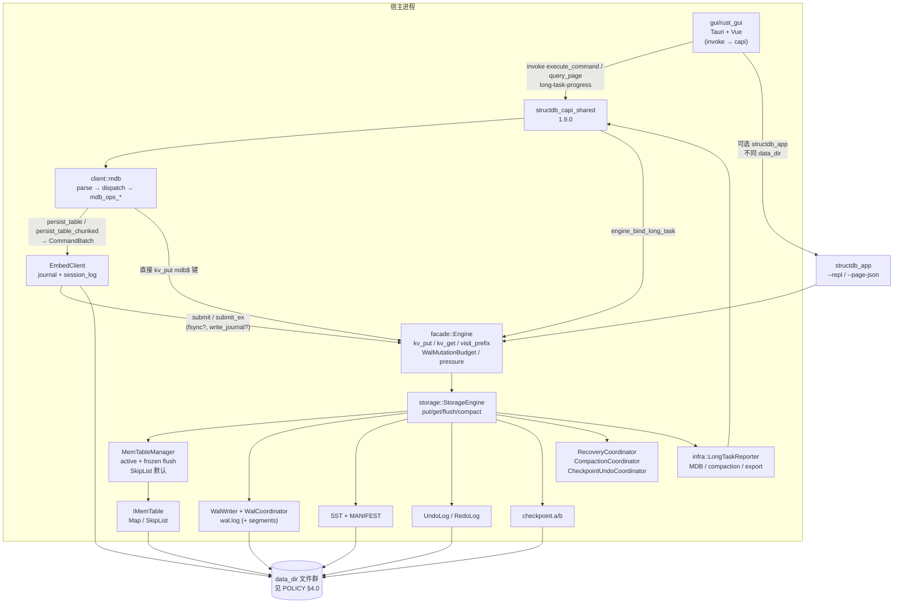
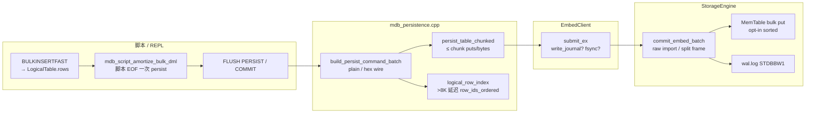
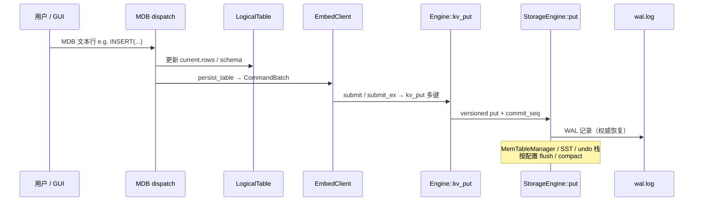
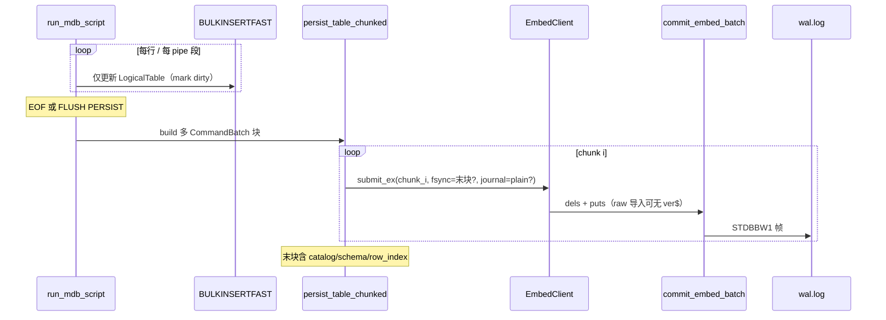
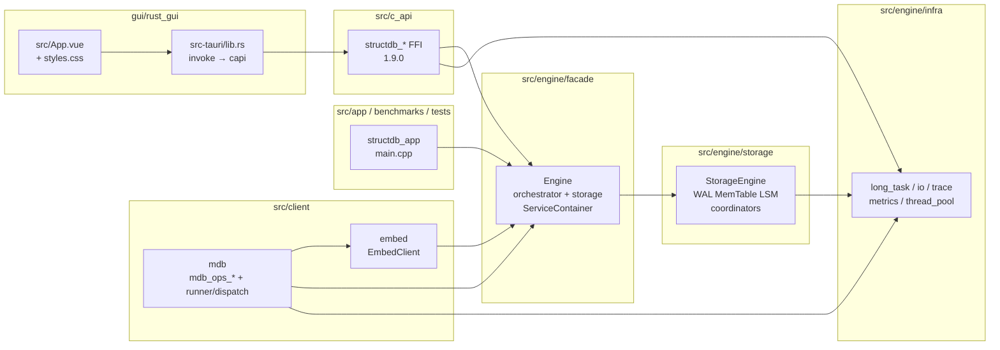
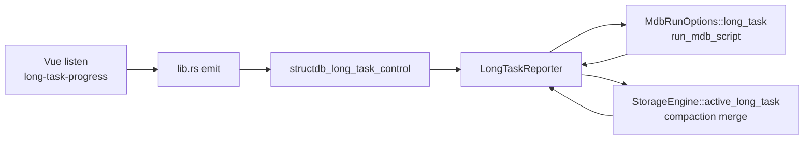
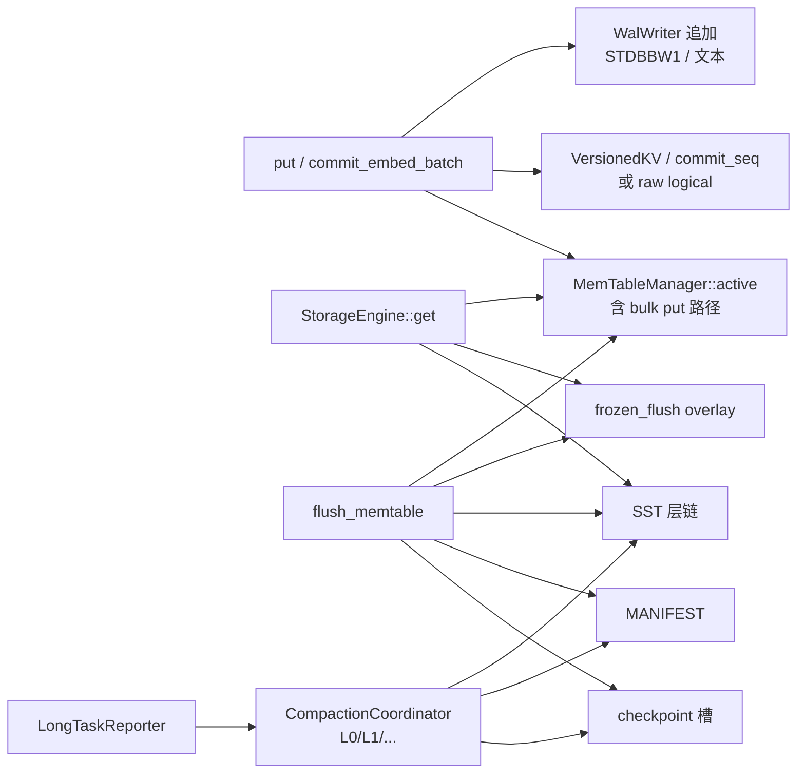

# StructDB 架构总览（数据流 · 代码版图 · 关键结构）

本文档与 **[POLICY.md](POLICY.md)**（约束与保底）、各 **[phases/PHASE*.md](phases/)** 专文互补：**此处给一张「从 UI 到磁盘」的连续图景与代码索引**；细节与不变式以 `POLICY` 与对应 PHASE 为准。

---

## 1. 文档导航

| 主题 | 文档 |
|------|------|
| 文件系统保底、事务链、单写者 | [POLICY.md §4](POLICY.md) |
| WAL 重放判别 | [phases/WAL_REPLAY.md](phases/WAL_REPLAY.md) |
| 事务链 GTest 与读路径 | [phases/TESTING_TXN_CHAIN.md](phases/TESTING_TXN_CHAIN.md) |
| L0/L1 compaction 与 MANIFEST | [COMPACTION.md](COMPACTION.md)、[phases/PHASE12.md](phases/PHASE12.md) |
| C API / 共享库 / GUI（`gui/rust_gui` + Tauri） | [phases/PHASE27.md](phases/PHASE27.md)、[phases/PHASE28.md](phases/PHASE28.md)、[phases/PHASE30.md](phases/PHASE30.md) |
| MDB 行锚重排与 GUI 撤销栈 | [phases/PHASE38.md](phases/PHASE38.md)（`CONFIRM_REORDER`、`[REORDER_MAP_JSON]`、`id_remap_chain`） |
| MDB 模块化 | [phases/PHASE26.md](phases/PHASE26.md)、[phases/PHASE32.md](phases/PHASE32.md)（`mdb_ops_*` 多编译单元） |
| MemTable 默认后端、CompactionResult、观测前缀 | [STORAGE_EVOLUTION_AND_OBSERVABILITY.md](STORAGE_EVOLUTION_AND_OBSERVABILITY.md) |
| 运行时 / 实验开关清单 | [ENGINE_RUNTIME_CONFIG.md](ENGINE_RUNTIME_CONFIG.md) |
| 性能路线图与长任务落地快照 | [OPTIMIZATION_PLAN.md](OPTIMIZATION_PLAN.md)、[STRUCTDB_EVALUATION_SUMMARY.md](STRUCTDB_EVALUATION_SUMMARY.md) |
| 竞品全维度对比与功能缺口 | [COMPETITIVE_MATRIX.md](COMPETITIVE_MATRIX.md) |
| MDB persist 性能（摊销 / 分块 / plain·raw） | [phases/PHASE39_PERSIST_PERF.md](phases/PHASE39_PERSIST_PERF.md)、[phases/PHASE40_PERSIST_PERF.md](phases/PHASE40_PERSIST_PERF.md) |
| `StorageEngine` 多 TU 权威表 | [phases/PHASE34.md](phases/PHASE34.md) |

---

## 2. 端到端数据流（总图）

下列 **flowchart** 概括：**宿主 / CLI / C API** 如何将 MDB 语义落到 **KV → WAL / MemTable / SST**，以及 **Embed 会话日志** 与 **`data_dir`** 的关系（单进程内多路径共享同一 `StorageEngine` 实例；**同一 `data_dir` 上不可并行两个独占 WAL 的进程**，见 GUI 进程内 CLI 回退实现）。



**读路径（简化）**：`Engine::kv_get(key, out, read_max_seq)` → `StorageEngine::get` 在 **MemTable（active ∪ frozen）∪ SST** 上按 **`commit_seq` 裁剪**可见版本（与 newdb 风格读序号一致；见 `POLICY` §4.1、`TESTING_TXN_CHAIN`）。`StorageEngine` 读路径在 **`shared_mutex` 共享锁**下与写路径并发（Phase 36）。

**写路径（两类）**：

1. **逻辑表会话内变更**（`INSERT` / `UPDATE` / …）：先更新内存中的 `LogicalTable`，在 `persist_table` 时编码为 **`mdb$v2$*`** 键批次，经 **`EmbedClient::submit` / `submit_ex`** 落盘（可选 `fsync_journal`、plain 导入批可 **`write_journal=false`**）。
2. **大表 bulk 导入快路径**（[PHASE39](phases/PHASE39_PERSIST_PERF.md) / [PHASE40](phases/PHASE40_PERSIST_PERF.md)）：脚本内 `BULKINSERTFAST` 默认 **EOF 摊销**一次 persist；脏行 >8192 时 **`persist_table_chunked`** 多帧 WAL（catalog/schema/`row_index` **仅末帧**）；可选 **plain 行**（tab 分隔）、**raw 逻辑值**（无 `ver$` 包装）、**skip undo**、MemTable **排序批量 put**。详见 §2.2。
3. **已直接走引擎的键**（部分工具路径）：`Engine::kv_put` / `kv_remove`（可选 **WAL 调度预算** `WalMutationBudget` 与 **异步 `kv_put` 队列**）。

### 2.2 MDB 大表导入持久化（PHASE39 / PHASE40）



| 阶段 | 行为 |
|------|------|
| 会话内 ingest | `BULKINSERTFAST` 写入 `LogicalTable`；全表 bulk 时 **延迟** 维护 `row_ids_ordered`，persist 前一次性重建（避免 O(n²)）。 |
| 批构建 | `PersistBuildOptions`：`plain_row_values`、`bulk_import` → `apply_storage_persist_hints`（raw + skip undo）。 |
| 分块 submit | 每块 `idempotency_token` `{base}:chunk:{i}`；仅末块 `fsync`；多表场景须 **每表** `FLUSH PERSIST`。 |
| 存储提交 | `commit_embed_batch`：导入批可走 **零拷贝 WAL puts**、`memtable_bulk_put_enabled`；超大帧由 `storage_embed_batch_max_frame_bytes` 兜底拆分。 |
| REPL / 事务 | REPL 与 **事务内** bulk 可能 **每批立即 persist**（`script_amortize && !txn_active`）；`ROLLBACK` 恢复 session 基线，存储回滚需 **`mdb_chain_rollback_on_mdb_rollback`**。 |

**压测参考**（本机 1M 行、`mega_data_mdb_stress.ps1`）：相对 PHASE39 基线 ~7.5K TPS，PHASE40 默认约 **~238K TPS**，`--mdb-bulk-import` 约 **~328K TPS**。回归：`Mdb.Phase40*`（24）、`Mdb.*`（127）。

### 2.1 GUI 宿主壳（`gui/rust_gui`）

- **Tauri**（`gui/rust_gui/src-tauri/`，入口 `lib.rs`）：动态加载 `structdb_capi_shared`，向 Vue 暴露 **`invoke`** 命令；与 **[phases/PHASE30.md](phases/PHASE30.md)** 的打包与嵌入策略一致。
- **前端**（`gui/rust_gui/src/App.vue` 等 + `styles.css`）：表数据视图、MDB 脚本页、命令控制台与事务栈；单条命令可携带 **`backward`** 文本参与撤销/重做；**MDB 脚本执行**监听 **`long-task-progress`**（`kind === mdbScript`），并调用 **`cancel_long_task`** / **`cancel_mdb_script`**（后者委托前者）停止后续行。
- **三十八期**：MDB **`CONFIRM_REORDER`** 在当前 `USE` 表上批量改**行锚**；引擎在成功路径输出 **`[REORDER_MAP_JSON]`**（可多行），GUI **按行** 压入 **`id_remap_chain`**，供撤销栈行 id 重写与多轮重排链一致；工具栏支持按当前排序**分页扫全表 id** 后一次性重编号为 `1…n`（`BEGIN` 事务内禁用）。详见 **[phases/PHASE38.md](phases/PHASE38.md)**。

**Tauri `invoke`（与 `src-tauri/src/lib.rs` 中 `generate_handler!` 对齐）**：

| 类别 | 命令 |
|------|------|
| 会话 / 表 | `get_state`、`set_workspace`、`set_current_table`、`list_tables`、`get_settings`、`set_settings` |
| MDB 执行 | `execute_command`、`execute_command_ex`、`infer_inverse_command`、`query_page` |
| 事务 | `txn_begin`、`txn_commit`、`txn_rollback`、`txn_savepoint`、`txn_rollback_to`、`txn_release_savepoint` |
| 撤销栈 | `save_stack_units`、`load_stack_units`、`stack_undo_unit`、`stack_redo_unit` |
| 脚本 / 长任务 | `run_script`、`run_script_ex`、`cancel_mdb_script`、`cancel_long_task` |
| 导出 / 压测 | `export_bundle`、`run_structdb_bench` |
| CLI 终端 | `cli_terminal_start`、`cli_terminal_write_line`、`cli_terminal_stop` |
| 诊断 | `dll_info`、`runtime_artifact_info` |

**长任务与进度（C API 1.8.0+，当前 1.9.0）**：

- **`structdb_long_task_control`** + **`structdb_mdb_run_options.long_task_control`**（V3，`STRUCTDB_MDB_RUN_OPTIONS_SIZE_V3 = 64`）：MDB 脚本、compaction merge、export 等共享 **协作取消** 与 **进度回调**。
- GUI 脚本批处理：`structdb_engine_begin_mdb_script_batch` → 循环 `structdb_mdb_execute_line_ex` → `structdb_engine_end_mdb_script_batch`；compaction 进度经 **`structdb_engine_bind_long_task`** 绑定到 `StorageEngine::active_long_task()`。
- **事件 `long-task-progress`**（camelCase：`unitsDone` / `bytesDone` / `kind` / `status` 等）为统一 UI 面；**`mdb-script-progress`**（`lineDone` / `totalLines`）在 `kind === mdbScript` 时作为兼容 shim 同步发射。
- **`run_script_ex`** 返回 **`cancelled`**（及 `ok` / `output` / `errorCode` / `stopLine`）；取消返回码 **`STRUCTDB_CAPI_ERR_CANCELLED`**（6）。
- 已移除或未注册的 invoke：`run_redo_undo_gate`、`c_api_runtime_stats`（见 [phases/PHASE30.md](phases/PHASE30.md)）。

---

## 3. 写入时序（MDB 持久化）

### 3.1 单行 / 小批量（增量或全量 snapshot）



### 3.2 脚本大 bulk（摊销 + 分块，PHASE40）



---

## 4. 逻辑表与存储键空间

MDB 逻辑表在存储中 **不是**「每表一个独立 heap 文件」的第二权威；权威在 **`mdb$v2$*`** 前缀的 **版本化 KV**（见 `mdb_keyspace`）：

```8:18:e:\db\StructDB\src\engine\storage\include\structdb\storage\mdb_keyspace.hpp
inline constexpr std::string_view kV2 = "mdb$v2$";
inline constexpr std::string_view kRow = "mdb$v2$row$";       // + table + '$' + pk
inline constexpr std::string_view kSchema = "mdb$v2$schema$";  // + table
inline constexpr std::string_view kRowIndex = "mdb$v2$idxrows$";  // + table → newline-separated primary keys
inline constexpr std::string_view kCatalog = "mdb$v2$cat$";   // + table → marker "1" when table exists
inline constexpr std::string_view kSecIdx = "mdb$v2$idx$";    // reserved: + table + '$' + col + '$' + tokenized value

inline std::string row_key(std::string_view table, std::string_view pk) {
  return std::string(kRow) + std::string(table) + '$' + std::string(pk);
}
```

---

## 5. 代码目录与依赖方向（组织）



**CMake 主树（根 `CMakeLists.txt`）**：`src/Base` → `engine/infra` → `planner` / `scheduler` / `runtime` / `orchestrator` / `facade` / `storage` → `client/embed` + `client/mdb` → `c_api` → `app`；可选 `tests`、`benchmarks`。

**依赖纪律（摘自方针）**：`src/engine/storage` **不得**反向依赖 `orchestrator` / `planner`；编排经 **Facade 窄接口** 注入（见 `POLICY` §2.2）。`structdb_storage` 链接 **`structdb_infra`**（I/O 后端、长任务、trace 等）。

**MDB 编译单元（`structdb_client_mdb`）**：

| 源文件 | 职责 |
|--------|------|
| `mdb_engine_ports.cpp` | `MdbEnginePorts`：Engine / Embed 窄端口 |
| `mdb_runner.cpp` | `run_mdb_script`、`MdbInteractiveSession` |
| `mdb_dispatch.cpp` + `mdb_runner_dispatch.inc` | 命令分派 |
| `mdb_command_parser.cpp` | 行解析 |
| `mdb_persistence.cpp` | `persist_table` / `persist_table_chunked`、`build/submit_persist_command_batch`、plain/raw 导入提示 |
| `mdb_ops_logical_index.cpp` | `row_ids_ordered`、延迟重建、sec_idx 辅助 |
| `mdb_query_paging.cpp` | `PAGE_JSON` / `SCAN MORE` 游标 |
| `mdb_ops_string_wire.cpp` | hex / snapshot wire |
| `mdb_ops_predicate.cpp` | WHERE / 谓词 |
| `mdb_ops_reorder.cpp` | `CONFIRM_REORDER` |
| `mdb_ops_pages_journal_import.cpp` | 分页 / journal / import |
| `mdb_ops_txn_log.cpp` | `session.txn` v2 恢复 |

---

## 6. Facade `Engine` 对外窄面

脚本 / 嵌入端通过 **`Engine::kv_get` / `kv_put` / `kv_visit_prefix`** 与存储对话，避免上层直接持有 `StorageEngine` 头文件耦合：

```50:65:e:\db\StructDB\src\engine\facade\include\structdb\facade\engine.hpp
  /// Narrow KV read for `client/mdb` (avoids pulling `storage_engine.hpp` into embed-only paths).
  bool kv_get(const std::string& key, std::string* value_out) const {
    return kv_get(key, value_out, (std::numeric_limits<std::uint64_t>::max)());
  }
  bool kv_get(const std::string& key, std::string* value_out, std::uint64_t read_max_seq) const;

  bool kv_put(const std::string& key, const std::string& value, bool fsync_wal);
  bool kv_remove(const std::string& key, bool fsync_wal);

  void kv_visit_prefix(std::string_view prefix,
                       const std::function<bool(std::string_view key, std::string_view value)>& visitor) const {
    kv_visit_prefix(prefix, visitor, (std::numeric_limits<std::uint64_t>::max)());
  }
  void kv_visit_prefix(std::string_view prefix,
                       const std::function<bool(std::string_view key, std::string_view value)>& visitor,
                       std::uint64_t read_max_seq) const;
```

**编排与背压（文字）**：

- **`ServiceContainer` / `ConfigurableEngine`**：运行时单例与配置快照（`EngineConfigSnapshot`）。
- **`WalMutationBudget`**（RAII）：`kv_put` / `kv_remove` / `EmbedClient::submit` 在 WAL 调度字节预算下阻塞获取 `WalQueueDepth` 槽位。
- **`storage_pressure_snapshot`** → Scheduler **`ResourceBudget`** 同步（L0 深度、WAL/undo 字节、compaction worker 队列、async `kv_put` 队列等）。
- **`embed_undo_stack_depth` / `rollback_embed_undo_until`**：MDB 事务链与 embed 版本化写 undo 栈对齐（Phase 23C）。
- **`drain_l0_compaction_queue` / `rerun_default_pipeline`**：defer L0 合并与 GraphExecutor 默认计划（Phase 13 / 19）。
- **可选 async `kv_put` 队列**（Phase 36）：`EngineConfigSnapshot::kv_put_async_queue_depth > 0` 时写路径经后台 worker 线程。

---

## 7. `StorageEngine`：写、读、刷盘 API 骨架

```53:93:e:\db\StructDB\src\engine\storage\include\structdb\storage\storage_engine.hpp
  bool put(const std::string& key, const std::string& value, bool fsync_wal) {
    return put(key, value, fsync_wal, 0);
  }
  /// When `batch_commit_seq != 0`, all versioned `mdb$` logical puts in one embed/journal batch share this seq.
  bool put(const std::string& key, const std::string& value, bool fsync_wal, std::uint64_t batch_commit_seq);
  /// Reserve one `commit_seq` for an upcoming batch (call once, then pass to each `put(..., seq)` in that batch).
  std::uint64_t reserve_commit_seq();
  bool remove(const std::string& key, bool fsync_wal);

  /// Returns logical payload (unwraps `mdbver1:` for `mdb$` keys). Tombstones and invisible versions read as miss.
  bool get(const std::string& key, std::string* value_out) const {
    return get(key, value_out, versioned_read_seq_latest());
  }
  bool get(const std::string& key, std::string* value_out, std::uint64_t read_max_seq) const;

  /// `read_max_seq == max uint64` means latest visible (no upper bound on stored commit seq).
  static std::uint64_t versioned_read_seq_latest();

  /// Monotonic high-water for new versioned puts; `data_dir/COMMIT_SEQ` is updated on `open` (after WAL replay),
  /// `close`, `checkpoint`, and flush/compaction paths — not on every `put` (WAL + in-memory `observe_*` remain authoritative).
  std::uint64_t latest_commit_seq() const { return commit_seq_hw_.load(std::memory_order_relaxed); }

  void visit_prefix(std::string_view prefix,
                    const std::function<bool(std::string_view key, std::string_view value)>& visitor) const {
    visit_prefix(prefix, visitor, versioned_read_seq_latest());
  }
  void visit_prefix(std::string_view prefix,
                    const std::function<bool(std::string_view key, std::string_view value)>& visitor,
                    std::uint64_t read_max_seq) const;

  /// Seal memtable to L0 SST and update manifest. Swaps active mem into `MemTableManager`'s frozen snapshot, records WAL offset,
  /// materializes sorted SST **outside** `mu_` (to `dir_/_structdb_memflush_tmp.sst` then renames to `L0-{gen}.sst`),
  /// then updates MANIFEST / `lsm_` / checkpoint under lock. Overlapping `flush_memtable` returns false
  /// (`flush_memtable already in progress`). On materialize/rename/manifest failure, frozen keys merge back into active mem.
  bool flush_memtable(std::string* error_out);
```

**算法要点（文字）**：

1. **`open`**：创建目录 → 加载 WAL / undo 目录项 → `wal_.open` → **`RecoveryCoordinator::replay_checkpoint_and_wal`**（`RecoveryOpenPolicy`、`WalReplayApplier`）→ manifest / checkpoint / `COMMIT_SEQ`；可选 **`data_dir/.structdb_exclusive.lock`** 建议锁（Phase 35）。
2. **`put` / `commit_embed_batch`**：在写锁下追加 WAL 帧（`STDBBW1` 或文本行）、写入 **版本化 KV**（`mdb$` 键与 `commit_seq` 绑定；**导入 raw** 可对 `mdb$` 键存 logical 字节无 `ver$` 包装），并更新 **`MemTableManager::active()`**；大批导入可走 **`mem_apply_puts_unlocked` 排序批量**路径。WAL / compaction 字节节流经 **`SteadyClockByteTokenBucket`**（`byte_token_bucket.*`）。超大 embed 批由 **`commit_embed_batch_unlocked_split_`** 按 `storage_embed_batch_max_frame_bytes` 分帧。
3. **`flush_memtable`**：将 active memtable **移入 frozen 快照**，锁外物化 **`STDBSST3` + footer Bloom** SST，更新 **MANIFEST** 与 **checkpoint**；失败时 **`merge_frozen_into_active_and_clear`** 回滚。
4. **`compact_merge_two_oldest_l0`**（及 L1→L2、L2→L3 等）：经 **`CompactionCoordinator`** 归并 SST、更新 MANIFEST；可选 **compaction worker** 队列（Phase 20）；长任务进度经 **`LongTaskReporter`** 上报。
5. **读路径**：`shared_mutex` 共享锁 + MemTable overlay（active over frozen）+ SST 层链；前缀扫描可走 **`for_each_sorted_prefix`** / overlay 优化。

**`StorageEngine` 实现文件（权威表见 [`phases/PHASE34.md`](phases/PHASE34.md)，并含后续协调器 TU）**：

| 源文件 | 职责 |
|--------|------|
| `storage_engine.cpp` | `COMMIT_SEQ`、`reserve_commit_seq`、`versioned_read_seq_latest` |
| `storage_engine_open_wal.cpp` | ctor、`open` / `close` |
| `wal_replay_applier.cpp` | WAL 行/批重放解码 |
| `recovery_coordinator.cpp` + `recovery_phase.cpp` | open 恢复编排、`StorageRecoveryPhase` |
| `storage_engine_put_undo.cpp` | 写路径、undo、WAL trim/GC |
| `storage_engine_read.cpp` | `get` / `visit_prefix` |
| `storage_engine_compaction_lsm.cpp` | flush、各层 compact、背压快照 |
| `storage_engine_segments_worker_checkpoint.cpp` | 段元数据、roll、worker、`checkpoint` |
| `storage_engine_detail.*` | SST/段元数据辅助 |
| `wal_coordinator.cpp` | WAL 段滚动 / 封存协调 |
| `checkpoint_undo_coordinator.cpp` | checkpoint 与 undo 前缀联合回收 |
| `compaction_coordinator.cpp` + `compaction_io_executor.cpp` | compaction 锁外 I/O、专用线程 |
| `memtable*.cpp` + `memtable_manager.cpp` | `IMemTable` 后端与 flush 快照 |
| `storage_telemetry.cpp` | trace span、`stdb.storage.*` 常量 |

---

## 8. 编排运行时（GraphExecutor）

默认流水线由 **Orchestrator** 产出 **ExecutionPlan**，**GraphExecutor** 在 **Scheduler** 预算下拓扑执行已注册 **Operator**（含 noop、flush、drain L0 等）；用于背压探测与可重复实验路径：

```15:29:e:\db\StructDB\src\engine\runtime\include\structdb\runtime\graph_executor.hpp
class GraphExecutor {
 public:
  void register_operator(std::string name, std::shared_ptr<IOperator> op);

  /// Ask in-flight `execute` to stop after the current node (cooperative; checked between nodes).
  void request_cancel();

  /// Topological execution with optional per-node memtable credit (1 byte) to exercise backpressure.
  bool execute(planner::ExecutionPlan plan, scheduler::ExecutionScheduler& sched, bool use_budget_probe,
               std::string* error_out);

 private:
  std::unordered_map<std::string, std::shared_ptr<IOperator>> ops_;
  std::mutex cancel_mu_;
  std::shared_ptr<std::atomic<bool>> active_cancel_;
};
```

---

## 9. 长任务横切（infra → 存储 → 客户端 → C API → GUI）



**`src/engine/infra/long_task_progress.hpp`** 定义 **`LongTaskKind`**（`MdbScript` / `CompactionMerge` / `Export` / …）、**`LongTaskCancelToken`**（协作取消）、**`LongTaskReporter`**（进度快照 + 回调）。C API **`structdb_long_task_control`** 包装同一 reporter；GUI 在脚本批处理前 **`long_task_control_create`**，经 **`set_progress_callback`** 转发为 Tauri 事件。

---

## 10. MDB 会话态（内存算法核心）

REPL / 脚本 / C API 会话在 **`ReplSessionState`** 中维护 **当前表**、**事务基线**、**快照读序号**、**分页游标** 等；逻辑行在 **`LogicalTable::rows`**（`std::map` 主键 → 单元格向量）：

```13:35:e:\db\StructDB\src\client\mdb\include\structdb\client\mdb_logical_table.hpp
struct LogicalTable {
  std::string name;
  std::vector<std::pair<std::string, std::string>> schema;
  std::map<std::string, std::vector<std::string>> rows;
  std::string pk_column;
  std::unordered_map<std::string, std::unordered_multimap<std::string, std::string>> str_idx;
  /// Row ids touched since last successful `persist_table` (for incremental embed batches when enabled).
  std::unordered_set<std::string> mdb_persist_dirty_rows;
  /// Previous cell vector before UPDATE/DELETE (same id as key); absent for pure INSERT dirties.
  std::unordered_map<std::string, std::vector<std::string>> mdb_persist_prev_cells;
  /// Schema/catalog layout changed — forces full persist.
  bool mdb_persist_schema_dirty{false};
  /// Primary keys in lexicographic order (mirrors `rows`); bulk >8K may defer rebuild until persist.
  std::vector<std::string> row_ids_ordered;

  void clear_data_keep_name() {
    schema.clear();
    rows.clear();
    str_idx.clear();
    pk_column.clear();
    mdb_persist_dirty_rows.clear();
    mdb_persist_prev_cells.clear();
    mdb_persist_schema_dirty = false;
    row_ids_ordered.clear();
  }
};
```

```35:47:e:\db\StructDB\src\client\mdb\include\structdb\client\detail\mdb_runner_internal.hpp
struct ReplSessionState {
  LogicalTable current;
  bool txn_active = false;
  LogicalTable txn_base;
  bool txn_read_committed = false;
  std::uint64_t txn_snap_seq = 0;
  std::map<std::string, LogicalTable> savepoints;
  std::size_t repl_line_no = 0;
  bool attempted_txn_recovery = false;
  bool allow_persist_while_txn_active_experimental = false;
  std::optional<std::size_t> txn_undo_stack_depth_at_begin;
  MdbQueryPagingState query_paging;
};
```

**`PAGE_JSON`**：在 **`current.rows` 全量**上排序后分页输出 JSON（无 `SCAN` 5000 行打印上限）；**`SCAN`** 仍受 PHASE25 上限约束，**`SCAN MORE` / `SCAN RESET`** 由 **`MdbQueryPagingState`** 维护游标。解析与分派见 **`mdb_command_parser`** + **`mdb_runner_dispatch.inc`**。

**`CONFIRM_REORDER`**：在当前 `USE` 表上对 **`LogicalTable::rows`** 的主键（行锚）做批量改名并经 **`persist_table`** 落盘；成功后引擎打印 **`[REORDER_MAP_JSON]`**（GUI 撤销栈与 **[phases/PHASE38.md](phases/PHASE38.md)** 约定一致）。**不得在 `BEGIN`…事务内**执行。

**脚本长任务**：`MdbRunOptions::long_task` 指向 **`LongTaskReporter*`**；`run_mdb_script` 按可执行行数上报 `units_done` / `units_total`，取消时设置 **`MdbRunResult::cancelled`**。

---

## 11. 嵌入式会话与耐久边界

`EmbedClient` 在 **`session_dir/_structdb_embed/`** 下维护 **日志行**、**checkpoint**、**session_log.txt**（活动审计，见 `PHASE29`）：

```17:53:e:\db\StructDB\src\client\embed\include\structdb\client\embed_client.hpp
/// Subdirectory under `EmbedClient::open(session_dir)` where journal, checkpoint, activity log, and `session.txn`
/// are stored so `session_dir` stays clean for host-owned files.
inline constexpr const char kEmbedSessionArtifactsDir[] = "_structdb_embed";

struct CommandBatch {
  std::string client_session_id;
  std::uint64_t term{0};
  std::string idempotency_token;
  std::vector<std::pair<std::string, std::string>> puts;
  /// Keys to remove (tombstone in storage); encoded in journal when non-empty.
  std::vector<std::string> dels;
};

/// Embedded durable session: journal of batches + checkpointed ack seq.
class EmbedClient {
 public:
  explicit EmbedClient(facade::Engine& engine);

  bool open(const std::filesystem::path& session_dir, std::string* error_out = nullptr);
  void close();
  // ...
  bool submit(const CommandBatch& batch, bool fsync_journal, std::string* error_out = nullptr);
  /// When `write_journal` is false, storage/WAL still commit; journal line skipped (bulk import; WAL authoritative).
  bool submit_ex(const CommandBatch& batch, bool fsync_journal, bool write_journal, std::string* error_out = nullptr);
```

**耐久档位**与 **`fsync_journal` / `fsync_each_batch` / `fsync_each_session_txn_op`** 的对照见 **[phases/TXN_INNODB_MAP.md §2](phases/TXN_INNODB_MAP.md)**（类比，非等价 InnoDB）。

**导入批 journal 跳过**：PHASE40 plain 大表 persist 对 `submit_persist_command_batch` 传 **`write_journal=false`**（WAL 仍为恢复权威；与 `embed_journal_skip_until_commit` 正交）。分块 persist 中途崩溃可能已持久化部分行（与 PHASE39 导入语义一致）；导入批 **无 undo** 时 MDB `ROLLBACK` 不保证撤销已提交存储批次。

**`session.journal` 写入**：`EmbedClient` 在会话期间对 `session.journal` 保持 **`FileWriter` 追加句柄**（避免每条 `submit` 反复 `open`）；`append_journal_line(..., fsync=true)` 在 `write_all` 后调用 `FileWriter::sync()`，与 `StorageEngine::wal_sync` 共同构成 **`fsync_journal=true`** 时的耐久边界。

---

## 12. MemTable 与 `MemTableManager`

MemTable 层已 **抽象为 `IMemTable`**，由 **`MemTableManager`** 管理 **active** 与 **flush 期间 frozen** 快照；默认后端为 **`SkipList`**（仍可通过 `MemTableBackend::Map` 切回 `std::map`）：

```7:11:e:\db\StructDB\src\engine\storage\include\structdb\storage\memtable_backend.hpp
enum class MemTableBackend : std::uint8_t {
  Map = 0,
  SkipList = 1,
};
```

```14:41:e:\db\StructDB\src\engine\storage\include\structdb\storage\memtable_manager.hpp
/// Active mutable memtable plus optional frozen snapshot during `flush_memtable` materialization.
class MemTableManager {
 public:
  explicit MemTableManager(MemTableBackend b = MemTableBackend::SkipList);

  IMemTable& active() noexcept { return *active_; }
  const IMemTable& active() const noexcept { return *active_; }

  const std::shared_ptr<IMemTable>& frozen_flush() const noexcept { return frozen_flush_; }
  MemTableBackend backend() const noexcept { return backend_; }

  void reset_to_backend(MemTableBackend b);
  bool begin_flush_move_active_to_frozen(std::string* error_out);
  void merge_frozen_into_active_and_clear();
  void clear_frozen_flush_only();
  void discard_frozen_snapshot();
  // ...
};
```

**`MemTable`（Map 后端）** 实现 **`IMemTable`**；**线程安全由 `StorageEngine::mu_` / `shared_mutex` 保证**，表本身无内部锁：

```14:58:e:\db\StructDB\src\engine\storage\include\structdb\storage\memtable.hpp
/// Default `IMemTable` backend: sorted `std::map` (correctness-first; hot path may be swapped later).
///
/// **Threading**: not synchronized. Production uses are under `StorageEngine`'s `mu_` (exclusive or shared lock)
/// or read-only views of a frozen table during flush; do not mutate concurrently.
class MemTable final : public IMemTable {
 public:
  void put(std::string key, std::string value) override;
  // ...
  bool for_each_sorted_prefix(std::string_view prefix,
                              const std::function<bool(const std::string&, const std::string&)>& visitor) const override;
  bool for_each_sorted_prefix_overlay(std::string_view prefix, const IMemTable& older,
                                      const std::function<bool(const std::string&, const std::string&)>& visitor) const override;
 private:
  std::map<std::string, std::string, std::less<>> map_;
  std::size_t bytes_total_{0};
};
```

**`MemTableSkipList`**（`memtable_skiplist.*`）为默认热路径后端。`commit_embed_batch` 在 **`memtable_bulk_put_enabled`** 或 **raw 导入** 且 puts 数 ≥ 阈值时，对 WAL puts **排序后** 调用 **`mem_apply_puts_unlocked(..., bulk=true)`**（`storage_engine_put_undo.cpp`）。`flush_memtable` 对 frozen 表做 **`for_each_sorted`** 快照并调用 `write_sst_sorted_entries`，写出 **`STDBSST3` + footer Bloom**（与 compaction 输出一致）。磁盘上仍可读历史 **`STDBSST2`** 与 **无前缀 legacy** SST（`storage_engine_detail.cpp` 统一切片）；点查可走 Bloom，前缀扫描对 Bloom 保守不用。

---

## 13. 存储引擎内部子图（概念）



---

## 14. 与本图不一致时以谁为准

1. **代码与 `POLICY` / `CHANGELOG`** 优先于本页示意图。  
2. **PHASE 专文** 优先于本页中同一主题的简述。  
3. 本页链接已指向 **`Docs/phases/`** 下文件；若本地书签仍用旧路径，请更新。

---

## 15. 维护

新增子系统或跨目录依赖时：**更新本页 Mermaid 与源码引用路径**（仓库根下 **`src/`** 为 C++ 主树、**`gui/rust_gui/`** 为 Tauri + Vue）、**`Docs/README.md` 索引**；persist 性能里程碑合入时同步 **[PHASE40_PERSIST_PERF.md](phases/PHASE40_PERSIST_PERF.md)** 与本节 §2.2 / §3.2；发版时可在 **`CHANGELOG.md`** 记一条「文档」变更。
