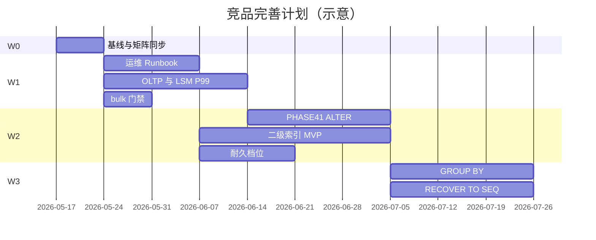

# StructDB 竞品差距完善计划

本文档由 **[`COMPETITIVE_MATRIX.md`](COMPETITIVE_MATRIX.md)** 的缺口与对标结论导出，给出**可排期、可验收**的完善路线。性能细项与已落地清单以 **[`OPTIMIZATION_PLAN.md`](OPTIMIZATION_PLAN.md)** 为准；存储/事务不变式以 **[`POLICY.md`](POLICY.md)** 为准。

**产品定位（不变）**：同进程嵌入式 **MDB + LSM + Embed** 工作台；**非**通用网络数据库、**非** PostgreSQL/MySQL 替代品。

**修订记录**：见文末。

---

## 1. 目标与成功标准

### 1.1 总目标（12 个月内）

在**不引入分布式与 SQL 全栈**的前提下，将矩阵中 StructDB 为 **◐/○** 且**与主场景相关**的维度提升到 **◐→●（子集）或 ○→◐**，使：

| 对标对象 | 目标关系 |
|----------|----------|
| **SQLite** | 嵌入式场景：耐久/备份/Schema 子集/事务可预期性 **接近**；SQL 语法 **不追求等价** |
| **RocksDB + 自建表语义** | 存储与 bulk **齐平或更省事**；ingest/Compaction 深度 **持续追赶** |
| **newdb CLI** | MDB 命令 **语义映射完成度 ↑**；`[NOT_SUPPORTED]` **有文档化替代路径** |

### 1.2 量化成功标准（建议门禁）

| 指标 | 当前锚点 | 目标 |
|------|----------|------|
| bulk 导入 TPS（1M 行 mega_data） | ~238K / ~328K（四十期） | 维持不退化；流式/segment 后 **+30%～2×**（视磁盘） |
| 单行 OLTP persist P50/P99 | 缺统一基线 | `run_persist_baseline.ps1` 建档；P99 较基线 **≤1.2×**（同配置） |
| `Mdb.*` + `StorageEngine.*` 回归 | 127 + 全量 | 每波合入 **零回退**；新能力 **≥1 条 GTest/波** |
| 矩阵「成熟度」叙事 | 实验工程 | **可重复备份/恢复 Runbook** + 独占锁默认文档化 |
| `[NOT_SUPPORTED]` 替代 | 仅报错 | 每类至少 **1 条 MDB/配置替代** 写入 `HELP` 与本文 §6 |

---

## 2. 战略边界（明确不做）

以竞品矩阵 §8、§6.4 与 `POLICY` 为准，**不纳入本计划主链**：

- 分布式、多主、复制、读写分离（网络层）
- 完整 SQL-92 / JDBC/ODBC 生态
- InnoDB 等价 purge、跨表 2PC、行锁等待图
- newdb **堆文件**语义（`AUTOVACUUM` 堆紧凑、跨进程 heap catalog）
- 全文 / 地理 / 向量（P3，仅作远期调研）

**例外**：若仅实现 **MDB 子集**（如 `ALTER TABLE ADD COLUMN`）且不破坏 WAL/单写者不变式，可纳入 Wave 2。

---

## 3. 缺口 → 倡议映射（总表）

| 矩阵缺口 | 倡议 ID | 波次 | 关联文档/期次 |
|----------|---------|------|----------------|
| 通用 OLTP 写慢 | **I-OLTP** | W1 | OPTIMIZATION §0.4；增量 persist 已部分有 |
| Compaction P99 / 读放大 | **I-LSM** | W1–W2 | PHASE13+、COMPACTION、OS_IO_ISOLATION |
| 备份 / 单文件便携 | **I-OPS** | W1–W2 | POLICY §4.0；新 Runbook |
| `ROLLBACK` 与存储不对齐 | **I-TXN** | W1–W2 | PHASE23 23C、PHASE31 矩阵 |
| `ALTER TABLE` | **I-DDL** | W2 | 新 PHASE41 草案 |
| 二级索引 / CBO | **I-IDX** | W2–W3 | HOTINDEX 替代路线 |
| `GROUP BY` / 多表 | **I-QRY** | W3 | 轻量聚合，非 JOIN |
| PITR / `RECOVER TO` | **I-PITR** | W3 | WAL 多段 + checkpoint_seq |
| `GROUPCOMMIT` / `WALSYNC` | **I-DUR** | W2 | TXN_INNODB_MAP 档位产品化 |
| bulk 再 ×N | **I-BULK** | W1–W2 | PHASE40 backlog、SST ingest 预研 |
| 多 schema | **I-SCH** | W4+ | 低优先 |
| SQL 接口 | **I-SQL** | 不主链 | 仅调研：MDB→SQL 翻译层 |

---

## 4. 波次计划

### Wave 0 — 基线与矩阵同步（第 0～1 周）

**目的**：完善计划可度量；避免「四十期已解除上限」与 OLTP 路径混淆。

| 任务 | 交付 | 验收 |
|------|------|------|
| W0-1 基线矩阵 | `scripts/results/` 归档模板 + README 一节 | 同一机器两次 mega_data 差异 **<5%** |
| W0-2 OLTP 基线 | 扩展 `run_persist_baseline.ps1`：1K 行 `INSERT`/`UPDATE` 小事务 | JSON 摘要入 `benchmarks/baselines/` |
| W0-3 矩阵维护 | `COMPETITIVE_MATRIX.md` §7 增加 OLTP 基线链接 | PR 检查清单项 |
| W0-4 评估文档勘误 | `STRUCTDB_EVALUATION_SUMMARY.md`：MemTable「唯一上限」改为 **分场景** | 与矩阵 §7.2 一致 |

---

### Wave 1 — 成熟度与主路径加固（第 1～4 周）

**矩阵维度**：崩溃恢复 ● 保持；ACID ◐→◐+；Compaction ◐；可观测性 ● 保持。

#### I-OPS：运维可复制

| 任务 | 说明 |
|------|------|
| W1-OPS-1 | 新增 **`Docs/BACKUP_RESTORE_RUNBOOK.md`**：`data_dir` + `session_dir` 冷备份顺序、独占锁、`open` 后 journal 重放检查项 |
| W1-OPS-2 | `structdb_app` 或脚本：**`--backup-bundle`**（tar/拷贝保底清单，不承诺单文件 `.db`） |
| W1-OPS-3 | GUI 文档：默认 **`STRUCTDB_GUI_EXCLUSIVE_DIR_LOCK`** 推荐开启场景 |

**验收**：按 Runbook 冷备→删目录→恢复→`COUNT` 一致；`EmbedClient` journal 用例仍绿。

#### I-TXN：事务语义可预期（不改为默认破坏兼容）

| 任务 | 说明 |
|------|------|
| W1-TXN-1 | 文档化 **三档配置**：`rollback` 仅会话 / 链式 undo / `mdb_persist_in_begin=false`；写入 `ONBOARDING` + 矩阵 §6.3 |
| W1-TXN-2 | `SHOW TXN` / `SHOW SNAPSHOT` 增加 **「存储回滚策略」** 一行（当前门闩状态） |
| W1-TXN-3 | 回归：`Mdb.IntegrateTxnRecoverRollbackRestartChain` + 链式门闩 **矩阵 F 行** 对照表（PHASE31） |

**验收**：新用户按 ONBOARDING 可选一档且无歧义；GTest 无回归。

#### I-OLTP：非 bulk 写路径

| 任务 | 说明 |
|------|------|
| W1-OLTP-1 | 默认开启或文档推荐：`mdb_incremental_persist` + 小批量路径 profiling |
| W1-OLTP-2 | REPL 可选 **`mdb_script_amortize_bulk_dml` 同类** 的「延迟 persist」提示（仅 REPL 开关，默认保持立即） |
| W1-OLTP-3 | `commit_embed_batch`：小批（≤N 键）**减少帧拆分** 开销审计 |

**验收**：W0-2 OLTP 基线 P99 较 Wave 0 改善或持平；`Mdb.*` 全绿。

#### I-LSM：尾延迟（延续已落地 worker/锁外 merge）

| 任务 | 说明 |
|------|------|
| W1-LSM-1 | 落实 `l0_compact_defer_after_flush` + drain **默认策略表**（开发/压测/桌面三档） |
| W1-LSM-2 | `SHOW STORAGE JSON` 增加 **pending_deferred_l0**、**last_merge_throttle_ns** 说明链接 |
| W1-LSM-3 | perf gate：可选 **`structdb_perf_gate`** 子场景 compaction 压力前后对比 |

**验收**：高 L0 场景 flush P99 有界（相对 W0 基线文档记录）；`*Phase36*` / `*Phase37*` 仍绿。

#### I-BULK：巩固四十期（防回退）

| 任务 | 说明 |
|------|------|
| W1-BULK-1 | CI 或每周任务：`mega_data_mdb_stress.ps1` + 结果对比 `compare_bench.py` |
| W1-BULK-2 | 默认配置表写入 `ENGINE_RUNTIME_CONFIG.md`（bulk-import、chunk、plain） |

**验收**：门禁 TPS ≥ 矩阵 §7.1 的 90% 下限。

---

### Wave 2 — SQLite 关键差距与 MDB 运维动词（第 2～8 周）

**矩阵维度**：Schema ◐→◐+；ACID ◐+；二级索引 ◐；耐久 ◐。

#### I-DDL：受限 `ALTER TABLE`（PHASE41 建议）

| 子阶段 | 范围 | 非目标 |
|--------|------|--------|
| **41A** | `ALTER TABLE ADD COLUMN`（默认值/NULL） | 改类型、删列 |
| **41B** | `ALTER TABLE RENAME COLUMN`（映射 `RENATTR` + persist） | 在线不加锁跨表 |
| **41C** | 文档：与 `persist_table` 崩溃窗口、BEGIN 内拒绝 | 堆式紧凑 |

**验收**：`Mdb.Phase41*`；`ALTER TABLE` 从 NotPortable 移除对应子命令；矩阵 §6.1 更新。

#### I-IDX：二级索引 MVP（替代 `HOTINDEX`）

| 任务 | 说明 |
|------|------|
| W2-IDX-1 | 设计：**`CREATE INDEX name ON table(col)`** → `mdb$idx$` 侧车 + `REBUILD INDEX` 维护 |
| W2-IDX-2 | `EXPLAIN WHERE` 输出 **是否命中命名索引** |
| W2-IDX-3 | 导入批可选 **延迟建索引**（IMPORT MODE 已有则扩展文档） |

**验收**：10⁵ 行表上带索引等值 `WHERE` 扫描量 **<<** 全表；GTest 冷启动后索引仍有效。

#### I-DUR：耐久档位产品化（映射 `WALSYNC` / `GROUPCOMMIT`）

| 任务 | 说明 |
|------|------|
| W2-DUR-1 | MDB：**`SET DURABILITY level`**（0/1/2 映射 `fsync_journal`、`fsync_each_session_txn_op` 等，见 TXN_INNODB_MAP） |
| W2-DUR-2 | 拒绝矩阵：`WALSYNC`/`GROUPCOMMIT` → 指向 `SET DURABILITY` 与 `SHOW TUNING` |
| W2-DUR-3 | `HELP` 与 COMPETITIVE_MATRIX §6.1 同步 |

**验收**：三档往返重启数据符合矩阵表；无新 WAL 权威语义变更（须过 POLICY 评审）。

#### I-BULK：下一档吞吐（OPTIMIZATION §0.4）

| 任务 | 说明 |
|------|------|
| W2-BULK-1 | **流式 chunk build**：避免全表 snapshot map 峰值内存 |
| W2-BULK-2 | **`IMPORT_SEGMENT`** 设计稿 + 原型（段式 WAL，与 `wal.segments` 对齐） |
| W2-BULK-3 | 评估 **sorted external ingest → SST**（RocksDB ingest 对标） |

**验收**：1M 行 mega_data 内存峰值 **≤ 当前 80%** 或 TPS **+20%**（二选一达成）；PHASE 专文更新。

#### I-OPS：`RENAME`/`DROP` 原子性（矩阵 §6.2）

| 任务 | 说明 |
|------|------|
| W2-OPS-1 | 单 WAL 帧内 catalog+数据 dels **同事务批**（或幂等 token 双阶段文档化） |
| W2-OPS-2 | 崩溃测试：`Mdb.Phase41*DropRenameCrash*` |

---

### Wave 3 — 查询与恢复深化（第 9～16 周）

**矩阵维度**：二级索引 ◐+；PITR ○→◐；MVCC ◐（不追求 ●）。

#### I-QRY：轻量分析（非 JOIN）

| 任务 | 说明 |
|------|------|
| W3-QRY-1 | **`GROUP BY col`** + `COUNT`/`SUM`（单表，内存聚合，行数上限） |
| W3-QRY-2 | 多列 `ORDER BY` 与 `PAGE_JSON` 协同（已有 partial_sort 扩展） |
| W3-QRY-3 | `SCAN` 可选 **按索引序**（依赖 I-IDX） |

**验收**：`Mdb.Phase42*`；矩阵 P0「GROUP BY」标为 ◐（子集）。

#### I-PITR：受限时间点恢复

| 任务 | 说明 |
|------|------|
| W3-PITR-1 | **`RECOVER TO CHECKPOINT_SEQ n`**（非 wall-clock；读取 checkpoint 链 + WAL 重放截断） |
| W3-PITR-2 | 文档：与 `undo` 前缀、`wal trim` 互斥矩阵 |
| W3-PITR-3 | 拒绝矩阵：`RECOVER TO TIME` 仍 NOT_SUPPORTED，指向 seq 版 |

**验收**：截断恢复后 `COUNT` 与标记一致；`WAL_REPLAY.md` + GTest 崩溃矩阵扩展。

#### I-LSM：Compaction 策略

| 任务 | 说明 |
|------|------|
| W3-LSM-1 | **size-tiered** 或加强 L2+ 调度（PHASE15 择一主干） |
| W3-LSM-2 | 读放大 benchmark：`BM_StdbStorageVisitPrefix*` 前后对比 |

#### I-TXN：可选默认对齐（产品决策）

| 任务 | 说明 |
|------|------|
| W3-TXN-1 | 评估 **默认 `mdb_chain_rollback_on_mdb_rollback=true`** 的破坏性；若否，提供 **profile 预设** |
| W3-TXN-2 | `WRITECONFLICT`：仅文档化为 **单写者无冲突**；或 OCC 调研（低优先） |

---

### Wave 4 — 生态与远期（第 17 周+，可选）

| 倡议 | 内容 | 条件 |
|------|------|------|
| **I-SCH** | 逻辑 `namespace`（非 SQL schema）前缀 `mdb$ns$` | 有明确多租户需求 |
| **I-SQL** | 只读 **SQL 子集翻译器**（SELECT/WHERE/LIMIT）→ MDB | 不改动存储；独立工具 |
| **I-CAPI** | 稳定 C API 2.0：bulk、备份、durability 档位 | Wave 1–2 语义冻结后 |
| **I-PORT** | Linux 首发 CI 矩阵（与 IOCP/io_uring 文档一致） | 人力允许 |

### Wave 4 实施摘要（2026-05-16）

| 倡议 | 交付 |
|------|------|
| **PHASE43 续** | `checkpoint_chain_validate`；`structdb_app --recover-to-checkpoint-seq`；`backup_manifest.json` |
| **PHASE45** | `DROP INDEX`；`CREATE UNIQUE INDEX` |
| **PHASE44** | `IMPORT SEGMENT` + `idem:import:<table>:seg:<token>` |
| **I-CAPI 1.9** | recover / backup_bundle / session durability |
| **远期** | [`PHASE46_NAMESPACE.md`](phases/PHASE46_NAMESPACE.md)、[`PHASE46_SQL_MAPPING.md`](phases/PHASE46_SQL_MAPPING.md)；可选 `structdb-linux-smoke.yml` |

---

## 5. 与现有 PHASE 编号衔接

| 建议期次 | 主题 | 前置 |
|----------|------|------|
| **PHASE41** | 受限 `ALTER TABLE` + DROP/RENAME 原子性 | PHASE25、PHASE31 |
| **PHASE42** | `GROUP BY` 子集 + 索引序 SCAN | PHASE41 可选、I-IDX |
| **PHASE43** | `RECOVER TO CHECKPOINT_SEQ` + 备份 Runbook 工具化 | PHASE20 WAL 多段、WAL_REPLAY |
| **PHASE44** | 流式 persist / IMPORT_SEGMENT / ingest 预研 | PHASE40 |

合入前须：`phases/PHASEn.md` 草案 + `POLICY` 不变式评审 + `COMPETITIVE_MATRIX.md` 修订记录。

---

## 6. `[NOT_SUPPORTED]` 替代路径清单（目标态）

实施 Wave 2 后，`HELP` 与本文应保持如下映射：

| 原命令 | 目标替代 |
|--------|----------|
| `WALSYNC` / `GROUPCOMMIT` | `SET DURABILITY n` + `SHOW TUNING` |
| `RECOVER TO …` | `RECOVER TO CHECKPOINT_SEQ n`（W3）；备份 Runbook 冷恢复 |
| `SEGMENT` | `ENGINE_RUNTIME_CONFIG`：`wal.segments` / `undo.segments` |
| `HOTINDEX` | `CREATE INDEX` + `REBUILD INDEX` |
| `ALTER TABLE` | PHASE41 子集 |
| `AUTOVACUUM` | `VACUUM` + `wal_auto_trim_*` / `SHOW STORAGE` |
| `CREATE/DROP SCHEMA` | 单库；多租户用应用前缀或 Wave 4 I-SCH |
| `WRITECONFLICT` | 文档：单写者；多进程用 `EXCLUSIVE_DIR_LOCK` |

---

## 7. 测试与门禁策略

| 层级 | 要求 |
|------|------|
| 每任务 | 至少 1 条 targeted GTest 或扩展现有 `Phase*` 切片 |
| 每波合入 | `Mdb.*` + `ctest -C Release` 全绿 |
| 性能 | bulk：`mega_data_mdb_stress.ps1`；OLTP：`run_persist_baseline.ps1` |
| 事务 | `*Phase31*` 或 TESTING_TXN_CHAIN §13 子集 |
| 文档 | 同步 `COMPETITIVE_MATRIX.md`、`CHANGELOG` Unreleased |

---

## 8. 风险与依赖

| 风险 | 缓解 |
|------|------|
| ALTER + persist 崩溃窗口 | 单帧 WAL + PHASE31 矩阵用例 |
| 索引与 raw 导入不一致 | 导入结束强制 `REBUILD INDEX` 或延迟索引 |
| 默认改 `mdb_chain_rollback` 破坏用户 | 仅 profile，不改默认 |
| 范围蔓延（SQL/JOIN） | 本计划 §2 边界；PR 引用倡议 ID |
| 配置组合爆炸 | `ENGINE_RUNTIME_CONFIG` 三档预设 + 矩阵测试表 |

**关键依赖链**：I-IDX → I-QRY（索引序 SCAN）；PHASE40 → I-BULK（流式/segment）；PHASE31 → I-TXN / I-OPS。

---

## 9. 执行节奏（建议甘特）

---

## 10. 维护

- 每完成一倡议：更新 **[`COMPETITIVE_MATRIX.md`](COMPETITIVE_MATRIX.md)** 对应行（◐/○→●/◐）与本计划倡议状态。
- 性能数字：只引用 **`scripts/results/`** 或 `PHASE40` 门禁，避免口头 TPS。
- 与 **[`OPTIMIZATION_PLAN.md`](OPTIMIZATION_PLAN.md)** 冲突时：性能实现细节以 OPTIMIZATION 为准；**产品缺口优先级**以本文为准。

---

## 修订记录

| 日期 | 摘要 |
|------|------|
| 2026-05-16 | 初稿：自 COMPETITIVE_MATRIX 导出 W0–W4、倡议 ID、PHASE41–44 建议、NOT_SUPPORTED 替代表 |
