# 十三期及后续路线（计划草案）

本文档在 **十二期已合入**（[`PHASE12.md`](PHASE12.md)：`MANIFEST` `FORMAT2`、L0/L1 读序、可选 L1 合并输出）的前提下，根据当前实现的 **主要缺口** 拟定 **下一阶段** 里程碑边界与推荐顺序，供排期与 `CHANGELOG`「计划」条目引用。

**说明**：本文为 **路线图计划**，非已发布行为规格；具体某一期关闭前须另写对应 `PHASEn.md` 与验收用例。

---

## 1. 背景：当前已识别的主要缺口

下列缺口与 [`POLICY.md`](POLICY.md) §3、[`COMPACTION.md`](COMPACTION.md) §1「仍未实现」及前文技术评估一致：

| 类别 | 缺口摘要 |
|------|-----------|
| **延迟** | **十一期**起可选在 **`flush_memtable` 成功路径末尾** 同步多轮 L0 合并，可能拉长单次 flush；十二期 L1 输出不改变「单写者、同步 compaction」本质。 |
| **调度** | **二十期**起可选 **单 compaction worker**（有界队列）；与 **Scheduler / Orchestrator** 的 **背压全链路** 联动见 **十四期** 与 **二十一期 21C**（渐进）。 |
| **层级与策略** | **十五期 / 二十二期**：L2 与 **L3+** 读序与 `compact_merge_two_oldest_l2_to_l3`（见 [`PHASE22.md`](PHASE22.md)）；**无** size-tiered 多路挑选（仍为后续）；L1 为 MVP（非重叠键区间、多路合并等未论证）。 |
| **日志与空间** | **二十期**起 **WAL 多段 v2**（`wal.segments` + `wal/archive/`）已落地；**`undo.log` 物理分段**（`undo.segments` v2、`undo/archive/`）见 **二十二期 22C** 与 [`UNDO_LOG_4C.md`](UNDO_LOG_4C.md)；与 compaction 正交。 |
| **事务与存储** | **`BEGIN` 内 `persist_table`** 默认开启（**`mdb_persist_in_begin`**，见 [`PHASE17.md`](PHASE17.md)）；默认 **`ROLLBACK` 不**链式 **`rollback_one_undo_frame`**；**二十三 23C** 门闩 **`mdb_chain_rollback_on_mdb_rollback`** 为 **true** 时链式弹 **`undo_stack_`**（见 [`PHASE23.md`](PHASE23.md)、`POLICY` §4.3）。**二十四 24A**：可选观测/硬闸与 `set_mdb_chain_txn_active_hint`（见 [`PHASE24.md`](PHASE24.md)）。**三十一 31A–31E**：组合语义矩阵、恢复链测试、checkpoint/MANIFEST 回归锚点（见 [`PHASE31.md`](PHASE31.md)、[`TESTING_TXN_CHAIN.md`](TESTING_TXN_CHAIN.md) §13）。 |
| **I/O** | 默认可仍为 **阻塞文件 I/O**；异步后端见 [`src/engine/infra/include/structdb/infra/io_backend.hpp`](../src/engine/infra/include/structdb/infra/io_backend.hpp) 路线图。 |

---

## 2. 排期原则

1. **不削弱** 既有不变式：**`wal.log` 崩溃恢复权威**、**先 MANIFEST 再 checkpoint**、十期 **`undo_log_safe_prefix_bytes`** 与截断安全论证（`POLICY` §3.5）。  
2. **每期** 可独立验收：文档（`PHASEn.md` 或本节子条升级）、`structdb_tests`、必要时 `TESTING_TXN_CHAIN` 新 § 与 `--gtest_filter`。  
3. **避免** 在同一里程碑内并行推进 **「MANIFEST/层级大改」** 与 **「undo/WAL 分段格式大改」**，降低迁移与回滚成本。  
4. **产品未拍板项**（尤其 7C/6D）单列里程碑，**以** [`TXN_BEGIN_PERSIST_DESIGN.md`](TXN_BEGIN_PERSIST_DESIGN.md) **拍板后再编码为主干**。

---

## 3. 十三期（建议优先）：Compaction 与 `flush` 关键路径解耦

**目标**：缓解 **单次 `flush_memtable` 尾部同步多轮 compact**（十一期）带来的尾延迟尖峰，同时 **暂不引入** 多线程并发写同一 `StorageEngine` 状态。

**可选主干方案（二选一或分 13A/13B）**：

- **13A — 单线程 compaction 队列**：`flush` 仅 **入队**「需要 compact」信号；专用 **单 worker** 在持锁语义清晰的前提下执行 `compact_merge_two_oldest_l0` / `try_compact_*`，每 job 限制 **最大轮数/最大耗时**，并暴露可观测指标（计数、最近一次耗时）。  
- **13B — 仍为同步但强约束**：保留 flush 内触发，默认降低默认轮数、增加「本 tick 仅合并一轮」等 **更保守** 策略 + 指标，作为迈向 13A 的过渡。

**明确不包含**：Scheduler/Orchestrator **全链路**背压（见 **十四期**）；L2+（见 **十五期**）。

**验收方向**：flush p99 在「高 L0 压力」场景下有界或明显改善；`COMPACTION` / `PHASE11` 补充新语义；GTest 覆盖队列/边界。

---

## 4. 十四期：背压与 Scheduler 薄联动

**目标**：把 **存储侧可安全公开的只读压力信号**（例如 **MANIFEST 中 L0 段长度**、**`wal.log` 尾部相对 checkpoint 的水位**、MemTable 占用、`compaction_merge_count()` 进程内计数等）经 **Facade 注入的策略/回调** 或 **窄快照结构** 送达 **`ExecutionScheduler` / `ResourceBudget`**，使 **`acquire_for_node`** 的拒绝与现有 **`BackpressureReason`**（`MemTableFull`、`WalBacklogged`、`CompactionBusy` 等）在 **真实负载** 下可被触发与观测；**Orchestrator** 可经已有 `on_backpressure` 类钩子做 **节流 / replan 触发**（实现深度可渐进，但接口契约须先定）。

**`POLICY` 对齐**：

- **§2.2**：**禁止** `engine/storage` 直接依赖 `orchestrator` / `planner`；上行只通过 **Scheduler 事件**、**Facade 注入回调** 或 **同层只读快照**，与现有 `ExecutionScheduler::set_callbacks`、`acquire_for_node` 模型一致。  
- **§4.2**：不改变 **同进程单写者**；十四期 **不**引入多线程并发写 `StorageEngine`。  
- **§3.3.1**：背压 **不**改变「**先 MANIFEST、再 checkpoint**」与 **L0 双文件合并** 的既有语义，仅影响 **何时** 允许上层算子申请资源或是否 **推迟** flush/compact 相关算子（由 Planner/Orchestrator 策略定义）。

**非目标**：跨进程分布式协调；InnoDB 式行锁等待；**自动**替用户决定何时调用 `flush_memtable`（仅提供信号与预算钩子）。

**验收方向**：`POLICY` §2 / §6.1 增补十四期一句索引；`structdb_tests` 或轻量集成：**注入的预算/回调** 在模拟高压下被调用；`TESTING_TXN_CHAIN` 如需可增 **「十四期背压」** filter 建议（与存储读路径正交时可从简）。

---

## 5. 十五期：L2+ 或 size-tiered（择一为主干）

**目标**：在 **单写者、同步 compaction**（与十一～十二期一致）前提下，**择一主干** 降低 SST 文件数量与读放大：

- **15A — L2+**：在 **`FORMAT2` 或后继格式** 中定义 **`level > 1`** 的 manifest 记录、**层内与跨层读序**（新→旧等规则须 **单独成文**），以及 **自 FORMAT2 的迁移/拒绝打开** 策略；每次层级变更仍须遵守 **先 MANIFEST、再 checkpoint**（`POLICY` §3.4）。  
- **15B — size-tiered**：不改变最大层级时，增加 **按 SST 大小或条目数** 的 **合并挑选策略**（仍 **单 job 同步** 执行），与九期「最旧两 L0」可并存为 **可配置策略** 或 **后续替换**（须在 `COMPACTION.md` 划界）。

**`POLICY` 对齐**：**§3.3.1**（compaction 与 checkpoint 顺序）；**§4.2**（单写者）；**§3.5**（任何新读路径不得削弱 **undo 前缀水位** 与 WAL 权威论证的 **可叙述性**）。

**非目标**：后台专用 compaction 线程（可归 **十三期**）；**十六期** 的 undo/WAL **物理分段格式**（避免与 manifest 大改同版本，见 §2 排期原则第 3 条）。

**验收方向**：独立 [`PHASE15.md`](PHASE15.md)（或等价名）**先于** 合并代码；`structdb_tests` 覆盖新读序 + 一次崩溃恢复 smoke；[`COMPACTION.md`](COMPACTION.md)「仍未实现」列表同步更新。

---

## 6. 十六期：`undo.log` / WAL 分段轮转（4C 后续）

**目标**：落实 [`UNDO_LOG_4C.md`](UNDO_LOG_4C.md) §3.3 与 `POLICY` §3.3 / **§3.5** 中仍为 **后续** 的 **分段/轮转**（可拆 **16A WAL**、**16B `undo.log`** 两个子里程碑，便于评审与回滚）。

**`POLICY` 对齐**：

- **§3.3**：WAL 前缀裁剪 **`wal_try_trim_prefix_through_checkpoint`** 的 **前置条件**（未刷盘数据不得依赖被裁前缀）在 **分段边界** 上须 **重新定义或保持等价**；**不得**在文档未论证的窗口 **暗示** 自动缩短 `undo.log`。  
- **§3.5**：与 **十期 `undo_log_safe_prefix_bytes` v2 槽**、**`undo_try_truncate_recyclable_prefix`**、**`kOpenFlagRebuildUndoStackFromLog`** 的 **[互斥/安全矩阵](UNDO_LOG_4C.md)** 一并扩展；**`open` 是否按水位自动截断** 仍须 **显式** 产品决策（当前实现为 **不**自动截断，见 [`PHASE10.md`](PHASE10.md)）。  
- **§4.0**：双根目录与保底文件清单在出现 **多物理 WAL/undo 片段** 时须 **同步修订**。

**非目标**：与 **十五期** 绑在同一版本发布（降低迁移风险，见 §2 排期原则第 3 条）；在十六期 **一并落地** 十七期的 **`BEGIN` 内 `persist_table`**（属十七期范围）。若 7C 已定稿，分段设计仍须 **预留** 与 [`TXN_BEGIN_PERSIST_DESIGN.md`](TXN_BEGIN_PERSIST_DESIGN.md) 的 **帧配对顺序** 兼容位。

**验收方向**：`PHASE16.md`（或 16A/16B 分册）、`structdb_tests` 崩溃/截断/重放矩阵扩展；`CHANGELOG` **用户可见** 文件布局变更单列。

---

## 7. 十七期：七期 7C / 六期 6D — `BEGIN` 内 `persist_table`

**状态（仓库当前）**：默认 **`EngineConfigSnapshot::mdb_persist_in_begin=true`** 与 **`MdbRunOptions::allow_persist_while_txn_active_experimental=true`**（AND）下，`BEGIN` 内变更经 **`persist_table` → `StorageEngine`**。**`ROLLBACK`** 默认仍 **不**链式 **`rollback_one_undo_frame`**；若 **`mdb_chain_rollback_on_mdb_rollback=true`**（默认 false，**二十三 23C**），则与 `undo_stack_` 深度水位对齐（受限模型，见 [`PHASE23.md`](PHASE23.md)、`POLICY` §4.3）。详见 [`PHASE17.md`](PHASE17.md)、[`TXN_BEGIN_PERSIST_DESIGN.md`](TXN_BEGIN_PERSIST_DESIGN.md)。

**`POLICY` 对齐**：

- **§3.1 / §4.3**：已更新为条件实现与 `ROLLBACK` 边界。  
- **§3.5**：`undo.log` 帧与 WAL 批次的 **配对顺序** 仍须在进阶场景（跨层回滚、分段）与设计文档交叉论证。  
- **§4.1**：`read_max_seq` / `mdb_storage_read_seq_for_script` 与 **会话事务内落盘** 的可见性规则见 [`TESTING_TXN_CHAIN.md`](TESTING_TXN_CHAIN.md) 增节。

**非目标**：InnoDB 等价 purge/MVCC；跨表两阶段提交；**在未同时开启 `mdb_persist_in_begin` 与 `mdb_chain_rollback_on_mdb_rollback` 时** 将 MDB `ROLLBACK` 隐式绑定为多步 **`rollback_one_undo_frame`**（链式语义见 **二十三 23C**，默认关闭）。

**验收方向**：`PHASE17.md`、`structdb_tests` **`Mdb.TxnBeginPersist*`**；`TESTING_TXN_CHAIN` §3 / §10。

---

## 8. 十八期：非阻塞 I/O 后端（IOCP / io_uring 等）

**目标**：在保持 **`FileWriter` / `FileReader` / `ThreadPool` 调用点稳定**（见 [`io_backend.hpp`](../src/engine/infra/include/structdb/infra/io_backend.hpp) 头内路线图）的前提下，为 `IoBackendKind` 增加 **非阻塞** 实现路径：**Windows 优先 IOCP**；**Linux io_uring 为可选后端**，且 **不得** 成为 Windows/MinGW 构建的 **必选依赖**（`POLICY` **§2.4**）。

**`POLICY` 对齐**：

- **§2.1**：异步完成事件应可归约为 **与 Scheduler 预算/队列深度** 可协作的模型（与十四期衔接时，避免「无界 in-flight I/O」）。**二十一期 21C**：`StoragePressureSnapshot` 暴露 compaction worker 队列深度与 **`pending_deferred_l0_compact`**，`ResourceBudget::set_compaction_slots_pressure_delta` 与 `Engine::sync_scheduler_budget_from_storage_pressure` 联动（见 [`PHASE21.md`](PHASE21.md)）。  
- **§6.2**：磁盘 heavy 基准 **可选** CI，默认路径仍可在 mock/小盘上回归。

**非目标**：改变 **WAL 崩溃恢复权威** 或帧 **顺序/fsync 策略** 的默认语义（除非单独开里程碑并写 `CHANGELOG`）；在 **十七期未闭合** 前，避免与 **事务内落盘** 同步大改同一版本。

**说明**：可与 **十三期** 并行人力，但须 **错开**「storage 大锁细化」与「全路径异步化」的 **同一 release**，降低回归面。

**验收方向**：`IoBackendKind` 非默认值下的 **读写正确性** 与 **WAL ordering** 单测；Windows CI 覆盖 IOCP 或明确 **构建开关** 文档；`POLICY` §2.4、`CHANGELOG` 记录平台矩阵。

---

## 9. 十九期：GraphExecutor 托管排空与默认管线（编排收口）

**目标**：将 **`drain_l0_compaction`**（封装 `StorageEngine::drain_pending_l0_compactions`）注册为 **`GraphExecutor`** 一等算子；当 **`l0_compact_defer_after_flush`** 为 true 时，**默认 / replan** 线性计划为 **`noop` → `drain_l0_compaction`**，否则保持单 **`noop`**。对外提供 **`Engine::rerun_default_pipeline`**（`replan_and_run` 封装），便于不暴露 `Orchestrator` 的宿主重复执行该管线。

**`POLICY` 对齐**：**§2.2**（仍由 Facade 装配运行时，**无** storage → orchestrator 反向包含）；**§4.2**（单写者、同线程执行计划不变）。

**非目标**：后台线程池自动 compaction；修改 **`flush_memtable`** 内尾部逻辑（十三期已解耦）。

**详稿**：[`PHASE19.md`](PHASE19.md)。

---

## 10. 二十期：存储子系统大改版（20A / 20B / 20C）

**目标**：在 **不削弱** WAL 崩溃恢复权威、**先 MANIFEST 再 checkpoint**、**§2.2 依赖方向** 的前提下，闭合 **十六期 WAL 物理分段** 与 **十八期 IOCP/io_uring 真路径** 的执行面，并引入 **可选** 有界 compaction worker（与 **十九期** `drain_l0_compaction` 编排衔接）。

| 子阶段 | 摘要 |
|--------|------|
| **20A** | `wal.segments` **v2**、`wal/archive/*` 封存、`open` 单调重放、`wal_try_trim` 仅作用于尾 `wal.log`；格式门闩与拒绝打开行为见 [`PHASE20.md`](PHASE20.md)。 |
| **20B** | 有界队列 + **单 worker**；`Engine::drain_l0_compaction_queue` 在启用 worker 时 **入队并等待**（与默认同步路径由配置切换）；持 `mu_` 的 drain 不变式见 `POLICY` §4.2。 |
| **20C** | Windows **IOCP** 顺序 WAL 写（CMake `STRUCTDB_WITH_IOCP`）；Linux **可选** `STRUCTDB_WITH_IO_URING`（默认 OFF）；WAL 帧顺序/fsync 语义须与阻塞模式等价。 |

**`POLICY` 对齐**：§3.3（多段 WAL + trim 边界）、§4.0（保底文件清单含 `wal.segments` v2 / `wal/archive/`）、§4.2（单逻辑写者与 worker 锁序）。

**详稿**：[`PHASE20.md`](PHASE20.md)。

---

## 11. 二十一期（缺陷偿还与演进）

**目标**：见 [`PHASE21.md`](PHASE21.md) — **21A** 文档卫生与可选 `wal/archive/` GC（须与 `wal_auto_trim_prefix_after_flush` 同开）、多段尾截断测试；**21B** Linux **io_uring** 可选链接与 `WalWriter` 路径、WalPipeline 顺序/fsync 文档与单测；**21C** compaction worker / L0 压力 → **`ResourceBudget`** / Scheduler 深化与 `COMPACTION.md` 索引。

**非目标**：**十七期** 的 **跨层 `ROLLBACK`** 产品化仍 **非**二十一期范围；**二十三 23C** 起以 **显式门闩** 提供受限链式对齐（见 [`PHASE17.md`](PHASE17.md)、[`PHASE23.md`](PHASE23.md)、`POLICY` §4.3）。**16B** `undo.log` 物理分段已迁至 **二十二期 22C**（见 [`PHASE22.md`](PHASE22.md)）。

**`POLICY` 对齐**：§3.3（WAL 链 + trim + 可选封存 GC）、§2.1 / §4.2（背压与单写者）。

---

## 12. 二十二期（独立大项）

**目标**：见 [`PHASE22.md`](PHASE22.md) — **22A** 默认 **L2+**（L3 manifest / 读序 / `compact_merge_two_oldest_l2_to_l3`）；**22B** `GraphExecutor` 预算探测贯通 **WAL 队列 / CompactionSlots / MemTable**，与 `Orchestrator::on_backpressure` 可观测联动；**22C** `undo.log` 物理分段（`undo.segments` v2、`undo/archive/`）与 `UNDO_LOG_4C` / `POLICY` 矩阵扩展；**22D** 原十七期门闩已由 **`mdb_persist_in_begin`** 默认实现闭合（见 [`PHASE17.md`](PHASE17.md)）。

**非目标**：以 **size-tiered** 作为二十二期的默认 compaction 主干（与 `PHASE22` 立项二选一中的另一支）。

**`POLICY` 对齐**：§2.2、§3.3、§3.5、§4.2 单写者与「先 MANIFEST 再 checkpoint」不变。

---

## 13. 推荐实施顺序（概要）

```mermaid
flowchart LR
  p12[十二期已合入]
  p13[十三期_flush与compact解耦]
  p14[十四期_背压薄联动]
  p15[十五期_L2或size_tiered]
  p16[十六期_undo_WAL分段]
  p17[十七期_BEGIN内persist]
  p18[十八期_异步IO]
  p19[十九期_Graph排空管线]
  p20[二十期_存储大改版]
  p21[二十一期_缺陷偿还]
  p22[二十二期_L3背压_undo16B]
  p23[二十三期_收口_L4链式回滚_IO矩阵]
  p24[二十四期_边界耐久文档入口]
  p25[二十五期_MDB命令库对标newdb]
  p26[二十六期_MDB模块化与Ports]
  p27[二十七期_C_API完善]
  p28[二十八期_C_API共享与FFI会话]
  p31[三十一期_边界硬化矩阵与测试]
  p32[三十二期_mdb_ops与StorageEngine粗拆分]
  p33[三十三期_StorageEngine细TU]
  p34[三十四期_拆分文档固化]
  p35[三十五期_L0锁外compact与目录锁]
  p36[三十六期_L1加两阶段与Facade队列]
  p37[三十七期_文档与对称回归收口]
  p38[三十八期_重排映射与撤销栈]
  p12 --> p13
  p13 --> p14
  p14 --> p15
  p14 --> p16
  p15 --> p17
  p16 --> p17
  p17 -.-> p18
  p13 --> p19
  p18 -.-> p19
  p16 --> p20
  p19 --> p20
  p18 --> p20
  p20 --> p21
  p21 --> p22
  p22 --> p23
  p23 --> p24
  p24 --> p25
  p25 --> p26
  p26 --> p27
  p27 --> p28
  p28 --> p31
  p31 --> p32
  p32 --> p33
  p33 --> p34
  p34 --> p35
  p35 --> p36
  p36 --> p37
  p37 --> p38
```

**文字顺序建议**：**12 → 13 → 14** 为 **主链**；**15 与 16** 可按团队负载 **二选一优先**（读放大优先则 15；磁盘/undo 运维优先则 16）；**17** 依赖产品决策；**18** 可与 **13** 并行但需控制合并风险；**十九期** 为 **十三期编排侧收口**，可与 **18** 并行文档与实现，建议在 **十三期代码路径已稳定** 后合入。**二十期** 建议 **20A → 20B → 20C** 连续交付；**二十一期** 在二十期主干上偿还文档/GC/io_uring 背压待办（见 `PHASE21.md`）；**二十二期** 收口 L3、背压全链路与 undo 物理分段（见 `PHASE22.md`）；**二十三期** 在单写者与「先 MANIFEST 再 checkpoint」不变式下收口 flush/L4/可选链式 `ROLLBACK` 与 I/O 文档矩阵（见 [`PHASE23.md`](PHASE23.md)）；**二十四期** 部署边界、耐久矩阵、WAL 重放入口与 ONBOARDING（见 [`PHASE24.md`](PHASE24.md)）；**二十五期** MDB 命令面与 newdb `HELP` 对齐（语义映射，见 [`PHASE25.md`](PHASE25.md)）；**二十六期** MDB 客户端拆 TU、`MdbEnginePorts` 与单点 dispatch（见 [`PHASE26.md`](PHASE26.md)）；**二十七期** C 绑定版本/错误码、`structdb_run_mdb_file_ex` 与可选日志（见 [`PHASE27.md`](PHASE27.md)）；**二十八期** 可选共享库、导出宏、引擎/embed/会话 C API 与 `structdb_mdb_execute_line_ex`（见 [`PHASE28.md`](PHASE28.md)）。**三十一期** 事务链与存储边界矩阵、恢复链 smoke、MANIFEST/checkpoint 不变式与 24A 补强（见 [`PHASE31.md`](PHASE31.md)）；可与主线文档并行维护，**不改变**默认引擎行为。**三十二～三十四期** `StorageEngine` / MDB 多 TU 与拆分后文档锚点见 [`PHASE32.md`](PHASE32.md)、[`PHASE33.md`](PHASE33.md)、[`PHASE34.md`](PHASE34.md)。**三十五～三十七期** 多并发 compaction 与收尾见 [`PHASE35.md`](PHASE35.md)、[`PHASE36.md`](PHASE36.md)、[`PHASE37.md`](PHASE37.md)。**三十八期** 重排映射与 GUI 撤销栈见 [`PHASE38.md`](PHASE38.md)。合并发布前跑全量 `structdb_tests` 与格式迁移演练。

---

## 14. 相关文档索引

| 文档 | 关联 |
|------|------|
| [`PHASE11.md`](PHASE11.md) | flush 后自动 L0、阈值与 L0 段长度 |
| [`PHASE12.md`](PHASE12.md) | `FORMAT2`、L0/L1、可选 L1 输出 |
| [`PHASE19.md`](PHASE19.md) | **十九期**：GraphExecutor `drain_l0_compaction` 与默认管线 |
| [`COMPACTION.md`](COMPACTION.md) | compaction 能力与「未实现」列表 |
| [`POLICY.md`](POLICY.md) | WAL 权威、checkpoint、分层依赖（§2.2、§3.3–3.5、§4.2–4.3） |
| [`TESTING_TXN_CHAIN.md`](TESTING_TXN_CHAIN.md) | 回归 filter 维度 |
| [`UNDO_LOG_4C.md`](UNDO_LOG_4C.md) | 十六期分段与矩阵；与 §3.5 联动 |
| [`TXN_BEGIN_PERSIST_DESIGN.md`](TXN_BEGIN_PERSIST_DESIGN.md) | 十七期前置设计与门闩 |
| [`io_backend.hpp`](../src/engine/infra/include/structdb/infra/io_backend.hpp) | 十八期 / **二十期 20C** IOCP / io_uring |
| [`PHASE20.md`](PHASE20.md) | **二十期**：多段 WAL、compaction worker、异步 I/O |
| [`PHASE21.md`](PHASE21.md) | **二十一期**：WAL 封存 GC、io_uring、compaction 背压深化 |
| [`PHASE22.md`](PHASE22.md) | **二十二期**：L3 compaction、GraphExecutor 多资源背压、`undo` 物理分段 |
| [`PHASE23.md`](PHASE23.md) | **二十三期**：flush 内联 L0 上限、L3→L4、可选 MDB 链式 `ROLLBACK`、I/O 支持矩阵 |
| [`PHASE24.md`](PHASE24.md) | **二十四期**：单写者/绕过 MDB、耐久矩阵、[`WAL_REPLAY.md`](WAL_REPLAY.md)、[`ONBOARDING.md`](ONBOARDING.md)、24A 观测/硬闸 |
| [`PHASE25.md`](PHASE25.md) | **二十五期**：MDB 命令库对标 newdb（语义映射）、`[NOT_SUPPORTED]` 矩阵 |
| [`PHASE26.md`](PHASE26.md) | **二十六期**：MDB 子模块拆分、`MdbEnginePorts`、`mdb_dispatch` 单点包含 `mdb_runner_dispatch.inc` |
| [`PHASE27.md`](PHASE27.md) | **二十七期**：`structdb_capi` 版本/返回码、`structdb_mdb_run_options`、`structdb_run_mdb_file_ex`、可选日志、`Capi.*` 单测 |
| [`PHASE28.md`](PHASE28.md) | **二十八期**：`STRUCTDB_BUILD_CAPI_SHARED`、`structdb_capi_shared`、`STRUCTDB_CAPI_EXPORT`、会话型 `structdb_mdb_execute_line_ex`、`structdb_capi_shared_smoke` |
| [`PHASE29.md`](PHASE29.md) | **二十九期**：`structdb_bench` 基线与 perf 门禁、`session_log.txt` 运维索引 |
| [`PHASE30.md`](PHASE30.md) | **三十期**：`rust_gui` 绑定 `structdb_capi_shared`、弃用 newdb 插件链 |
| [`PHASE31.md`](PHASE31.md) | **三十一期**：事务链与存储边界组合矩阵、恢复顺序；GTest 子集用 **`*Phase31*`** 或 [PHASE31 § 推荐行](PHASE31.md) 显式前缀；`TESTING_TXN_CHAIN` §13 |
| [`PHASE32.md`](PHASE32.md) | **三十二期**：MDB `mdb_ops_*`、`storage_engine_detail` 与 compact/checkpoint 粗拆分 |
| [`PHASE33.md`](PHASE33.md) | **三十三期**：`storage_engine_open_wal` / `put_undo` / `read` + `compaction_lsm` / `segments_worker_checkpoint` |
| [`PHASE34.md`](PHASE34.md) | **三十四期**：多 TU 文档锚点与 GTest 文案固化；可选 MDB `mdb_ops_*` 再切 |
| [`PHASE35.md`](PHASE35.md) | **三十五期**：L0 锁外 compaction、`submit_mu_`、可选目录建议锁、`structdb_engine_open_ex` |
| [`PHASE36.md`](PHASE36.md) | **三十六期**：L1+ 两阶段 compaction、Facade `kv_put` 队列、GUI 独占锁环境变量 |
| [`PHASE37.md`](PHASE37.md) | **三十七期**：CHANGELOG/测试索引收口、`*Phase37*` 对称回归、三十八期候选划界 |
| [`PHASE38.md`](PHASE38.md) | **三十八期**：`CONFIRM_REORDER`、`[REORDER_MAP_JSON]`、GUI `id_remap_chain`、`*Phase38*` 回归 |
| [`scheduler.hpp`](../src/engine/scheduler/include/structdb/scheduler/scheduler.hpp)、[`budget.hpp`](../src/engine/scheduler/include/structdb/scheduler/budget.hpp) | 十四期 `ResourceType` / `BackpressureReason` / `acquire_for_node` |

---

## 15. 修订记录

| 日期 | 摘要 |
|------|------|
| 2026-05-13 | 初稿：十二期后的 十三～十八期 路线草案 |
| 2026-05-13 | **十四～十八期** 扩写：`POLICY` 对齐条、非目标、验收与代码锚点；十六期 16A/16B 可选拆分；十七期与 `CHANGELOG` 条件项对齐 |
| 2026-05-13 | **十九期** 条目、mermaid 与 [`PHASE19.md`](PHASE19.md) 索引 |
| 2026-05-13 | **二十期** 条目、mermaid 节点 `p20`、`PHASE20.md` 索引；推荐顺序节顺延为 §11 |
| 2026-05-13 | **二十一期** 条目、`p21` 节点、[`PHASE21.md`](PHASE21.md) 索引；章节 §11–§14 重排 |
| 2026-05-13 | **二十二期**：新增 §12、[`PHASE22.md`](PHASE22.md)、[`PHASE17.md`](PHASE17.md) 索引、mermaid `p22`；§13–§15 顺延 |
| 2026-05-13 | **二十三期**：[`PHASE23.md`](PHASE23.md) 索引、mermaid `p23`；§7 非目标与 **23C** 门闩对齐；§13 推荐顺序顺延 |
| 2026-05-13 | **二十四期**：[`PHASE24.md`](PHASE24.md)、[`WAL_REPLAY.md`](WAL_REPLAY.md)、[`ONBOARDING.md`](ONBOARDING.md) 索引；mermaid `p24`（`p23`→`p24`）；§1 事务与存储、§13 文字顺序 |
| 2026-05-13 | **二十五期**：[`PHASE25.md`](PHASE25.md) 索引、mermaid **`p25`**（`p24`→`p25`）；§13 文字顺序 |
| 2026-05-13 | **二十六期**：[`PHASE26.md`](PHASE26.md) 索引、mermaid **`p26`**（`p25`→`p26`）；§13 文字顺序 |
| 2026-05-13 | **二十七期**：[`PHASE27.md`](PHASE27.md) 索引、mermaid **`p27`**（`p26`→`p27`）；§13 文字顺序 |
| 2026-05-13 | **二十八期**：[`PHASE28.md`](PHASE28.md) 索引、mermaid **`p28`**（`p27`→`p28`）；§13 文字顺序 |
| 2026-05-13 | **三十期**：[`PHASE30.md`](PHASE30.md) 索引；`rust_gui` 与 `structdb_capi_shared` 对齐说明 |
| 2026-05-13 | **三十一期**：[`PHASE31.md`](PHASE31.md) 索引；mermaid **`p31`**（`p28`→`p31`）；§1 事务与存储、§13 文字顺序、`TESTING_TXN_CHAIN` §13 |
| 2026-05-14 | **三十二～三十三期**：[`PHASE32.md`](PHASE32.md)、[`PHASE33.md`](PHASE33.md) 索引；mermaid **`p32`/`p33`**（`p31`→`p32`→`p33`）；§14 文档索引两行 |
| 2026-05-14 | **三十四期**：[`PHASE34.md`](PHASE34.md) 索引；mermaid **`p34`**（`p33`→`p34`）；§14 一行；GTest 说明与 `PHASE31` 表对齐 |
| 2026-05-14 | **三十五～三十八期**：[`PHASE35.md`](PHASE35.md)、[`PHASE36.md`](PHASE36.md)、[`PHASE37.md`](PHASE37.md)、[`PHASE38.md`](PHASE38.md) 索引；mermaid **`p35`/`p36`/`p37`/`p38`**（`p34`→`p35`→`p36`→`p37`→`p38`）；§13 文字顺序、`TESTING_TXN_CHAIN` §14 |
