# 二十六期：MDB 子模块拆分与包络耦合（PHASE26）

## 目标

- 将原先集中在单文件 [`src/client/mdb/src/mdb_runner.cpp`](../src/client/mdb/src/mdb_runner.cpp) 的大量实现迁出，形成多个编译单元，缩短增量编译路径。
- 用窄接口 **`MdbEnginePorts`** 收敛对 `Engine` / `EmbedClient` 的 KV、提交等调用，便于后续单测或替换适配层。
- **`mdb_runner_dispatch.inc` 仅在一处被 `#include`**（[`mdb_dispatch.cpp`](../src/client/mdb/src/mdb_dispatch.cpp)），由 `mdb_dispatch_execute_line` 统一绑定每行上下文。

## 当前模块与依赖（允许方向）

```mermaid
flowchart TB
  subgraph public [Public API]
    runner_hpp[mdb_runner.hpp]
  end
  subgraph detail [detail headers]
    internal[mdb_runner_internal.hpp]
    ops_detail[mdb_ops_detail.hpp]
    env[mdb_dispatch_env.hpp]
    ports_h[mdb_engine_ports.hpp]
  end
  runner_cpp[mdb_runner.cpp]
  dispatch_cpp[mdb_dispatch.cpp]
  ops_sw[mdb_ops_string_wire.cpp]
  ops_li[mdb_ops_logical_index.cpp]
  ops_pr[mdb_ops_predicate.cpp]
  ops_txn[mdb_ops_txn_log.cpp]
  ops_pl[mdb_ops_persist_load.cpp]
  ops_pj[mdb_ops_pages_journal_import.cpp]
  ports_cpp[mdb_engine_ports.cpp]
  parser[mdb_command_parser.cpp]
  inc[mdb_runner_dispatch.inc]
  parser --> internal
  runner_cpp --> internal
  runner_cpp --> env
  dispatch_cpp --> env
  dispatch_cpp --> inc
  ops_sw --> internal
  ops_sw --> ops_detail
  ops_li --> internal
  ops_li --> ops_detail
  ops_pr --> internal
  ops_txn --> internal
  ops_pl --> internal
  ops_pj --> internal
  ports_cpp --> ports_h
  ops_sw --> ports_h
  ops_li --> ports_h
  ops_pr --> ports_h
  ops_txn --> ports_h
  ops_pl --> ports_h
  ops_pj --> ports_h
  runner_cpp --> ports_h
  dispatch_cpp --> ports_h
```

- **`mdb_runner_internal.hpp`**：`LogicalTable`、`ReplSessionState` 及 MDB 内部函数声明（不含 `Engine` 完整定义即可使用的签名优先用 `MdbEnginePorts`）。
- **`MdbEnginePorts`**：`kv_get`、`kv_visit_prefix`、`submit` 的最小包装（[`mdb_engine_ports.cpp`](../src/client/mdb/src/mdb_engine_ports.cpp)）。
- **`mdb_ops_*.cpp`（三十二期 [PHASE32.md](PHASE32.md)；**三十四期** [PHASE34.md](PHASE34.md) 再切持久化/页导入）**：原 `mdb_runner_ops.cpp` 已按主题拆为 `mdb_ops_string_wire` / `mdb_ops_logical_index` / `mdb_ops_predicate` / `mdb_ops_txn_log` / `mdb_ops_persist_load` / `mdb_ops_pages_journal_import`；共享字面量比较见 [`mdb_ops_detail.hpp`](../src/client/mdb/include/structdb/client/detail/mdb_ops_detail.hpp)。
- **`mdb_dispatch.cpp`**：构造局部别名后 `#include "mdb_runner_dispatch.inc"`，**消除** `mdb_runner.cpp` 内对 `.inc` 的重复包含。

## 行为与验收

- 对外 API 不变：`run_mdb_script`、`mdb_repl_execute_line`、`MdbInteractiveSession`、`mdb_table_snapshot_key`、`mdb_decode_stored_snapshot` 等保持 [`mdb_runner.hpp`](../src/client/mdb/include/structdb/client/mdb_runner.hpp) 契约。
- 回归：`structdb_tests --gtest_filter=Mdb.*` 全量通过。

## 后续可选（未强制）

- 引入 `structdb_client_mdb_core` 子库 + 薄适配层（仅当需要与 `facade` 头完全隔离时）。
