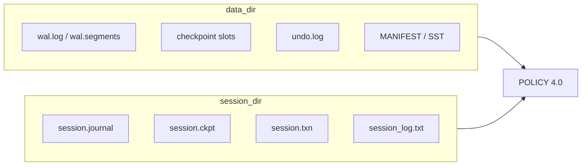

# 二十九期：perf 门禁、运维向可观测性索引、MIT 许可与 POLICY 读者路线图

**状态**：文档与工具链落地（见 [`CHANGELOG.md`](CHANGELOG.md) `[Unreleased]`）。**非目标**：本期内 **不** 引入 Prometheus / OpenTelemetry / 统一 metrics 导出协议；以 **磁盘文件 + 进程内 API** 为「可观测性 MVP」。

---

## 1. Perf 门禁（`structdb_bench`）

- **基线**：[`benchmarks/baselines/structdb_bench_baseline.json`](../benchmarks/baselines/structdb_bench_baseline.json)（Google Benchmark JSON）。
- **对比**：[`benchmarks/scripts/compare_bench.py`](../benchmarks/scripts/compare_bench.py)，默认按 **`real_time`（ns/次）** 与基线比较 **`--max-ratio`**（默认 **1.5**）。
- **手册与 CMake**：[`benchmarks/README.md`](../benchmarks/README.md)、[`POLICY.md`](POLICY.md) **§6.2**、根 `CMakeLists.txt` 的 **`STRUCTDB_ENABLE_PERF_GATE`**（`ctest -L perf`，MSVC 须 **`-C Release`**）。

---

## 2. 运维向：运行侧日志、水位与会话文件

下列关系与 **权威顺序** 仍以 [`POLICY.md`](POLICY.md) **§4.0** 为准；本节为 **排障索引**。

### 2.1 会话活动日志 `session_log.txt`

- **写入时机**：每次 **`EmbedClient::open`** 成功追加 **`SESSION_OPEN`**（UTC、pid、与 embed/引擎相关的**水位字段**）；**`close`** 追加 **`SESSION_CLOSE`**。
- **轮转**：超过 **2MiB** 轮转为 **`session_log.arch.*`**，至多保留 **12** 份归档（详见 [`CHANGELOG.md`](CHANGELOG.md) C API 1.7.0 小节）。
- **API**：**`structdb_embed_get_session_log_path_utf8`**（C API；见 [`PHASE28.md`](PHASE28.md)）。
- **用途**：确认某次进程生命周期内会话目录是否按预期打开/关闭；**不**参与崩溃恢复权威（权威仍为 **WAL + checkpoint + journal** 组合，见 **§4.0.3**）。

### 2.2 会话与恢复文件（`session_dir`）

| 文件 | 摘要 |
|------|------|
| **`session.journal`** | embed 批次 journal；与 **`session.ckpt`**、幂等 token 配合跨重启恢复未 ack 批次。 |
| **`session.ckpt`** | 会话 ack；第三行可记引擎 **`checkpoint_seq`**（与 POLICY §4 / §3.4 关联）。 |
| **`session.txn`** | MDB **未提交** 逻辑状态（`BEGIN` / `TXNV2` 等）；损坏或无法解析时可能被丢弃（见 `CHANGELOG`）。 |
| **`session_log.txt`** | 活动日志（§2.1），**非** WAL 权威。 |

### 2.3 水位与读视图（对照 `SHOW SNAPSHOT` / `SHOW TXN`）

| 名称（概念） | 典型含义 | 文档 |
|--------------|----------|------|
| **`latest_commit_seq`** | 存储引擎已分配/可见的提交序号上沿 | `POLICY` §4.1、`CHANGELOG` |
| **`read_snapshot_seq`（embed）** | 非事务脚本与 embed 读视图对齐的序号 | C API 查询、[`PHASE28.md`](PHASE28.md) |
| **事务内 `storage_read_seq` / `txn_storage_read_seq`** | `TXNISOLATION snapshot` 固定 `BEGIN` 时序号；`read_committed` 随 `latest_commit_seq` | **`POLICY` §4.1**、**`SHOW SNAPSHOT`** |
| **`BEGIN` 时 `undo_stack_` 深度** | 链式 **`ROLLBACK`**（`mdb_chain_rollback_on_mdb_rollback=true`）弹栈目标 | **`POLICY` §4.3**、[`PHASE23.md`](PHASE23.md) |

读路径审计表见 [`TESTING_TXN_CHAIN.md`](TESTING_TXN_CHAIN.md)。

### 2.4 引擎侧压力与背压（进程内 / 调试）

- **Facade → Scheduler**：`storage_pressure_snapshot`、`sync_scheduler_budget_from_storage_pressure`（**WAL 队列**、**CompactionSlots**、MemTable 等映射到 `ResourceBudget`），见 **`POLICY` §2.1** 背压索引。
- **GraphExecutor**：在 **`use_budget_probe`** 下对 **WalQueueDepth、CompactionSlots、MemTableBytes** 做预算探测，使 **`Orchestrator::on_backpressure`** 可观测（[`PHASE22.md`](PHASE22.md) **22B**）。
- **说明**：上述为 **进程内信号**与测试钩子向；**不是** 面向生产的 metrics 抓取规范。完整监控栈（抓取、告警、大盘）留待后续工程化。

---

## 3. 必读 `POLICY` 段落（单键版本、语义受限、`ROLLBACK` 与存储）

仅 **索引 + 结论**；论证仍以 `POLICY` 正文为准。

| 主题 | 结论一句 | 详阅 |
|------|----------|------|
| **单键「版本」与读裁剪** | `mdb$` 为 **`commit_seq` 读裁剪**下的可见性；**不是** InnoDB 式行多版本链。 | **`POLICY` §4.1**（`read_max_seq`）、根 `README.md` MVCC 段 |
| **语义受限** | **`undo_stack_`** 为进程内 LIFO；`BEGIN` 快照深度与链式回滚依赖 **单写者**；其他路径并发版本化写与活跃 MDB 事务交错为 **未定义**。 | **`POLICY` §4.3**「受限语义」、[`PHASE24.md`](PHASE24.md) |
| **`ROLLBACK` 与存储（默认）** | 默认 **`mdb_chain_rollback_on_mdb_rollback=false`**：**`ROLLBACK`** 只恢复会话 **`current` / `session.txn`**，**不**链式撤销已落盘 `mdb$` 写。 | **`POLICY` §3.1**、**§4.3** |
| **链式 `ROLLBACK`（可选）** | **`mdb_chain_rollback_on_mdb_rollback=true`** 且 **`mdb_persist_in_begin=true`** 等条件下，先 **`rollback_embed_undo_until`** 至 **`BEGIN` 记录的栈深**，再恢复会话表。 | **`POLICY` §4.3**、[`PHASE23.md`](PHASE23.md)、[`TXN_BEGIN_PERSIST_DESIGN.md`](TXN_BEGIN_PERSIST_DESIGN.md) |
| **崩溃后会话与 undo 水位** | `session.txn` 重放后 **`txn_undo_stack_depth_at_begin` 不自动从磁盘恢复**；链式存储回滚须新 **`BEGIN`** 再采水位。 | [`PHASE23.md`](PHASE23.md) |

---

## 4. 与 MIT 许可、仓库根 `LICENSE`

StructDB **自有代码**以根目录 **`LICENSE`**（**MIT**）授权；`ThirdParty/*` 仍各循其许可证（见根 `README.md`）。
