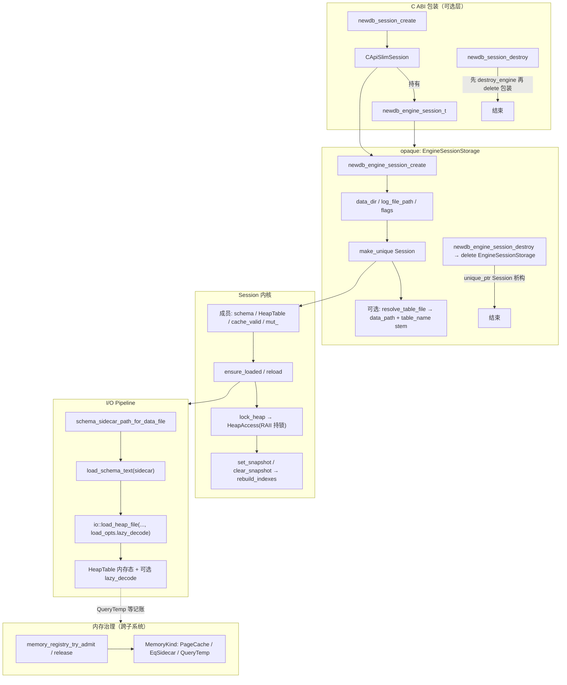
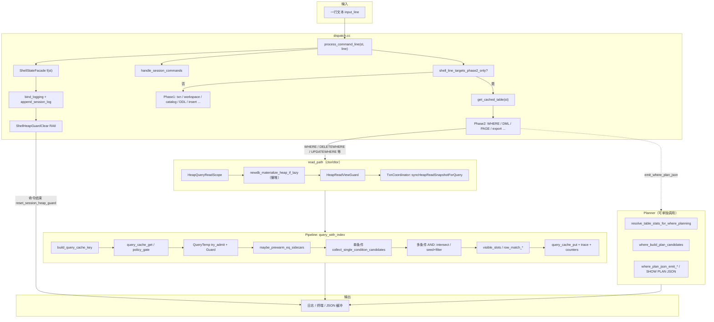
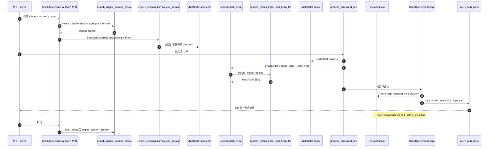
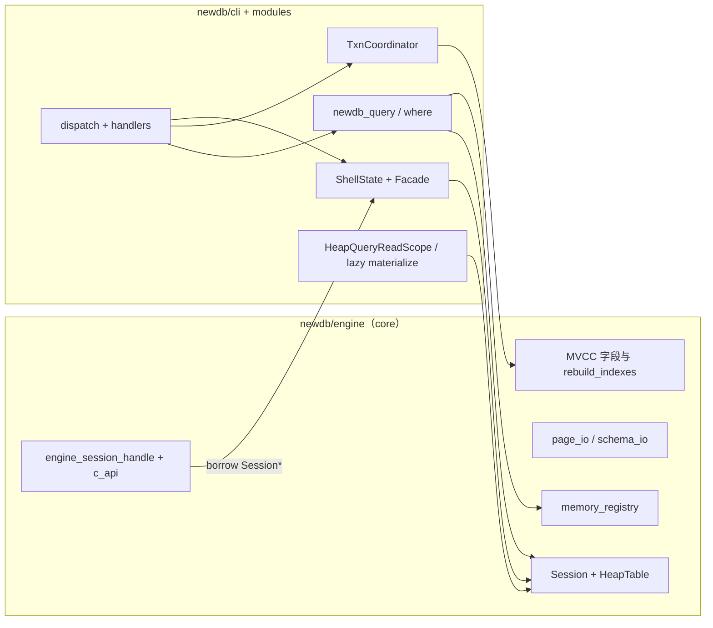
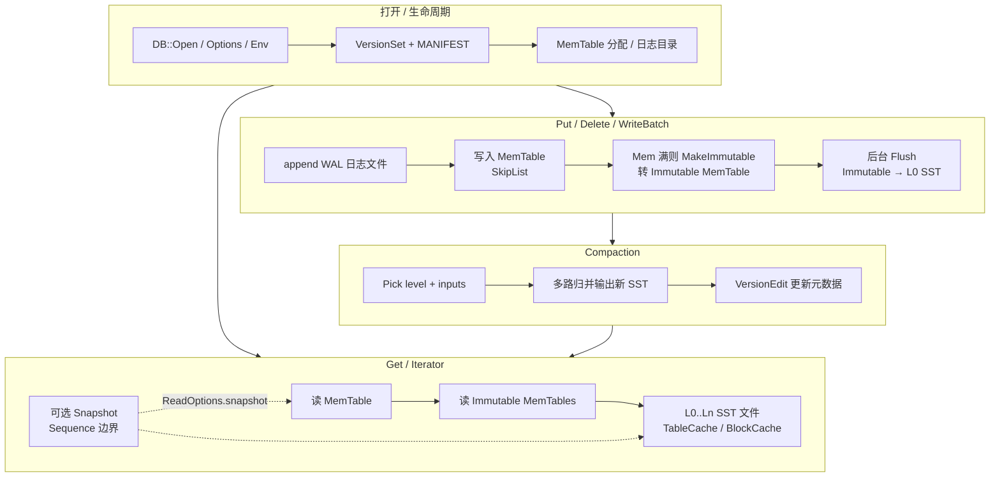
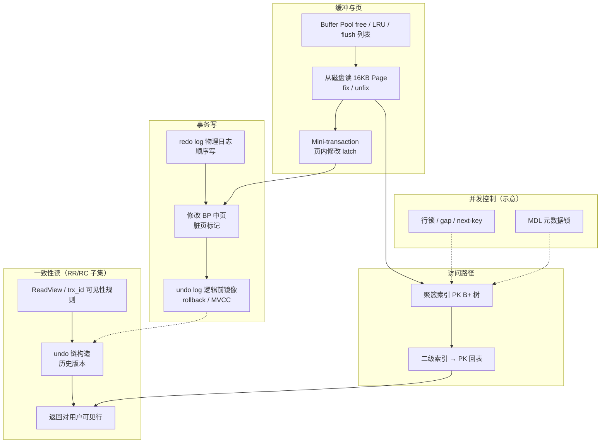
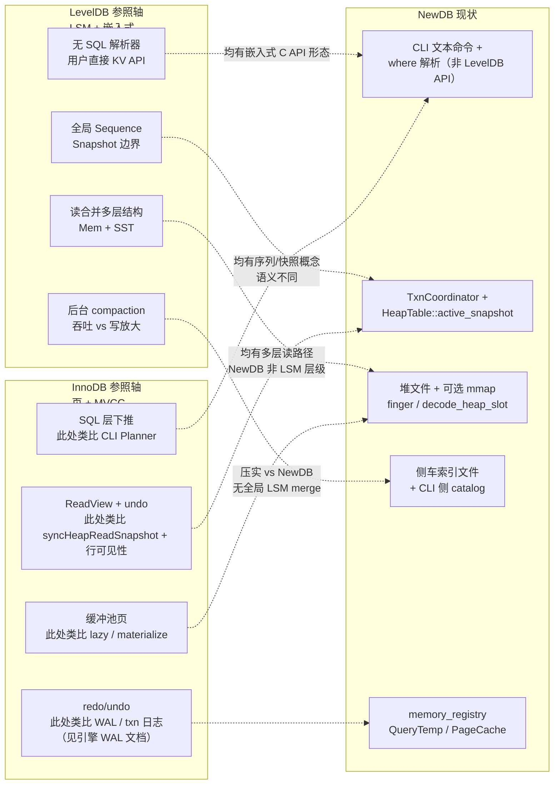

# NewDB：ctor/dtor + Facade + Planner + Pipeline 架构解析（Engine / CLI 分册）

本文用 **构造/析构（ctor/dtor）**、**门面（Facade）**、**计划器（Planner）**、**执行管线（Pipeline）** 四个透镜分别解析 **`newdb/engine`（引擎侧）** 与 **`newdb/cli` + `cli/modules`（CLI 侧）**，并给出 **Engine↔CLI 协作**，以及与 **LevelDB**（LSM、嵌入式 KV）、**InnoDB**（B+ 树聚簇、缓冲池、redo/undo、MVCC）的 **存储与读路径对照**（含 Mermaid）。代码引用使用仓库路径，便于 IDE 跳转。

**边界一句话**

| 侧 | 根目录 | 典型职责 |
|----|--------|----------|
| **Engine** | `newdb/engine/` | `Session` / `HeapTable` / MVCC 快照字段、堆文件与 schema I/O、`memory_registry`、WAL 与恢复、`newdb_engine_session_*` 不透明句柄、C ABI 入口（可再桥接 CLI） |
| **CLI** | `newdb/cli/`、`newdb/cli/modules/` | 命令路由、`ShellState`/`Facade`、事务协调 `TxnCoordinator`、WHERE **解析+计划+执行**（`newdb_query`）、读路径 RAII（`HeapQueryReadScope`）、侧车与统计文件 |

> **Planner**（谓词候选、成本 JSON）与 **Pipeline**（`query_with_index` 真正产出 slot）的 **主要代码体** 在 CLI 的 `where` / `newdb_query`；引擎提供 **堆数据、可见性、内存准入** 等「执行 substrate」，本身 **不** 实现 SQL 风格多表优化器。

---

## A. 引擎侧（Engine）

### A.0 引擎侧四透镜映射

| 透镜 | Engine 落点 | 说明 |
|------|-------------|------|
| **ctor/dtor** | `EngineSessionStorage`、`newdb::Session`、`Session::HeapAccess`、`newdb_engine_session_create/destroy` | C 句柄持有 `unique_ptr<Session>`；`delete` 句柄即析构整条引擎会话存储链 |
| **Facade** | `newdb_engine_session_t` 不透明指针、`engine_session_borrow_cpp_session`、`c_api.h` / `c_api.cpp`（内嵌或插件 backend） | 对外隐藏 `Session` 布局；C++ 侧通过 borrow 访问 |
| **Planner** | **无独立 SQL 优化器** | 提供 `TableSchema`、`HeapTable::logical_row_count`、`memory_registry`（含 `MemoryKind::QueryTemp`）等 **被 CLI 计划器消费** 的能力 |
| **Pipeline** | `Session::reload` / `ensure_loaded`、`io::load_heap_file`、`HeapTable` + `MVCCSnapshot`、`HeapTable::materialize_all_rows` | 从磁盘/sidecar **装载** 与 **行存储语义**；可见行集合由快照 + 表内逻辑配合 CLI 查询 |

### A.1 ctor/dtor：引擎会话句柄与 `Session`

**C API 会话存储**：`newdb_engine_session_create` 分配 `EngineSessionStorage`（内部 `unique_ptr<newdb::Session>`），并填充 `data_dir`、`log_file_path`、可选默认表路径解析。

```66:96:newdb/engine/src/session/api/engine_session_handle.cpp
newdb_engine_session_t* newdb_engine_session_create(const char* data_dir_c,
                                                    const char* default_table_c,
                                                    const char* log_path_c,
                                                    const uint32_t flags) {
    try {
        auto impl = std::make_unique<EngineSessionStorage>();
        impl->flags = flags;
        impl->data_dir = null_to_str(data_dir_c);
        impl->log_file_path = null_to_str(log_path_c);
        impl->session = std::make_unique<newdb::Session>();

        const std::string rel_or_abs = null_to_str(default_table_c);
        if (!rel_or_abs.empty()) {
            namespace fs = std::filesystem;
            const fs::path p(rel_or_abs);
            impl->session->table_name = p.stem().string();
            impl->session->data_path = resolve_table_file(impl->data_dir, rel_or_abs);
        }

        return reinterpret_cast<newdb_engine_session_t*>(impl.release());
    } catch (...) {
        return nullptr;
    }
}

void newdb_engine_session_destroy(newdb_engine_session_t* session) {
    if (session == nullptr) {
        return;
    }
    delete reinterpret_cast<EngineSessionStorage*>(session);
}
```

**`Session` 本体**：持有 `data_path`、`table_name`、`TableSchema schema`、`HeapTable table`、`cache_valid` 与 **`mut_`**；`HeapAccess` 在 `lock_heap` 成功路径上 **持有 unique_lock 直到析构**。

```22:75:newdb/engine/include/newdb/session.h
struct Session {
    class HeapAccess {
        friend struct Session; // lock_heap() packs the held mutex into `lock_`.

        std::optional<std::unique_lock<std::mutex>> lock_{};
        Session* session_{nullptr};
        bool ok_{false};

    public:
        HeapAccess() = default;
        HeapAccess(HeapAccess&& o) noexcept = default;
        HeapAccess& operator=(HeapAccess&& o) noexcept = default;
        HeapAccess(const HeapAccess&) = delete;
        HeapAccess& operator=(const HeapAccess&) = delete;
        ~HeapAccess();

        explicit operator bool() const noexcept { return ok_ && session_ != nullptr; }

        [[nodiscard]] HeapTable* table() noexcept { return (*this) ? &session_->table : nullptr; }
        [[nodiscard]] const HeapTable* table() const noexcept {
            return (*this) ? &session_->table : nullptr;
        }
        [[nodiscard]] Session& session() noexcept { return *session_; }
        [[nodiscard]] const Session& session() const noexcept { return *session_; }
    };

    std::string data_path;   // e.g. users.bin
    std::string table_name;  // logical table name (stem)
    TableSchema schema;
    HeapTable table;
    bool cache_valid{false};

    mutable std::mutex mut_;
    // ...
    [[nodiscard]] HeapAccess lock_heap(const char* log_file);
    HeapTable* mutable_heap(const char* log_file);
};
```

**加载管线（引擎 Pipeline 核心）**：`reload` 读 sidecar schema，再 `load_heap_file`；支持 `NEWDB_LAZY_HEAP` 环境变量打开 lazy decode。

```24:37:newdb/engine/src/session/api/session.cpp
Status session_reload_impl(Session& s) {
    const std::string sidecar = schema_sidecar_path_for_data_file(s.data_path);
    const Status s1 = load_schema_text(sidecar, s.schema);
    if (!s1.ok) {
        return s1;
    }
    HeapLoadOptions load_opts{};
    const char* lazy_env = std::getenv("NEWDB_LAZY_HEAP");
    if (lazy_env != nullptr && std::strcmp(lazy_env, "1") == 0) {
        load_opts.lazy_decode = true;
    }
    const Status s2 = io::load_heap_file(s.data_path.c_str(), s.table_name, s.schema, s.table, load_opts);
    s.cache_valid = s2.ok;
    return s2;
}
```

**快照与索引重建（与 MVCC 读视图配合）**：

```75:85:newdb/engine/src/session/api/session.cpp
void Session::set_snapshot(const MVCCSnapshot& snapshot) {
    std::lock_guard<std::mutex> g(mut_);
    table.set_snapshot(snapshot);
    table.rebuild_indexes(schema);
}

void Session::clear_snapshot() {
    std::lock_guard<std::mutex> g(mut_);
    table.clear_snapshot();
    table.rebuild_indexes(schema);
}
```

### A.2 Facade：不透明句柄与 C ABI

- **`newdb_engine_session_t`**：C 侧仅见指针；实现体为 `EngineSessionStorage`（见上）。  
- **Borrow**：`engine_session_borrow_cpp_session` 将 opaque 转回 `Session*`，供 `ShellState(ShellStateEngineBorrowedTag{}, …)` 等使用。

**Slim C API** 在会话包装层再次体现 ctor/dtor 顺序：`CApiSlimSession` 持有 `engine` 指针，`newdb_session_destroy` 先 `newdb_engine_session_destroy` 再 `delete` 包装器。

```123:146:newdb/engine/src/api/c/c_api_slim.cpp
newdb_session_handle newdb_session_create(const char* data_dir,
                                          const char* table_name,
                                          const char* log_file_path) {
    try {
        auto ptr = std::make_unique<CApiSlimSession>();
        ptr->engine = newdb_engine_session_create(data_dir, table_name, log_file_path, 0);
        if (ptr->engine == nullptr) {
            return nullptr;
        }
        ptr->last_error = NEWDB_OK;
        return ptr.release();
    } catch (...) {
        return nullptr;
    }
}

void newdb_session_destroy(newdb_session_handle handle) {
    auto* ptr = static_cast<CApiSlimSession*>(handle);
    if (ptr == nullptr) {
        return;
    }
    newdb_engine_session_destroy(ptr->engine);
    delete ptr;
}
```

**非 slim / 非 plugin 构建**：`c_api.cpp` 通过 `#include <newdb/c_api_cli_bridge.h>` 将会话命令导入与 `newdb_demo` 相同的 CLI 栈（与 `read_path_policy.h` 文档一致）。

```1:22:newdb/engine/src/api/c/c_api.cpp
#include <newdb/c_api.h>
#include <newdb/c_api_helpers.h>
#include <newdb/read_path_policy.h>
#include <newdb/schema.h>
#include <newdb/schema_io.h>

#if !defined(NEWDB_C_API_PLUGIN_BACKEND)
#include <newdb/c_api_cli_bridge.h>
#else
#include <newdb/cli_backend_abi.h>
```

```1:13:newdb/engine/include/newdb/read_path_policy.h
/// Read-path / MVCC snapshot policy for newdb.
///
/// User-visible reads that honor transaction isolation must refresh
/// `HeapTable::active_snapshot` through `TxnCoordinator::syncHeapReadSnapshotForQuery`
/// (typically via `HeapQueryReadScope` / `HeapReadViewGuard(TxnCoordinator&, HeapTable&)` in
/// `cli/shell/read_path/heap_query_read_scope.h` and `heap_read_view_guard.h`).
///
/// The C API (`engine/src/api/c/c_api.cpp`) routes SQL-like commands through the same
/// CLI dispatch stack as `newdb_demo`, so interactive CLI, embedding tests, and the
/// shared library share one snapshot-selection implementation.
```

### A.3 Planner（引擎视角）

引擎 **不** 维护 `where_build_plan_candidates` 这类谓词计划树；其「计划相关」职责是：

1. **提供统计与行数真相**：`HeapTable::logical_row_count`、表级统计文件由 CLI 侧解析后注入 `WhereQueryContext`（见 `plan_impl.cc` / `table_stats`）。  
2. **全局内存准入**：`memory_registry_try_admit(MemoryKind::QueryTemp, …)` 与 `QueryTemp` 释放，与 CLI `where_plan_impl_try_admit_query_temp` 闭环（见 `memory_registry.h`）。

```23:28:newdb/engine/include/newdb/memory_registry.h
/// Memory-heavy subsystems registered with the global registry (Phase 5 v2 closed loop).
enum class MemoryKind : int {
    PageCache = 0,
    EqSidecar = 1,
    QueryTemp = 2,
};
```

### A.4 Pipeline（引擎视角）

引擎侧「执行」= **把字节变成可迭代的堆行状态**：`ensure_loaded` → `load_heap_file`；lazy 模式下 `rows` 可为空，由 `heap_file_` + `heap_fingers_` 提供 `logical_row_count`；CLI 侧 `newdb_materialize_heap_if_lazy` 最终调用 **`HeapTable::materialize_all_rows`** 将存储背板展开为内存行向量。

```32:63:newdb/engine/include/newdb/heap_table.h
    // When `load_heap_file(..., HeapLoadOptions{.lazy_decode=true})` succeeds, rows stay empty and
    // logical rows are served from `heap_file_` + finger table (mmap or fread per page).
    std::shared_ptr<const HeapFileReadView> heap_file_;
    std::vector<int> heap_sorted_ids_;
    std::vector<HeapRowFinger> heap_fingers_;
    // ...
    [[nodiscard]] bool is_heap_storage_backed() const noexcept {
        return heap_file_ != nullptr;
    }

    [[nodiscard]] std::size_t logical_row_count() const noexcept {
        return is_heap_storage_backed() ? heap_fingers_.size() : rows.size();
    }

    // Decode one logical row by slot index (same numbering as `index_by_id` values when storage-backed).
    [[nodiscard]] bool decode_heap_slot(std::size_t slot, Row& out) const;

    // Expand storage-backed rows into `rows` and drop the mmap/file view (classic in-memory table).
    [[nodiscard]] Status materialize_all_rows(const TableSchema& schema);
```

WAL、页缓存、恢复管线在同库其它 TU 中，与 **会话加载** 共同构成引擎写/读 **I/O Pipeline**（本文不展开 WAL 状态机；见 `wal_manager` 与存储文档）。

### A.5 图示：引擎侧 ctor/dtor 与数据装载（完整化）



---

## B. CLI 侧（Shell + Modules + newdb_query）

### B.0 CLI 侧四透镜映射

| 透镜 | CLI 落点 | 说明 |
|------|----------|------|
| **ctor/dtor** | `ShellState` / `ShellStateOwner`、`HeapQueryReadScope`、`HeapReadViewGuard`、`ShellHeapGuardClear` | 聚合 txn/WHERE/LSM；读路径 **RAII** 安装/恢复 MVCC；命令结束清 heap guard |
| **Facade** | `ShellStateFacade`、`process_command_line` | handler 窄表面；dispatch 可不含 `shell_state.h` |
| **Planner** | `where_build_plan_candidates`、`where_estimate_scan_rows`、`where_plan_catalog_*`、JSON emit | 候选计划 + 启发式成本 + 可观测输出 |
| **Pipeline** | `query_with_index`、`query_cache_*`、`where_policy_gate`、`collect_single_condition_candidates`、`row_match_*` | 在 **已同步读快照** 的 `HeapTable` 上产出匹配 slot |

### B.1 ctor/dtor

```14:31:newdb/cli/shell/state/shell_state.cc
ShellState::ShellState()
    : impl_(std::make_unique<Impl>()) {
    impl_->session_ = std::make_unique<newdb::Session>();
    impl_->heap_guard_box_ = std::make_unique<shell_state_detail::HeapGuardBox>();
    impl_->txn_where_ = std::make_unique<ShellTxnWhereRuntime>();
    impl_->lsm_sidecar_ = std::make_unique<ShellLsmSidecarRuntime>();
}

ShellState::ShellState(ShellStateEngineBorrowedTag, newdb_engine_session_t* engine_host)
    : impl_(std::make_unique<Impl>()) {
    impl_->engine_session_borrow_ = engine_host;
    impl_->session_.reset();
    impl_->heap_guard_box_ = std::make_unique<shell_state_detail::HeapGuardBox>();
    impl_->txn_where_ = std::make_unique<ShellTxnWhereRuntime>();
    impl_->lsm_sidecar_ = std::make_unique<ShellLsmSidecarRuntime>();
}

ShellState::~ShellState() = default;
```

```209:221:newdb/cli/shell/state/shell_state.cc
ShellStateOwner::ShellStateOwner() {
    engine_ = newdb_engine_session_create("", nullptr, nullptr, 0);
    if (engine_ == nullptr) {
        shell_ = std::make_unique<ShellState>();
        return;
    }
    shell_ = std::make_unique<ShellState>(ShellStateEngineBorrowedTag{}, engine_);
}

ShellStateOwner::~ShellStateOwner() {
    shell_.reset();
    newdb_engine_session_destroy(engine_);
    engine_ = nullptr;
}
```

```13:28:newdb/cli/shell/read_path/heap_query_read_scope.h
    HeapQueryReadScope(TxnCoordinator& txn,
                       newdb::HeapTable& tbl,
                       const newdb::TableSchema& sch,
                       TxnCoordinator* lazy_stats_txn = nullptr) {
        if (tbl.is_heap_storage_backed()) {
            status_ = newdb_materialize_heap_if_lazy(tbl, sch, lazy_stats_txn);
            if (!status_.ok) {
                return;
            }
        }
        guard_.emplace(txn, tbl);
    }
```

```41:48:newdb/cli/shell/dispatch/router/dispatch.cc
    struct ShellHeapGuardClear {
        ShellStateFacade* f;
        ~ShellHeapGuardClear() {
            if (f != nullptr) {
                f->reset_session_heap_guard();
            }
        }
    } shell_heap_clear{&f};
```

### B.2 Facade

```26:37:newdb/cli/shell/state/shell_state_facade.h
/// Non-owning view over `ShellState` for handlers that should depend on a narrow surface.
/// Implementation is in `shell_state_facade.cc` so this header avoids pulling `txn_manager.h` / `where.h`.
struct ShellStateFacade {
    ShellState& st;

    explicit ShellStateFacade(ShellState& shell) noexcept;

    [[nodiscard]] TxnCoordinator& txn() noexcept;
    [[nodiscard]] const TxnCoordinator& txn() const noexcept;
    [[nodiscard]] WhereQueryContext& where() noexcept;
    [[nodiscard]] const WhereQueryContext& where() const noexcept;
    [[nodiscard]] newdb::Session& session() noexcept;
    [[nodiscard]] const newdb::Session& session() const noexcept;
```

```17:20:newdb/cli/shell/dispatch/router/dispatch.cc
bool process_command_line(ShellState& st, const char* input_line) {
    ShellStateFacade f(st);
    std::string& current_table = f.table_name();
    std::string& current_file = f.data_path();
```

### B.3 Planner

```319:334:newdb/cli/modules/where/executor/plan/plan_impl.cc
std::vector<PlanCandidate> where_build_plan_candidates(const newdb::HeapTable& tbl,
                                                       const newdb::TableSchema& schema,
                                                       const std::vector<WhereCond>& conds,
                                                       WherePlanningStatsRef stats) {
    const TableStats* stats_hint = stats.table_stats;
    const std::size_t n = tbl.logical_row_count();
    const std::uint64_t qt_est_plan =
        where_plan_detail::query_temp_est_bytes(n, conds.empty() ? 1 : conds.size(), stats_hint);
    if (!where_plan_impl_try_admit_query_temp(qt_est_plan)) {
        return where_plan_candidate_fallback_heap_scan_only(n);
    }
    where_plan_detail::QueryTempBytesGuard qt_guard_plan(qt_est_plan, nullptr);
    std::map<std::string, double> best;
    where_plan_candidate_cost_seed(best, tbl, schema, conds, n, stats_hint);
    return where_plan_candidate_materialize_sorted(best, n);
}
```

### B.4 Pipeline

```9:23:newdb/cli/shell/read_path/query_with_index_under_read_scope.cc
bool query_with_index_under_heap_read_scope(TxnCoordinator& txn,
                                            newdb::HeapTable& tbl,
                                            const newdb::TableSchema& schema,
                                            WhereQueryContext& where_ctx,
                                            const std::vector<WhereCond>& conds,
                                            std::vector<std::size_t>& out,
                                            const char* verb_tag,
                                            const char* log_file) {
    const HeapQueryReadScope heap_read_scope(txn, tbl, schema, &txn);
    if (!heap_read_scope.ok()) {
        log_and_print(log_file, "%s %s\n", verb_tag, heap_read_scope.materialize_status().message.c_str());
        return false;
    }
    out = query_with_index(tbl, schema, conds, &where_ctx);
    return true;
}
```

```448:506:newdb/cli/modules/where/executor/plan/plan_impl.cc
std::vector<std::size_t> query_with_index(const newdb::HeapTable& tbl,
                                          const newdb::TableSchema& schema,
                                          const std::vector<WhereCond>& conds,
                                          WhereQueryContext* ctx_ptr) {
    std::vector<std::size_t> result;
    WhereQueryContext& ctx = (ctx_ptr != nullptr) ? *ctx_ptr : default_where_context();
    where_policy_set(ctx, false, "");
    ctx.query_count.fetch_add(1, std::memory_order_relaxed);
    // ...
    const std::size_t n = tbl.logical_row_count();
    const bool has_or = std::any_of(conds.begin(), conds.end(), [](const WhereCond& c) {
        return c.logic_with_prev == "OR";
    });
    const auto estimate_scan_rows = [&](const std::vector<WhereCond>& in) -> std::size_t {
        return where_estimate_scan_rows(tbl, schema, in, ctx_ptr);
    };
    where_plan_detail::QueryTraceGuard trace(n, conds.size(), &ctx);
    const std::string cache_key = build_query_cache_key(tbl, schema, conds);
    if (query_cache_get(ctx, cache_key, result)) {
        const bool policy_bypass = (conds.size() == 1 && is_single_cond_index_friendly(conds[0], schema));
        if (!policy_bypass &&
            !where_policy_gate("cache_hit", n, conds.size(), estimate_scan_rows(conds), has_or, ctx)) {
            return {};
        }
        return result;
    }

    if (conds.empty()) {
        const std::uint64_t qt_est = where_plan_detail::query_temp_est_bytes(n, 1, ctx.query_stats_hint);
        if (!where_plan_impl_try_admit_query_temp(qt_est)) {
            return {};
        }
        where_plan_detail::QueryTempBytesGuard qt_guard(qt_est, &ctx);
        result = visible_slots_for_query(tbl, schema, n);
        query_cache_put(ctx, cache_key, result);
        return result;
    }
```

库边界：[`NEWDB_QUERY_LAYER.md`](NEWDB_QUERY_LAYER.md)；分层：[`SHELL_STATE_LAYERING.md`](../dev/SHELL_STATE_LAYERING.md)。

### B.5 图示：CLI 单条命令从路由到 WHERE Pipeline（完整化）



---

## C. Engine ↔ CLI 协作（端到端）

### C.1 序列图：从引擎句柄到 CLI dispatch（典型嵌入路径）



### C.2 组件图：职责切片



---

## D. 与 LevelDB、InnoDB 的对照（存储与读路径）

说明：**LevelDB** 指 Google LevelDB 及其常见用法（嵌入式、LSM、WAL+MemTable+SST）；**InnoDB** 指 MySQL/MariaDB 中的 **InnoDB 存储引擎子系统**（聚簇 B+ 树、缓冲池、redo/undo、一致性读）。二者都不是 NewDB 的「上游依赖」，而是 **业界参照系**：NewDB 当前以 **堆表文件 + 可选 mmap 惰性解码 + 侧车索引 + 会话内 MVCC 快照** 为主，与 LevelDB 的 **按 user-key 分层合并**、InnoDB 的 **页级缓冲与多版本行** 均 **不完全同构**，下表与图示突出 **可比维度** 与 **差异**。

### D.1 LevelDB：写路径、读路径、压实（完整化示意）



### D.2 InnoDB：缓冲池、B+ 树、redo/undo、一致性读（完整化示意）



### D.3 NewDB：在「LevelDB 轴」与「InnoDB 轴」上的落点（示意）



### D.4 三向对照表（Engine / CLI 分列）

| 维度 | LevelDB | InnoDB | NewDB **Engine** | NewDB **CLI** |
|------|-----------|--------|------------------|---------------|
| **数据模型** | user_key → value 字节串 | 表行 + PK 聚簇 + 二级索引 | 单表 `HeapTable` 逻辑行 slot、`Row` 向量或 mmap finger | schema、WHERE 条件、`PlanCandidate` 标签 |
| **主要磁盘形态** | WAL + SST 多层 | 表空间页 + redo/undo | `.bin` 堆文件、schema sidecar、WAL（引擎） | 侧车（eq/page/visibility 等）**独立文件** |
| **读放大结构** | MemTable + 多层 SST 归并 | BP + B+ 树层级遍历 | `decode_heap_slot` / `materialize_all_rows`、页缓存类路径 | `query_with_index`、sidecar **预热点**、结果 cache |
| **快照 / 多版本** | `Snapshot` 基于 sequence；**无**行级 undo 链 | ReadView + undo 版本链 | `HeapTable::active_snapshot` + `is_row_visible` | `HeapReadViewGuard` → `syncHeapReadSnapshotForQuery` |
| **「Planner」** | 无；仅 bloom / 层选择 | 优化器在 Server 层；引擎暴露统计/索引 | 无 SQL 优化器；`logical_row_count`、`memory_registry` | `where_build_plan_candidates`、`where_estimate_scan_rows` |
| **「Compaction」** | 核心后台路径 | change buffer merge、purge、flush | 无 LevelDB 式全局 compaction；可有 vacuum/存储治理（见专门文档） | LSM **shell 缓存**名系调参面，**非** LevelDB 内核 |
| **嵌入方式** | 库链接 + `DB` 句柄 | 通常随 mysqld；libmysqlclient 不暴露 InnoDB 直接 API | `newdb_engine_session_t` + `Session` borrow 或自有 `Session` | `ShellState` / C API → `c_api_cli_bridge` → `dispatch` |

**读路径一句话对齐**

- **像 LevelDB**：一次读往往要 **组合多个内部结构**（LevelDB：mem+immutable+多层 SST；NewDB：`heap_file_` finger **或** 物化后的 `rows` + 可选侧车短路）。  
- **像 InnoDB**：事务可见读依赖 **显式读视图安装**（InnoDB：ReadView；NewDB：`syncHeapReadSnapshotForQuery` + `read_path_policy` 与 `HeapQueryReadScope` 约定）。

---

## E. 优缺点与演进（分侧）

### E.1 引擎侧

**优点**：`Session` 与 `HeapAccess` 的 **mutex 契约** 写进头文件；`engine_session` 不透明句柄利于 ABI 演进；`memory_registry` 把 **QueryTemp** 与页缓存、侧车统一在进程级治理叙事中。

**缺点**：优化器缺失导致 **所有「聪明选路」** 集中在 CLI；引擎单独嵌入时若绕过 `read_path_policy` 约定，易出现 **快照与 lazy 物化顺序** 错误。

**演进**：强化 `read_path_policy` 的静态检查或 lint；继续把「读视图刷新」必需条件收敛到更少入口；评估将部分 `query_with_index` 的 **纯表扫描子路径** 下沉为 engine 可复用 API（需严格 ABI 评审）。

### E.2 CLI 侧

**优点**：Facade + `newdb_query` 拆分编译单元；读路径 RAII 与 dispatch 清理对称；计划与执行共享 QueryTemp 估计。

**缺点**：`plan_impl.cc` 计划与执行交织；dispatch 仍部分传 `ShellState&`；启发式成本仍重。

**演进**：见 [`TRACK_Q_WHERE_SINK_EPIC.md`](../dev/TRACK_Q_WHERE_SINK_EPIC.md)、[`NEWDB_QUERY_LAYER.md`](NEWDB_QUERY_LAYER.md) — Track Q 阶段二、Planner TU 拆分、Facade 全覆盖 handler。

---

## F. 参考文档

- [`SHELL_STATE_LAYERING.md`](../dev/SHELL_STATE_LAYERING.md)  
- [`NEWDB_QUERY_LAYER.md`](NEWDB_QUERY_LAYER.md)  
- [`MODULE_BOUNDARIES.md`](MODULE_BOUNDARIES.md)  
- [`TRACK_Q_WHERE_SINK_EPIC.md`](../dev/TRACK_Q_WHERE_SINK_EPIC.md)  
- [`TXN_ISOLATION_AND_LOCKING.md`](../txn/TXN_ISOLATION_AND_LOCKING.md)

---

*文档版本：Engine/CLI 分册；§D 为 LevelDB / InnoDB 存储参照对比；符号迁移后以 CMake 与上述参考文档为准。*
