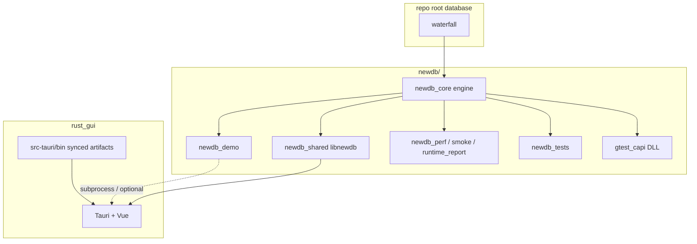
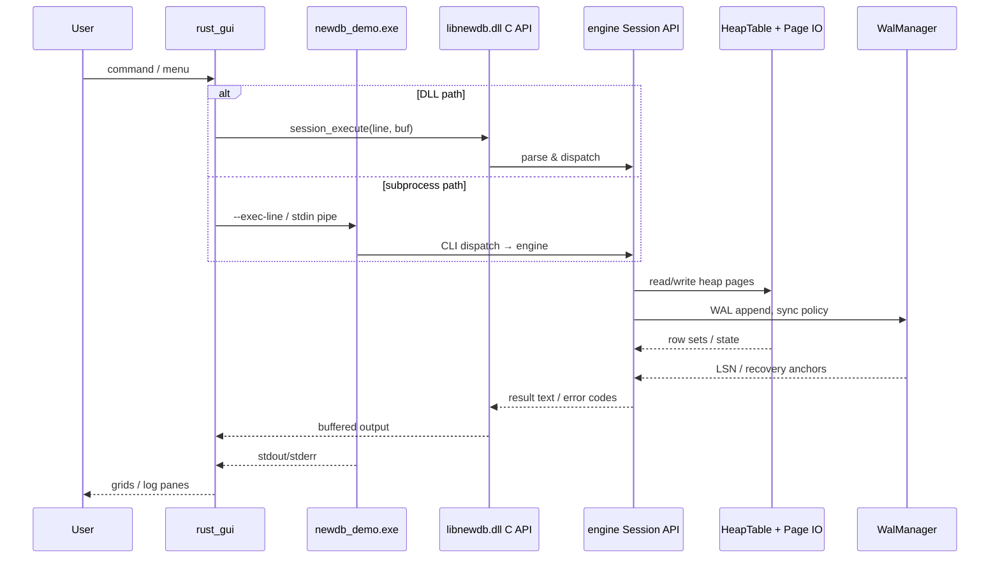
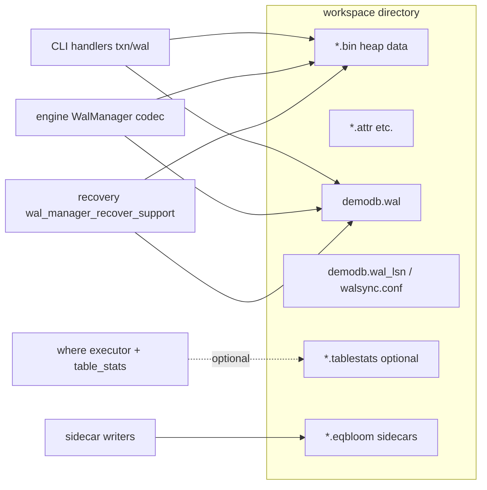

# database

[中文](readme.md) | English

A hands-on database engineering repository. This file is a **shortened** view of [`newdb/docs/architecture/PROJECT_DATAFLOW_WHOLE.md`](newdb/docs/architecture/PROJECT_DATAFLOW_WHOLE.md): **top-level layout** and **high-level data flow** only. Per-module tables, field glossaries, and CI observability details stay in the full doc.

## Repository layout

```
database/                    # repo root
├── waterfall/               # paged storage & shared foundations (linked by newdb_core)
├── newdb/                   # main tree: engine + CLI + tools + tests + Rust GUI + scripts + docs
│   ├── engine/              # storage engine (C++): heap, WAL, MVCC, C ABI, cache
│   ├── cli/                 # interactive command layer (C++): shell, dispatch, modules
│   ├── tools/               # perf, smoke, runtime_report
│   ├── tests/               # GoogleTest + gtest_capi bridge sources
│   ├── rust_gui/            # Tauri + Vue desktop GUI
│   ├── scripts/             # CI, benches, validation, soak
│   ├── docs/
│   ├── intro/               # LaTeX → PDF
│   └── CMakeLists.txt
├── gtest_capi/              # optional gtest C API sample/packaging
├── docs/                    # repo-level notes (complements newdb/docs)
├── rules/
├── Makefile
└── README.md / README.en.md
```

**Compile-time direction (macro)**: `waterfall` ← `newdb/engine` ← binaries/libs; `cli` uses public headers under `engine/include/newdb/*` only.

## Data flow: build & link



## Data flow: interactive commands (GUI / demo / C API)

One logical command may use **in-process DLL** or **demo subprocess**; both are “command text → buffers / logs”.



## Data flow: persistence & recovery (disk)



**Read path (macro)**: open table → `HeapTable` + optional page_cache → MVCC visibility → WHERE/sidecars.

**Write path (macro)**: coordinator → `WalManager` → heap & sidecar updates.

## Quick links

- Source: `newdb/` · GUI: `newdb/rust_gui/`
- PDF intro: `newdb/intro/out/newdb-intro.pdf`
- Developer guide: `docs/dev-guide.md`
- Module boundaries: `newdb/docs/architecture/MODULE_BOUNDARIES.md`
- Build & test: `newdb/docs/dev/BUILD.md`
- Full data-flow doc: [`PROJECT_DATAFLOW_WHOLE.md`](newdb/docs/architecture/PROJECT_DATAFLOW_WHOLE.md)

## Repository

- GitHub: [skyline019/database](https://github.com/skyline019/database)
