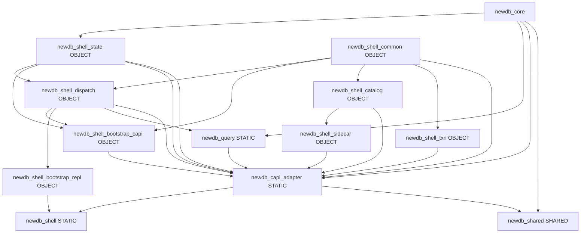

# newdb Module Boundaries

This document defines the second-stage module boundaries for `newdb`.

Decoupling roadmap index (phases, CI gates, presets): [`DECOUPLING_ROADMAP.md`](DECOUPLING_ROADMAP.md). Query static library: [`NEWDB_QUERY_LAYER.md`](NEWDB_QUERY_LAYER.md). Optional multi-repo notes: [`MULTI_REPO_PACKAGING.md`](MULTI_REPO_PACKAGING.md).

## Dependency Direction

- `cli/app` -> `cli/shell/*` -> `cli/modules/*` -> `engine/include/newdb/*`
- `engine/src/*` can depend on `engine/include/newdb/*` and other engine implementation units.
- `cli/*` must not include engine private implementation headers.
- **`waterfall/`** provides page/CRC utilities (`crc32c_compat` when system `libcrc32c` is absent); **`newdb_core`** links **`waterfall`** as a **PIC-enabled** static archive so Linux shared libraries (`libnewdb.so`, `libnewdb_cli_backend.so`) link cleanly.

## CLI Submodules

- `cli/shell/bootstrap`: process startup, argv parsing, workspace bootstrap.
- `cli/shell/repl`: interactive loop and line execution surface.
- `cli/shell/dispatch`: command routing and handler orchestration, split as:
  - `cli/shell/dispatch/router`: `process_command_line` entrypoint and `dispatch_routing` (phase-2 verb fast path).
  - `cli/shell/dispatch/registry`: demo command catalog / umbrella headers and snapshot sources.
  - `cli/shell/dispatch/handlers`: domain command handlers (ddl, dml, query, txn, session, io, workspace).
  - `cli/shell/dispatch/support`: parsing, validation, and hot-index glue used by handlers.
  - `cli/shell/dispatch/services`: background or cross-cutting dispatch services (lsm-lite, sidecar invalidation).
  - `cli/shell/dispatch/shared`: shared declarations used across dispatch units (e.g. `dispatch_internal.h`).
- `cli/shell/state`: long-lived shell/session state and state helpers. **Implementation split** (compile-time decoupling, still one aggregate root):
  - Public aggregate: `shell_state.h` (`ShellState` forward API + accessors).
  - **pimpl**: `shell_state_impl.h` + `shell_state.cc` (fields / `Session` ownership).
  - **Facade**: `shell_state_facade.{h,cc}` for read-oriented helpers without pulling the full aggregate header into every TU.
  - **Ops**: `shell_state_ops.{h,cc}` for batch/bootstrap paths that used to bloat `shell_state.cc`.
  - **Owner**: `shell_state_owner.h` for embedders (`demo_main.cc` avoids including `shell_state.h` directly).
  - Include discipline / Wave notes: [`SHELL_STATE_INCLUDE_AUDIT.md`](../dev/SHELL_STATE_INCLUDE_AUDIT.md).
- `cli/shell/diag`: diagnostic and verbose output.

- `cli/modules/common/logging|util|view`: cross-cutting logging, small utilities, and table preview output.
- `cli/modules/where/parser`: where/agg parser and parse helpers.
- `cli/modules/where/executor`: where evaluation and aggregation execution. **Planner TU split** under `executor/plan/`:
  - `plan_impl.cc` — main query planning entrypoints.
  - `plan_impl_support.{h,cc}` — shared helpers used by the planner.
  - `plan_query_index.cc` — index/sidecar-aware planning slices.
  - `plan_scan_estimate.{h,cc}` — scan row estimates / budget hints.
  - `where_plan_catalog.{h,cc}` — catalog-facing plan metadata.
  - Internal headers: `plan_impl_detail.h`, `plan_impl_internals.h` (keep cross-TU coupling narrow).
- `cli/modules/txn/coordinator`: transaction coordinator and state machine.
- `cli/modules/sidecar/eq|covering|page|visibility|common`: sidecar implementations by access pattern.

### WHERE planner / `newdb_session_where_plan_json` (roadmap fork)

Today the planner and catalog logic required by [`newdb_session_where_plan_json`](../../engine/include/newdb/c_api.h) live under **`cli/modules/where`** — **CliEmbedTier**, not engine-only ([`C_API_CAPABILITY_TIERS.md`](../dev/C_API_CAPABILITY_TIERS.md)). Two long-term options:

1. **Keep CLI embed**: document and test slim/plugin absence paths only; no migration.
2. **Sink toward engine or `newdb_query`**: move parser + plan modules behind a stable library boundary — large refactor touching ABI, GUI contracts, and CI gates — track as its own milestone before editing production layouts.

**Parallel product tracks (pick priority per release):**

- **Track P — Plugin assembly**: treat [`NEWDB_C_API_PLUGIN_BACKEND`](../../CMakeLists.txt) + [`NEWDB_BUILD_CLI_BACKEND_PLUGIN`](../../CMakeLists.txt) + `NEWDB_CLI_BACKEND_PATH` as the “fully decoupled” shipping shape; presets and CI smoke already exercise it — extend packaging/runbooks only (copy/paste layout: [`scripts/ci/plugin_backend_packaging.md`](../../scripts/ci/plugin_backend_packaging.md)).
- **Track Q — Query/WHERE milestone**: dedicated epic if choosing “sink” option 2 above; do not block routine shell refactors on Q.

## Engine Submodules

- `engine/src/session/api`: public session-facing behavior.
- `engine/src/session/table_access`: table load/cache/materialization behavior.
- `engine/src/api/c`: stable C ABI implementation (`c_api.cpp`) linked against public `newdb/c_api.h`.
- `engine/src/wal/writer|codec|checkpoint|recovery`: WAL concerns split by responsibility.
- `engine/src/mvcc/snapshot|txn_index|gc`: visibility, txn bookkeeping, cleanup.
- `engine/src/io/page`: page IO concerns.

## Shared library modes (`newdb_shared`)

| Mode | CMake | Role |
|------|-------|------|
| **Slim** | `NEWDB_SHARED_SLIM=ON` | Engine-only shared library: minimal C ABI (`c_api_slim.cpp`), no static `newdb_capi_adapter`. |
| **Plugin** | `NEWDB_C_API_PLUGIN_BACKEND=ON` + `NEWDB_BUILD_CLI_BACKEND_PLUGIN=ON` | `newdb_shared` links only `newdb_core`; full session behavior loads `newdb_cli_backend` at runtime (`NEWDB_CLI_BACKEND_PATH`). Decouples **static** CLI/shell from the main DLL. |
| **Full default** | `NEWDB_SHARED_SLIM=OFF`, plugin off | `newdb_shared` statically links `newdb_capi_adapter` (dispatch / bridge / txn / WHERE / sidecar; not REPL-only TU). **CLI embed tier**: full C API surface without claiming the DLL is free of CLI code. |

Details: [CI_SLIM_FULL_MATRIX.md](../dev/CI_SLIM_FULL_MATRIX.md), [C_API_PLUGIN_BACKEND.md](../dev/C_API_PLUGIN_BACKEND.md).

## Release assembly gates (积木阶段 1)

Ship or merge **engine/shell/C API boundary** changes only after:

| Gate | What to run / check |
|------|---------------------|
| **Full shared** | Configure `-DNEWDB_BUILD_SHARED=ON -DNEWDB_SHARED_SLIM=OFF` (clean tree); build `newdb_shared`, `newdb_capi_adapter`, `newdb_tests`, `newdb_capi_integration_tests`; `ctest -L newdb` (or project CI matrix). |
| **Slim shared** | `-DNEWDB_SHARED_SLIM=ON`; build `newdb_shared`, `newdb_capi_slim_tests`; run slim-labeled / full matrix per [CI_SLIM_FULL_MATRIX.md](../dev/CI_SLIM_FULL_MATRIX.md). |
| **Plugin backend** | `-DNEWDB_C_API_PLUGIN_BACKEND=ON -DNEWDB_BUILD_CLI_BACKEND_PLUGIN=ON` (mutually exclusive with slim); `CliBackendPluginSmoke` and documented `NEWDB_CLI_BACKEND_PATH`. |
| **Include baselines** | `python3 newdb/tools/count_shell_state_includes.py --fail-if-count-above 10`; `python3 newdb/tools/count_bridge_dispatch_includes.py`; `python3 newdb/tools/audit_object_includes.py` (budgets in [.github/workflows/newdb-ci-reusable.yml](../../../.github/workflows/newdb-ci-reusable.yml); local: `cmake --build <dir> --target newdb_audit_object_includes`). |
| **Runtime stats contract** | `python3 newdb/scripts/validate/check_runtime_stats_contract_parity.py`; optional `validate_runtime_stats.py` on representative JSONL fixtures. |

Authoritative CI wiring: [.github/workflows/newdb-ci-reusable.yml](../../../.github/workflows/newdb-ci-reusable.yml).

## CMake assembly diagram (current)

Named **OBJECT** compile bricks (resolved when folded into **`newdb_capi_adapter`**):

- **`newdb_shell_state`**: shell state + C API bridge spine (cannot be a standalone `STATIC` without duplicating the rest of the adapter link closure).
- **`newdb_shell_dispatch`**: router, handlers, dispatch support, and dispatch services (formerly `newdb_shell_obj_dispatch`).
- **`newdb_shell_bootstrap_capi` / `newdb_shell_bootstrap_repl`**: non-REPL vs REPL bootstrap TU slices.
- **`newdb_shell_common`**, **`newdb_shell_catalog`**, **`newdb_shell_txn`**, **`newdb_shell_sidecar`**: module-layer OBJECT bricks aggregated into `newdb_capi_adapter`.
- **`newdb_query`**: **STATIC** library (WHERE parse/plan/execute); linked **PUBLIC** with `newdb_capi_adapter` (not folded as OBJECT bricks). See [`NEWDB_QUERY_LAYER.md`](NEWDB_QUERY_LAYER.md).

Update this diagram when adding or renaming blocks.

### OBJECT vs STATIC shell bricks (pre-study)

- **`newdb_query` (`STATIC`)** is the first promoted **non-OBJECT** slice inside the embed stack: it links **`PUBLIC`** into `newdb_capi_adapter` so embedders still depend on a single adapter archive + its transitive libs. Further splits should follow the same pattern to avoid duplicate static state / ODR issues.
- **`newdb_shell_state` as a standalone `STATIC` link target** remains **not viable** without the rest of the `newdb_capi_adapter` link closure (linking only `newdb_shell_state` + `newdb_shared` reproduces large unresolved-symbol sets). Keep **OBJECT** bricks folded into `newdb_capi_adapter` as in the diagram above.
- **Pilot: `newdb_shell_common` → `STATIC`**: **deferred**. OBJECT targets already give strong incremental builds; promoting `newdb_shell_common` alone would require every dependent OBJECT/executable edge to adopt a consistent `PUBLIC`/`PRIVATE` `target_link_libraries` story across MinGW/MSVC/Linux and risks subtle **ODR / duplicate static state** if anything linked the static library twice. Unless a **second embedder** needs an explicit static library boundary, stay on OBJECT aggregation.

## Rules

- Prefer `#include "cli/.../file.h"` for CLI internal includes.
- Prefer `#include <newdb/...>` for engine public interfaces.
- Avoid adding cross-submodule includes when function parameters can carry dependencies.

## Build

CMake 选项、MSVC `/MT`、MinGW 静态运行时与 CTest 用法见 [BUILD.md](../dev/BUILD.md)。性能 CI 预算见 [PERF_AND_CI_BUDGETS.md](../ci/PERF_AND_CI_BUDGETS.md)；对标 LevelDB/InnoDB 索引见 [COMPARE_LEVELDB_INNODB_ROADMAP.md](../roadmap/COMPARE_LEVELDB_INNODB_ROADMAP.md)。
