# 全仓库模块与子模块数据流总览

本文档描述 [skyline019/database](https://github.com/skyline019/database) 仓库内**各顶层组件、newdb 子系统、外部进程与观测数据**之间的依赖与数据流向，便于 onboarding、排障与扩展设计时对照。

**CLI 内模块/子模块的先后次序、责任链与写/WHERE 微观路径**见 [§11](#11-模块与子模块间流动详解)。

> 模块边界与 include 规则见 [MODULE_BOUNDARIES.md](./MODULE_BOUNDARIES.md)；构建与测试命令见 [BUILD.md](../dev/BUILD.md)。

---

## 1. 仓库顶层拓扑

```
database/                    # 仓库根
├── waterfall/               # 页式存储与通用基础库（被 newdb_core 链接）
├── newdb/                   # 主工程：引擎 + CLI + 工具 + 测试 + Rust GUI + 脚本 + 文档
│   ├── engine/              # 存储引擎（C++）：堆表、WAL、MVCC、C ABI、缓存
│   ├── cli/                 # 交互式命令层（C++）：shell、dispatch、业务模块
│   ├── tools/               # 可执行工具：perf、smoke、runtime_report
│   ├── tests/               # GoogleTest 回归与 gtest_capi 桥接源码
│   ├── rust_gui/            # Tauri + Vue 桌面 GUI
│   ├── scripts/             # CI、压测、校验、soak（Python/PowerShell）
│   ├── docs/                # 设计与运维文档（本文件所在树）
│   ├── intro/               # LaTeX 源码解析工程 → PDF
│   └── CMakeLists.txt       # 构建编排（含 FetchContent googletest、gtest_capi）
├── gtest_capi/              # 可选独立子树：gtest C API 示例/打包（与 newdb 内 gtest_capi 目标同源思路）
├── docs/                    # 仓库级讲义与 handout（与 newdb/docs 互补）
├── rules/                   # Makefile 片段（非 CMake 路径）
├── resources/               # 仓库级资源（若有）
├── Makefile                 # 顶层 make 入口
└── README.md / README.en.md
```

**依赖方向（编译期）**：`waterfall` ← `newdb/engine` ← `newdb` 可执行与库；`cli` 仅通过 `engine/include/newdb/*` 公共头访问引擎，不依赖引擎私有实现头。

---

## 2. newdb 子模块全表（按目录）

### 2.1 `newdb/engine`（存储引擎）

| 子路径 | 职责 | 典型数据载体 |
|--------|------|----------------|
| `include/newdb/` | 对外 C/C++ API 声明（`c_api.h`、`heap_table.h`、`wal_manager.h` 等） | 类型、句柄、枚举 |
| `src/api/c/` | C ABI 实现：`session_create/destroy/set_table/execute` | 命令文本 → 结果缓冲 |
| `src/session/api` | 会话级 API 行为 | 会话状态、错误码 |
| `src/session/table_access` | 表加载、物化、历史 | `HeapTable`、快照 |
| `src/heap/` | 堆文件页、行、waterfall 适配 | 页缓冲、行字节 |
| `src/io/page/` | 页读写 | 块设备/文件偏移 |
| `src/schema/`、`src/catalog/` | 表模式与目录 | `TableSchema`、元数据 |
| `src/codec/` | 元组编解码 | 列值字节流 |
| `src/wal/writer/`、`codec/`、`recovery/` | WAL 追加、编解码、恢复与段扫描 | `demodb.wal`、LSN、redo 记录 |
| `src/mvcc/snapshot/` | 可见性与快照 | `snapshot_lsn`、读路径 |
| `src/lsm/` | LSM-lite 协作（与 CLI 服务配合） | 层键、压缩提示 |
| `src/cache/` | 页缓存、内存预算 | `page_cache_*`、`memory_budget_*` 计数 |
| `src/util/` | CRC 等杂项 | 校验和 |

### 2.2 `newdb/cli`（命令与编排层）

| 子路径 | 职责 | 典型数据载体 |
|--------|------|----------------|
| `cli/app/` | `newdb_demo` 入口、参数 | argv、workspace 路径 |
| `cli/shell/bootstrap/` | 进程启动、工作区引导 | 环境、`--data-dir` |
| `cli/shell/repl/` | 交互行读取与执行 | 用户行文本 |
| `cli/shell/dispatch/router/` | `process_command_line`、phase-2 路由 | 动词 → 处理器 |
| `cli/shell/dispatch/registry/` | 命令表、快照注册源 | 命令名 → 处理分支 |
| `cli/shell/dispatch/handlers/*` | DDL/DML/查询/事务/会话/IO/工作区 | 解析后的参数、日志行 |
| `cli/shell/dispatch/support/` | 参数解析、热索引 | 中间结构 |
| `cli/shell/dispatch/services/` | LSM、sidecar 失效等跨切服务 | 失效事件、队列 |
| `cli/shell/dispatch/shared/` | 共享内部声明 | `dispatch_internal.h` |
| `cli/shell/state/` | `ShellState`、会话、WHERE 上下文 | 长生命周期状态 |
| `cli/shell/diag/` | 诊断输出 | 文本 |
| `cli/modules/common/` | 日志、工具、表格视图 | 格式化行 |
| `cli/modules/catalog/` | 模式目录 | schema 文件 |
| `cli/modules/import_export/` | IMPORTDIR、EXPORT CSV/JSON | 文件路径、流 |
| `cli/modules/where/parser/` | WHERE 条件解析 | `WhereCond` 链 |
| `cli/modules/where/executor/` | 执行、计划、策略、缓存、**table_stats** | 命中行集、计划 JSON、`*.tablestats` |
| `cli/modules/txn/coordinator/` | 事务、锁、WAL 服务、恢复、vacuum、写冲突、**runtime stats** | `TxnRuntimeStats`、调优 JSON |
| `cli/modules/sidecar/*` | 等值索引、覆盖投影、页索引、可见性 checkpoint、**index_catalog** | sidecar 文件、缓存 |
| `cli/modules/storage/` | **table_storage_health** 度量 | 碎片率、tier |

### 2.3 `newdb/tools`、`newdb/tests`、`newdb/rust_gui`、`newdb/scripts`

| 组件 | 职责 | 数据流要点 |
|------|------|------------|
| `tools/perf`、`concurrent_perf`、`smoke`、`report` | 压测、冒烟、**runtime_report** | 读引擎 + 写 JSON/控制台 |
| `tests/*.cpp` | 单测、集成测、`gtest_c_api` | 内存堆、临时目录、断言 |
| `rust_gui`（Vue + Tauri） | 通过 **DLL `libnewdb` + `newdb_demo` 子进程`** 驱动 | 命令字符串、分页参数、日志流；`sync_runtime_binaries.ps1` 同步 `src-tauri/bin` 与 `resources/scripts` |
| `scripts/ci|validate|soak|bench` | 门禁、统计 schema、趋势 rollup | `*.jsonl`、dashboard JSON |

### 2.4 文档与 intro

| 路径 | 数据流角色 |
|------|------------|
| `newdb/docs/**` | 人读：设计约束、CI 预算、隔离语义 |
| `newdb/intro/**` | 人读：LaTeX → PDF，与源码交叉引用 |

---

## 3. 编译与链接依赖图（Mermaid）

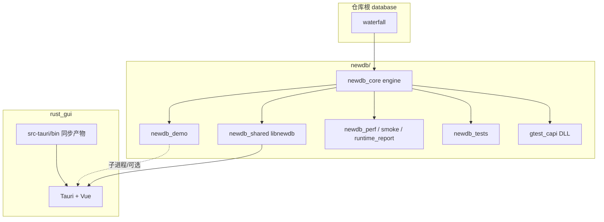

---

## 4. 交互式命令路径（GUI / demo / C API）

同一条「逻辑命令」可走 **进程内 DLL** 或 **子进程 demo**，数据形态均为「行文本 → 输出缓冲 / 日志」。

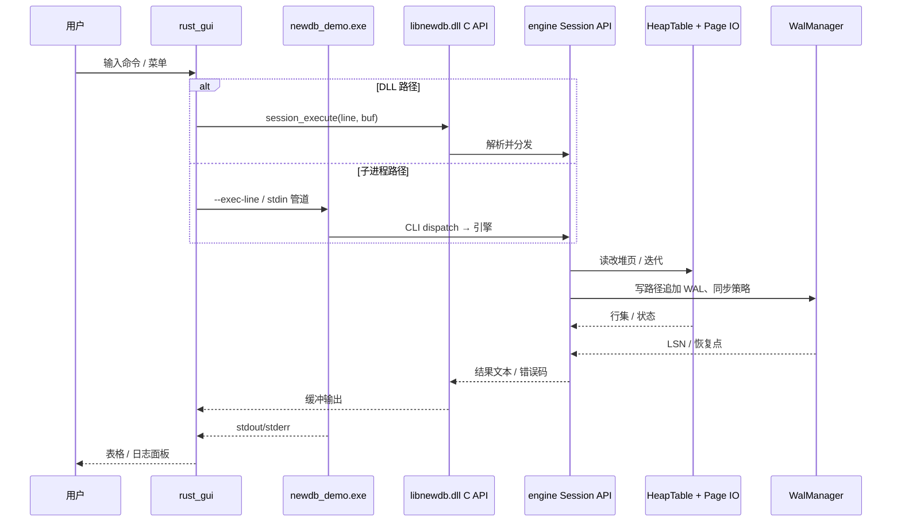

---

## 5. 持久化与恢复数据流（磁盘）

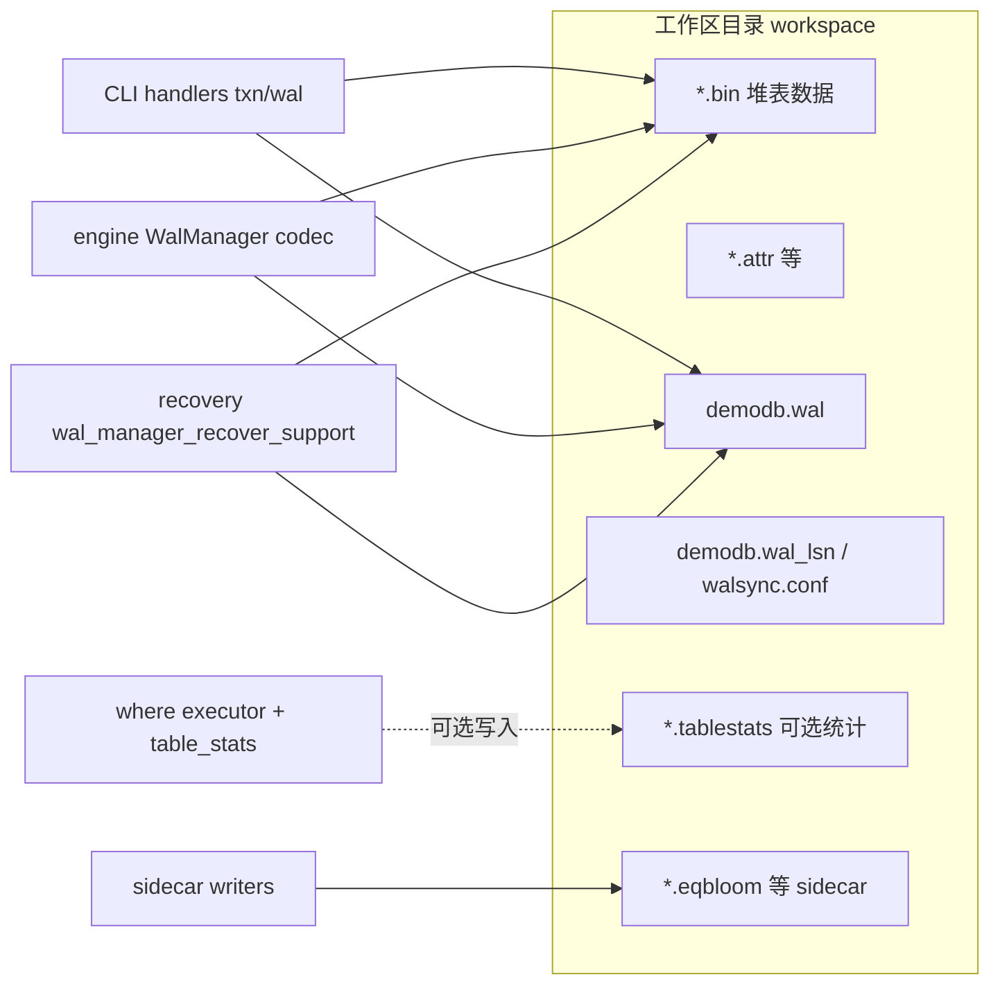

**读路径**：打开表 → `HeapTable` + 可选 **page_cache**（引擎）→ MVCC 快照过滤 → WHERE/sidecar 加速命中。

**写路径**：命令经事务协调器 → `WalManager` 落盘 → 堆与索引/sidecar 更新 →（可选）`VACUUM`、**storage_health** 采样进入 runtime stats。

---

## 6. WHERE / 计划 / Sidecar 数据流（逻辑）

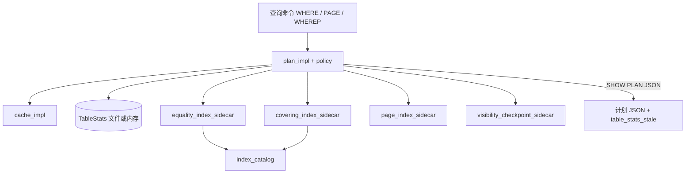

---

## 7. 观测与 CI 数据流（运行时统计）

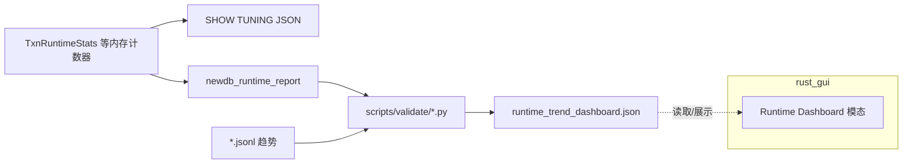

`rust_gui` 通过 **镜像脚本**（`sync_runtime_binaries.ps1`）与 Tauri `invoke` 调用本机 Python/可执行文件参与校验；与引擎内部计数通过「导出 JSON / 日志」间接耦合。

---

## 8. 测试体系数据流

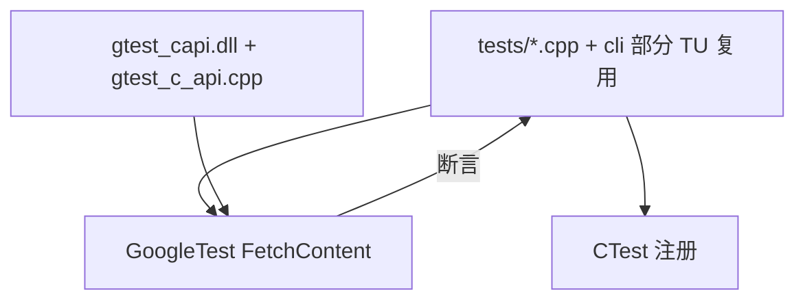

- **进程内**：`newdb_tests` 直接链 `newdb_core` + `GTest::gtest_main`。
- **跨语言演示**：`gtest_capi` 导出 C 接口包装 gtest，供 Python ctypes 等（见 `scripts/examples`）。

---

## 9. 与 `gtest_capi/` 仓库根子树的关系

| 路径 | 说明 |
|------|------|
| `newdb/CMakeLists.txt` 内 `gtest_capi` 目标 | 主构建产出的 `libgtest_capi.dll`（名称随工具链） |
| 根目录 `gtest_capi/` | 独立 CMake 工程示例，便于单独分发与实验，**不替代** newdb 内目标 |

数据流上：二者均为「测试运行器 ↔ GTest」边界，与引擎业务数据流正交。

---

## 10. 一页总览：主数据平面

| 平面 | 输入 | 输出 | 关键模块 |
|------|------|------|----------|
| **用户命令** | 文本行 | 文本结果 / 表 | `dispatch` → `handlers` → `txn`/`where`/… |
| **表数据** | SQL-like 语义命令 | 行 / 页 | `HeapTable`、`page_io`、sidecar |
| **事务与 WAL** | BEGIN…COMMIT、写操作 | WAL 记录、LSN | `wal_service`、`wal_manager`、recovery |
| **可见性** | 快照、读事务 | 过滤后的行集 | `mvcc`、`txn_manager` |
| **观测** | 运行中事件 | JSON/JSONL、报告 | `stats_impl`、`runtime_report`、scripts |
| **GUI** | 点击 / 脚本 | 命令、文件对话框 | Tauri、`libnewdb`、`newdb_demo` |

---

## 11. 模块与子模块间流动详解

本节在 §3–§10 的粗粒度图之上，按**真实调用顺序**与**数据载体**说明 `cli` 内各 handler、`modules/*`、`shell/state` 与 `engine` 之间如何衔接。实现以 `process_command_line`（`cli/shell/dispatch/router/dispatch.cc`）为准。

### 11.1 命令入口：从 REPL 到两阶段分发

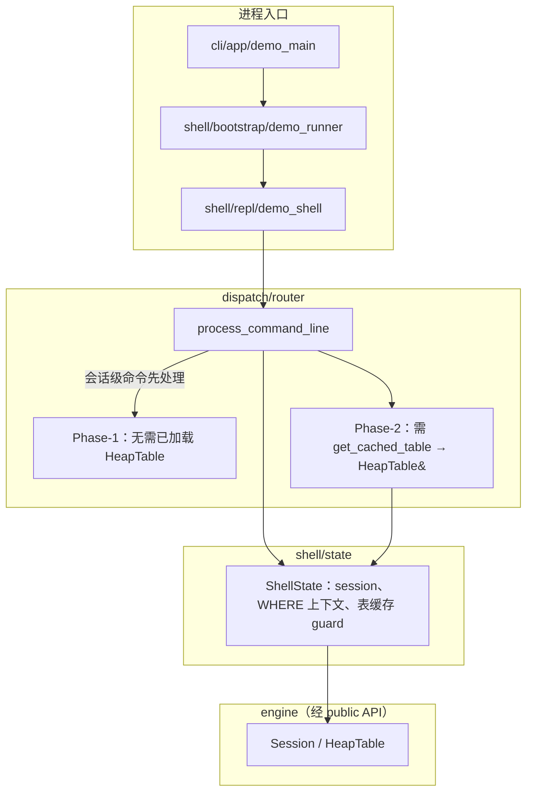

**控制流要点**

1. `logging_bind_shell` 与 `append_session_log_line`：把当前行绑定到日志后端并写入会话日志文件（与业务模块正交）。
2. **会话子通道**：`handle_session_commands` 若命中则直接返回，不进入 phase-1/2。
3. **Phase-1 短路**：若 `shell_line_targets_phase2_only(line)` 为真（前缀如 `WHERE`/`PAGE`/`UPDATE`/`EXPORT` 等），**整段 phase-1 跳过**，直接进入 phase-2，避免无表时对 txn/DDL 链的空转。
4. **Phase-2 前置条件**：`get_cached_table` 失败则 phase-2 静默 no-op（保持与历史 shell 行为一致：无表时不报错直接返回）。

### 11.2 Phase-1：handler 链顺序与模块落点

下列顺序为源码中的**固定数组顺序**：前者返回 `true` 则后续不再执行。

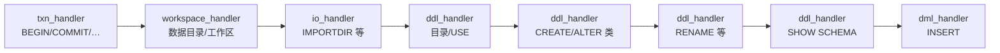

| 顺序 | Handler 入口（概念） | 常触达的 `cli/modules` / 服务 |
|------|----------------------|-------------------------------|
| 1 | `handle_txn_commands` | `txn/coordinator/*`（锁、WAL、恢复、vacuum、写冲突、**stats_impl**） |
| 2 | `handle_workspace_admin_commands` | `common/*`、工作区路径解析 |
| 3 | `handle_import_defattr_commands` | `import_export`、磁盘 attr |
| 4–6 | DDL / catalog 系列 | `catalog`、模式文件、引擎表创建 |
| 7 | `handle_schema_show_commands` | 目录与表元数据展示 |
| 8 | `handle_dml_insert_command` | `txn` + 堆写入路径、可能触发 WAL |

**典型载体**：`ShellState&`、`current_table` / `data_path` 字符串、日志路径、`eff_data`（effective 后的数据根）。

### 11.3 Phase-2：handler 链顺序与查询落点


| 顺序 | Handler | 主要向下调用 |
|------|---------|----------------|
| 1 | `handle_schema_key_command` | 目录 / 主键元数据、引擎表句柄 |
| 2 | `handle_query_where_count_commands` | **`where/*`**（parser → executor → plan/policy/cache）、**sidecar**、`table_stats` |
| 3 | `handle_dml_update_delete_commands` | `txn`、行级写、WAL、写冲突检测 |
| 4 | `handle_dml_attr_commands` | 属性列、堆行更新 |
| 5 | `handle_query_*_commands`（FIND/SUM…） | `where` 或表扫描聚合 |
| 6 | `handle_query_page_command` | 页级扫描 + **page_index_sidecar** 等 |
| 7 | `handle_export_command` | `import_export`、流式写出 |

**典型载体**：`HeapTable& tbl`、WHERE 文本 → 解析树 → 候选行 id / 聚合标量；`SHOW PLAN` / `EXPLAIN WHERE` 为同一路径上的**观测侧输出**（计划 JSON + stale 标记）。

### 11.4 写路径：从 DML handler 到磁盘

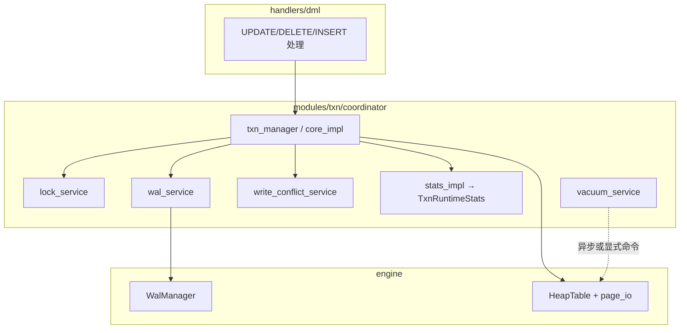

**数据流摘要**：命令参数 → 事务状态机 →（必要时）**锁键** → **WAL 记录**追加 → 堆页/sidecar 就地更新 → 计数器进入 **runtime stats**；冲突时 `write_conflict_service` 在提交前短路。

### 11.5 WHERE 执行子图：parser → plan → 策略与缓存

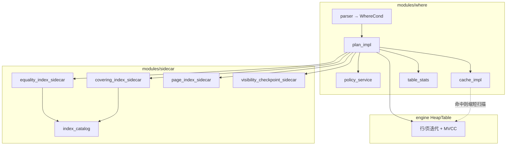

**流动说明**：`plan_impl` 汇聚「统计是否过期、缓存是否命中、哪类 sidecar 可剪枝」；**不可剪枝或 miss** 时仍回落到 `HeapTable` 全表/分页扫描。`*.tablestats` 为 **executor** 与磁盘之间的可选持久化层（见 §5）。

### 11.6 跨 handler 服务：`dispatch/services`

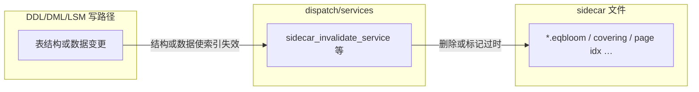

**意图**：避免每个 handler 直接散落文件删除逻辑；**失效事件**（表名、索引类）从写路径注入服务，读路径在 `plan_impl` 侧视为「可能 miss」。

### 11.7 观测子系统：从协调器到 GUI / CI

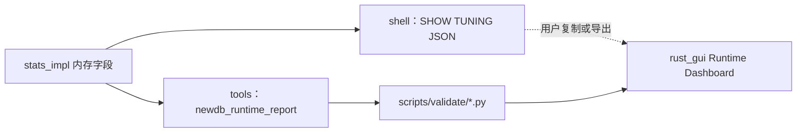

**耦合性质**：`stats_impl` 与 **GUI 无直接链接**；流动靠 **JSON 文本 / 文件 / 子进程 stdout**，与 §7 一致。

### 11.8 引擎内部（只标与 CLI 接壤的边界）

CLI **不得** include `engine/src/**`；合法流动为：

| 方向 | 载体 | 说明 |
|------|------|------|
| CLI → Engine | `newdb::HeapTable*`、`Session` API、C API 封装 | 经 `include/newdb/*.h` |
| Engine → CLI | 行缓冲、错误码、LSN 可见性 | 由 session/table_access 返回 |
| Engine ↔ 磁盘 | WAL codec、`wal_segment_scanner`（恢复） | 对 CLI 透明，仅通过打开表 / recovery 命令暴露效果 |

### 11.9 子模块→子模块矩阵（速查）

| 源 | 经载体 | 典型目标 | 语义 |
|----|--------|----------|------|
| `repl` | 原始行文本 | `dispatch` | 一行一调度 |
| `dispatch` | `ShellState` | `handlers/*` | 两阶段、责任链 |
| `query_handler` | WHERE 字符串 | `where/parser` | 语法树 |
| `where/plan_impl` | 计划上下文 | `policy` / `cache` / `sidecar` | 剪枝与限流 |
| `where/executor` | 行 id / 列缓冲 | `HeapTable` | 取列、判条件 |
| `dml_handler` | 键与列值 | `txn` → `wal_service` | 持久化顺序 |
| `txn` | LSN、锁集合 | `engine` WAL + heap | 一致性与隔离 |
| `ddl` | schema diff | `catalog` + `sidecar_invalidate` | 元数据与索引一致 |
| `stats_impl` | 计数器 | `SHOW TUNING` / `runtime_report` | 可观测性出口 |

---

## 12. 维护说明

- 新增 CLI 子模块时：在 **handlers** 注册命令，避免从 `engine/src` 私有头拉依赖；遵守 [MODULE_BOUNDARIES.md](./MODULE_BOUNDARIES.md)。
- 新增磁盘产物时：在本文件 **§5**、**§10** 与 **§11** 补充条目，并在 `STORAGE_GOVERNANCE_AND_RECOVERY_BUDGETS.md`（若适用）对齐恢复预算。
- Mermaid 在 GitHub/GitLab 预览良好；本地若需 PNG 可导出后附在 `docs/handout/` 一类目录（按需）。

---

*文档版本：与仓库 `main` 上 newdb 二阶段模块划分一致；若目录重构，请同步更新 §2 表格、§11 分发链与图表中的节点名。*
