# 全仓库模块与子模块数据流总览

本文档描述 [skyline019/database](https://github.com/skyline019/database) 仓库内**各顶层组件、newdb 子系统、外部进程与观测数据**之间的依赖与数据流向，便于 onboarding、排障与扩展设计时对照。

**默认叙述口径（配图以此为准）**：**Plugin 双 DLL**——主共享库 **`libnewdb`**（`newdb_shared`）仅链 **`newdb_core`**（+ C API 装载器），**CLI / dispatch / `newdb_query`** 落在独立 **`newdb_cli_backend`**，由运行时 **`NEWDB_CLI_BACKEND_PATH`** 在首次会话创建前装载（详见 §3、§3.2、[C_API_PLUGIN_BACKEND.md](../dev/C_API_PLUGIN_BACKEND.md)）。**单 DLL full_embed** 仍为正交代便捷预设（本地 demo、少搬运场景），与 Plugin **数据流等价**，差别仅在链接期是否静态并入 `newdb_capi_adapter`。

**与 CMake 默认值的关系**：仓库 **`CMakeLists.txt`** 中 **`NEWDB_C_API_PLUGIN_BACKEND` 默认 OFF**（本地一键编出单 DLL 较省事）；**产品发行 / rust_gui 镜像包** 通常显式 **`ON` + `NEWDB_BUILD_CLI_BACKEND_PLUGIN=ON`**，与本文图示一致。

**CLI 内模块/子模块的先后次序、责任链与写/WHERE 微观路径**见 [§11](#11-模块与子模块间流动详解)。**核心类型、启发式算法、编译/运行期耦合**见 [§12](#12-数据结构算法要点耦合与关联)；**各字段与 API 形参逐项解释**见 [§12.12](#1212-字段与形参释义手册)。

> 模块边界与 include 规则见 [MODULE_BOUNDARIES.md](./MODULE_BOUNDARIES.md)；构建与测试命令见 [BUILD.md](../dev/BUILD.md)。**Shell OBJECT 积木 → `newdb_capi_adapter` →（full_embed 链入主库 | plugin 链入 `newdb_cli_backend`）** 见 [BUILD.md § CMake shell 积木](../dev/BUILD.md)、[plugin_backend_packaging.md](../../scripts/ci/plugin_backend_packaging.md)。

---

## 1. 仓库顶层拓扑

```
database/                    # 仓库根
├── waterfall/               # 页式存储与通用基础库（被 newdb_core 链接）
├── newdb/                   # 主工程：引擎 + CLI + 工具 + 测试 + Rust GUI + 脚本 + 文档
│   ├── engine/              # 存储引擎（C++）：堆表、WAL、MVCC、C ABI、缓存
│   ├── cli/                 # 交互式命令层（C++）：shell、dispatch、业务模块
│   ├── tools/               # 可执行工具：perf、smoke、runtime_report
│   ├── tests/               # GoogleTest 回归与 gtest_capi 桥接源码
│   ├── rust_gui/            # Tauri + Vue 桌面 GUI
│   ├── scripts/             # CI、压测、校验、soak（Python/PowerShell）
│   ├── docs/                # 设计与运维文档（本文件所在树）
│   ├── intro/               # LaTeX 源码解析工程 → PDF
│   └── CMakeLists.txt       # 构建编排（含 FetchContent googletest、gtest_capi）
├── gtest_capi/              # 可选独立子树：gtest C API 示例/打包（与 newdb 内 gtest_capi 目标同源思路）
├── docs/                    # 仓库级讲义与 handout（与 newdb/docs 互补）
├── rules/                   # Makefile 片段（非 CMake 路径）
├── resources/               # 仓库级资源（若有）
├── Makefile                 # 顶层 make 入口
└── README.md / README.en.md
```

**依赖方向（编译期）**：`waterfall` ← `newdb/engine` ← `newdb` 可执行与库；`cli` 仅通过 `engine/include/newdb/*` 公共头访问引擎，不依赖引擎私有实现头。

---

## 2. newdb 子模块全表（按目录）

### 2.0 `waterfall/`（页式存储与通用基础库）

| 子路径 | 职责 | 备注 |
|--------|------|------|
| `storage/` | `Page`、`Record`、存储错误模型 | 被 `newdb_core` 堆/I-O 路径链接 |
| `utils/` | `arena`、错误辅助；**`crc32c_compat.cc`** | 若 **未**检测到系统 **`libcrc32c`**（PkgConfig），则编入兼容实现，避免引擎侧重复一份 CRC32C |
| `include/waterfall/` | 对外头（endian shim、配置等） | 消费者仅依赖该 **PUBLIC** include 目录 |
| **CMake** | 静态库 **`waterfall`** | **`POSITION_INDEPENDENT_CODE ON`**：保证 `libwaterfall.a` 可链入 **`libnewdb.so` / `libnewdb_cli_backend.so`** 等共享对象（Linux `-fPIC`） |

### 2.1 `newdb/engine`（存储引擎）

| 子路径 | 职责 | 典型数据载体 |
|--------|------|----------------|
| `include/newdb/` | 对外 C/C++ API 声明（`c_api.h`、`heap_table.h`、`wal_manager.h` 等） | 类型、句柄、枚举 |
| `src/api/c/` | C ABI：`c_api.cpp`（full）、**`c_api_slim.cpp`**（slim 产物） | 命令文本 → 结果缓冲 |
| `src/session/api` | 会话句柄、`session_apply_table` | 会话状态、懒加载物化 |
| `src/session/table_access` | 表加载、物化、历史 | `HeapTable`、快照 |
| `src/heap/` | 堆文件页、行、waterfall 适配 | 页缓冲、行字节 |
| `src/io/page/` | 页读写 | 块设备/文件偏移 |
| `src/schema/`、`src/catalog/` | 表模式与目录 | `TableSchema`、元数据 |
| `src/codec/` | 元组编解码 | 列值字节流 |
| `src/json/` | `json_escape`、`runtime_stats_snapshot_json_write` | 导出 JSON 字符串 |
| `src/wal/writer/`、`codec/`、`recovery/` | WAL 追加、编解码、恢复与段扫描 | `demodb.wal`、LSN、redo 记录 |
| `src/mvcc/snapshot/` | 可见性与快照 | `snapshot_lsn`、读路径 |
| `src/lsm/` | LSM-lite 协作（与 CLI 服务配合） | 层键、压缩提示 |
| `src/cache/` | 页缓存、内存预算门面 | `page_cache_*`、`memory_budget_*` |
| `src/memory/` | **`MemoryRegistry`** 全局 admit/evict | `mem_*` 与侧车/QueryTemp 闭环 |
| `include/newdb/wal_sync_mode.h` | **`WalSyncMode`**（与 `wal_manager.h` 拆文件） | fsync 策略枚举 |
| `include/newdb/txn_runtime_stats_snapshot.h` | **`TxnRuntimeStats` POD**（与 CLI 共享形状） | JSON/C API 契约平面 |
| `src/util/` | 引擎内杂项工具 | **页级 CRC32C 兼容实现已下沉至 `waterfall/utils/crc32c_compat.cc`**（见 §2.0） |

### 2.2 `newdb/cli`（命令与编排层）

| 子路径 | 职责 | 典型数据载体 |
|--------|------|----------------|
| `cli/app/` | **`demo_main.cc`**：`newdb_demo` 入口；持有 **`ShellStateOwner`** | argv、`ShellState&` |
| `cli/shell/bootstrap/` | **`demo_runner.cc`** / **`demo_cli.*`**：日志绑定、**`recoverFromWAL`**、mdb/import/batch | workspace、`ShellStateFacade` |
| `cli/shell/repl/` | **`demo_shell`**：交互行读取与执行 | 用户行文本 |
| `cli/shell/c_api/` | **`c_api_cli_bridge`**、runtime JSON builder、`show_storage_log` | C API ↔ dispatch |
| `cli/shell/state/` | **`ShellState`（pimpl）**、**`shell_state_owner`**、**`shell_state_facade`**、**`shell_state_ops`**、**`shell_state_heap_read_guard`**、`shell_state_lsm`/`sidecar` bundles | 会话聚合根、堆 guard |
| `cli/shell/dispatch/router/` | `process_command_line`、phase-2 路由 | 动词 → 处理器 |
| `cli/shell/dispatch/registry/` | 命令表、快照注册源 | 命令名 → 处理分支 |
| `cli/shell/dispatch/handlers/*` | DDL/DML/查询/事务/会话/IO/工作区 | 解析后的参数、日志行 |
| `cli/shell/dispatch/support/` | 参数解析、热索引 | 中间结构 |
| `cli/shell/dispatch/services/` | LSM、sidecar 失效等跨切服务 | 失效事件、队列 |
| `cli/shell/dispatch/shared/` | 共享内部声明 | `dispatch_internal.h` |
| `cli/shell/state/` | `ShellState`、会话、WHERE 上下文（**Facade / Ops / pimpl 分层**，见 §2.2.2） | 长生命周期状态 |
| `cli/shell/diag/` | 诊断输出 | 文本 |
| `cli/modules/common/` | 日志、工具、表格视图 | 格式化行 |
| `cli/modules/catalog/` | 模式目录 | schema 文件 |
| `cli/modules/import_export/` | IMPORTDIR、EXPORT CSV/JSON | 文件路径、流 |
| `cli/modules/where/parser/` | WHERE 条件解析 | `WhereCond` 链 |
| `cli/modules/where/executor/` | 执行、计划（**`plan/` 多编译单元**，§2.2.2）、策略、缓存、**table_stats** | 命中行集、计划 JSON、`*.tablestats` |
| `cli/modules/txn/coordinator/` | 事务、锁、WAL 服务、恢复、vacuum、写冲突、**runtime stats** | `TxnRuntimeStats`、调优 JSON |
| `cli/modules/sidecar/*` | 等值索引、覆盖投影、页索引、可见性 checkpoint、**index_catalog** | sidecar 文件、缓存 |
| `cli/modules/storage/` | **table_storage_health** 度量 | 碎片率、tier |

### 2.2.1 CMake：shell OBJECT 与 `newdb_capi_adapter`

- **本文默认发行形态（plugin）**：`-DNEWDB_C_API_PLUGIN_BACKEND=ON -DNEWDB_BUILD_CLI_BACKEND_PLUGIN=ON` 时，`newdb_shared` **不**静态链接 `newdb_capi_adapter`；**`newdb_cli_backend`**（共享库）**`PRIVATE` 链接 `newdb_capi_adapter`**（进而 **`newdb_core` + `newdb_query`**）。宿主进程只须分发 **两个** 共享对象 + 设置 **`NEWDB_CLI_BACKEND_PATH`**（绝对路径为佳）。打包示例：[plugin_backend_packaging.md](../../scripts/ci/plugin_backend_packaging.md)。
- **对照（full embed，单 DLL 便利）**：`newdb_capi_adapter` 在**链接期** `PRIVATE` 进入 `newdb_shared`，无第二 DLL；适合 demo/工具链一体化。
- **装配图**：[MODULE_BOUNDARIES.md](./MODULE_BOUNDARIES.md)；**目标名与 preset**：[BUILD.md](../dev/BUILD.md)。
- **OBJECT 积木**：`cli/` 下 shell、dispatch、txn、WHERE、sidecar 等拆成 **`newdb_shell_*` OBJECT**，由 **`newdb_capi_adapter`** `$<TARGET_OBJECTS:…>` 聚合；REPL 独占 TU 在 **`newdb_shell_bootstrap_repl`** → **`newdb_shell`** → **`newdb_demo`**。

### 2.2.2 源码级解耦（数据库栈，非 rust_gui）

下列变更收紧 **编译单元边界** 与 **依赖方向**，不改变 **full_embed 与 plugin** 下对外能力（仅链接/装载位置不同）；详情见 [MODULE_BOUNDARIES.md](./MODULE_BOUNDARIES.md)、[`SHELL_STATE_INCLUDE_AUDIT.md`](../dev/SHELL_STATE_INCLUDE_AUDIT.md)。

| 主题 | 做法 | 典型路径 |
|------|------|----------|
| **`ShellState` 分层** | 聚合根仍是一个 `ShellState`，但实现拆成 **pimpl（`shell_state_impl.h`）**、**门面（`shell_state_facade.{h,cc}`）**、**批量/运维操作（`shell_state_ops.{h,cc}`）**、**Owner（`shell_state_owner.h` + `shell_state.cc`）**；测试与 runtime stats 构造优先通过 **Facade / Owner**，减少 **直接 `#include "cli/shell/state/shell_state.h"`** 的 TU 数量 | `cli/shell/state/` |
| **WHERE 计划管线拆分** | 原 **`plan_impl`** 相关逻辑拆成多 TU：**`plan_impl.cc`**（主干）、**`plan_impl_support.{h,cc}`**、**`plan_query_index.cc`**、**`plan_scan_estimate.{h,cc}`**、**`where_plan_catalog.{h,cc}`**，头文件 **`plan_impl_detail.h` / `plan_impl_internals.h`** 收敛内部依赖 | `cli/modules/where/executor/plan/` |
| **工作区与重排** | **`workspace_handler`** 与 **`CONFIRM_REORDER`** / **`[REORDER_MAP_JSON]`** 输出衔接（供上层消费逻辑行 id 映射） | `cli/shell/dispatch/handlers/workspace/` 等 |
| **CRC32C 归属** | 引擎内重复 CRC 实现删除，统一由 **`waterfall`** 在缺系统库时提供 **`crc32c_compat`** | `waterfall/utils/crc32c_compat.cc`、`waterfall/CMakeLists.txt` |

### 2.3 `newdb/tools`、`newdb/tests`、`newdb/rust_gui`、`newdb/scripts`

| 组件 | 职责 | 数据流要点 |
|------|------|------------|
| `tools/perf`、`concurrent_perf`、`smoke`、`report` | 压测、冒烟、**runtime_report** | 读引擎 + 写 JSON/控制台 |
| `tests/*.cpp` | 单测、集成测、`gtest_c_api` | 内存堆、临时目录、断言 |
| `rust_gui`（Vue + Tauri） | **默认**：进程内加载 **`libnewdb` + `newdb_cli_backend`**（与 **`NEWDB_CLI_BACKEND_PATH`**）；可选 **`newdb_demo` 子进程** | `sync_runtime_binaries.ps1` 同步 `src-tauri/bin`；命令字符串经 **`newdb_session_execute`**；**`CONFIRM_REORDER`** 等仍走同一 dispatch |
| `scripts/ci|validate|soak|bench` | 门禁、统计 schema、趋势 rollup | `*.jsonl`、dashboard JSON |

### 2.4 文档与 intro

| 路径 | 数据流角色 |
|------|------------|
| `newdb/docs/**` | 人读：设计约束、CI 预算、隔离语义 |
| `newdb/intro/**` | 人读：LaTeX → PDF，与源码交叉引用 |

---

## 3. 编译与链接依赖图（默认 Plugin）

下图 **粗线 = 编译期链接**，**虚线 = 运行期 dlopen/LoadLibrary**。**Waterfall → `newdb_core`** 省略重复画出（见 §2.0）。

### 3.0 总览：Plugin 预设下的产物关系

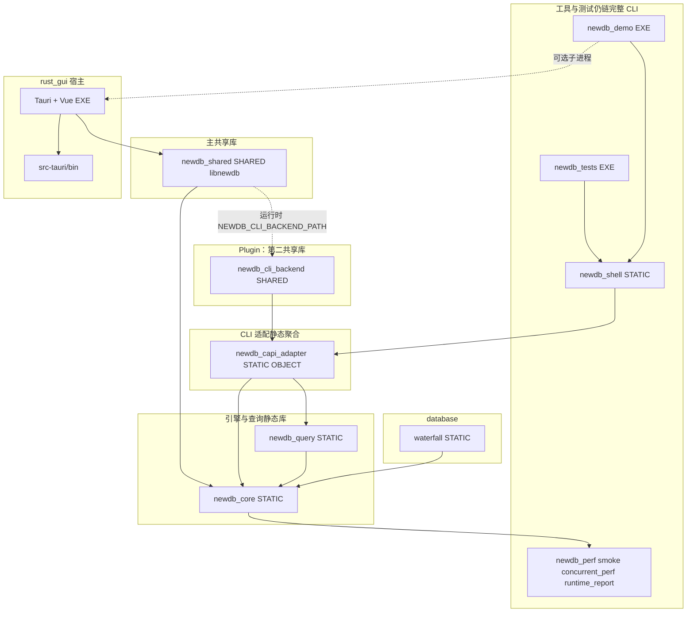

**读图要点**

| 边 | 含义 |
|----|------|
| **`BE` → `CAP`** | **`target_link_libraries(newdb_cli_backend PRIVATE newdb_capi_adapter)`**：backend **静态并入**全部 shell/query/dispatch，运行时作为 **独立 .so/.dll** 与主库进程共生。 |
| **`DLL` → `ENG`** | **`NEWDB_C_API_PLUGIN_BACKEND=ON`** 时 **`newdb_shared` PRIVATE `newdb_core`**，**不**链接 `newdb_capi_adapter`。 |
| **`DLL` -.-> `BE`** | **`c_api.cpp`** 中 **`cli_dll_load_unlocked`**：`LoadLibraryA` / **`dlopen(RTLD_NOW)`**，再 **`GetProcAddress` / `dlsym`** 解析 **`newdb_cli_backend_*`**（§3.2.2）。 |
| **`newdb_demo` / `newdb_tests`** | 仍链接 **`newdb_shell` → `newdb_capi_adapter`**，与 GUI **进程内 plugin** 路径独立（集成测不走 dlopen）。 |

**GTest**：**`gtest_capi`** 仅依赖 FetchContent GTest；**`newdb_tests`** 另链 **`GTest::gtest_main`**（图中略）。

### 3.1 对照：`newdb_shared` 三种链接形态

与 [MODULE_BOUNDARIES.md](./MODULE_BOUNDARIES.md)「Shared library modes」一致；**首推 Plugin**，下列按 **发行优先级** 排列。

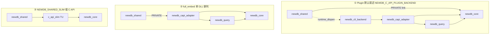

- **① plugin**：主库只含 **`newdb_core`**；**`newdb_cli_backend`** **编译期**链接 **`newdb_capi_adapter` + `newdb_query`**；运行期主库 **dlopen** backend，**`newdb_session_create`** 失败则返回 **`NULL`**（须设置 **`NEWDB_CLI_BACKEND_PATH`**）。  
- **② full embed**：**`newdb_capi_adapter`** **链接期**进入 **`newdb_shared`**，无第二 DLL。  
- **③ slim**：仅引擎 + **`c_api_slim`**；与 **`NEWDB_C_API_PLUGIN_BACKEND` 互斥**（不可同时 slim + plugin）。详情见 [CI_SLIM_FULL_MATRIX.md](../dev/CI_SLIM_FULL_MATRIX.md)。

### 3.2 Plugin 装载与命令路径（详细图）

#### 3.2.1 发行目录与进程边界（推荐布局）

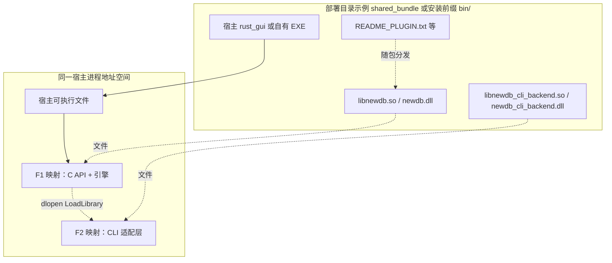

- Windows：backend 与主 DLL **同目录** 或 **`PATH`**；Linux：**`LD_LIBRARY_PATH`** / **`RUNPATH`**，且 **`NEWDB_CLI_BACKEND_PATH` 建议绝对路径**（见 [C_API_PLUGIN_BACKEND.md](../dev/C_API_PLUGIN_BACKEND.md)）。

#### 3.2.2 `newdb_session_create`：装载 backend 与符号解析（实现：`engine/src/api/c/c_api.cpp`）

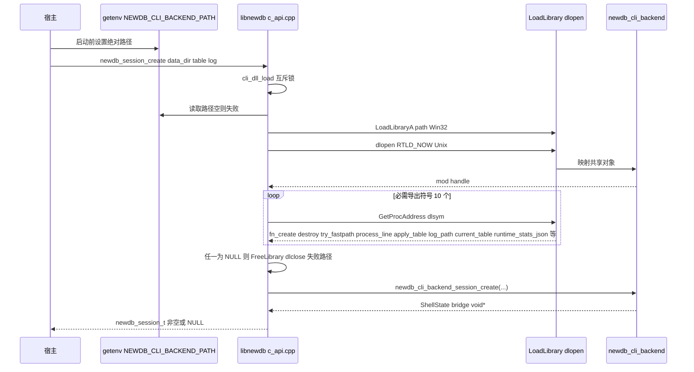

**必须在 backend 中解析成功的 C 符号**（名称与 `c_api.cpp` 一致）：

| 导出函数 | 角色 |
|----------|------|
| `newdb_cli_backend_session_create` | 构造 CLI/`ShellState` 桥 |
| `newdb_cli_backend_session_destroy` | 销毁桥 |
| `newdb_cli_backend_try_fastpath` | 可选快路径 |
| `newdb_cli_backend_process_line` | **一行命令 → dispatch** |
| `newdb_cli_backend_apply_table` | 切换表 |
| `newdb_cli_backend_log_path` | 当前日志路径 |
| `newdb_cli_backend_current_table` | 当前表名 |
| `newdb_cli_backend_runtime_stats_json` | 运行时 JSON |
| `newdb_cli_backend_runtime_snapshot_line` | 快照行 |
| `newdb_cli_backend_where_plan_json` | WHERE 计划 JSON |

（实现文件：**`cli/shell/c_api/cli_backend_exports.cc`**。）

#### 3.2.3 一条命令：`newdb_session_execute`（Plugin）

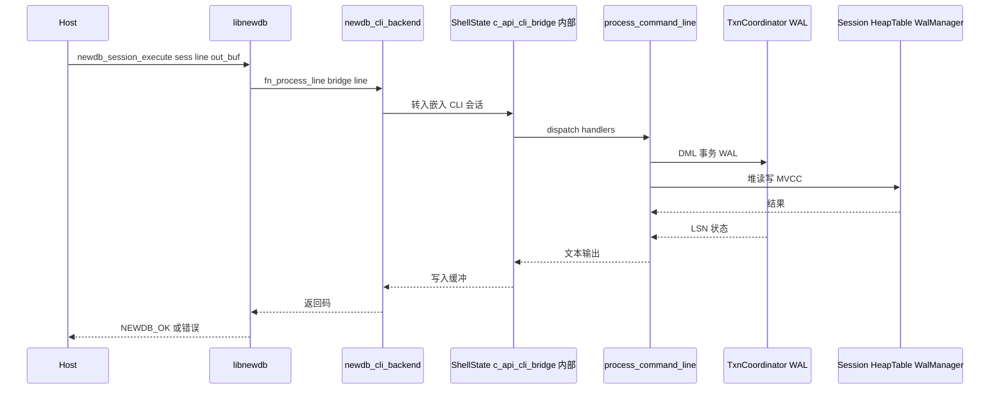

**与 full_embed 的差异**：仅 **`Bridge` 所在模块** 在主 DLL **（embed）** 或 **backend DLL（plugin）**；**`Router` → `Txn` → `Eng` 数据平面相同**。

---

## 4. 交互式命令路径（GUI / demo / C API）

同一条「逻辑命令」可走 **进程内 DLL** 或 **子进程 demo**，数据形态均为「行文本 → 输出缓冲 / 日志」。

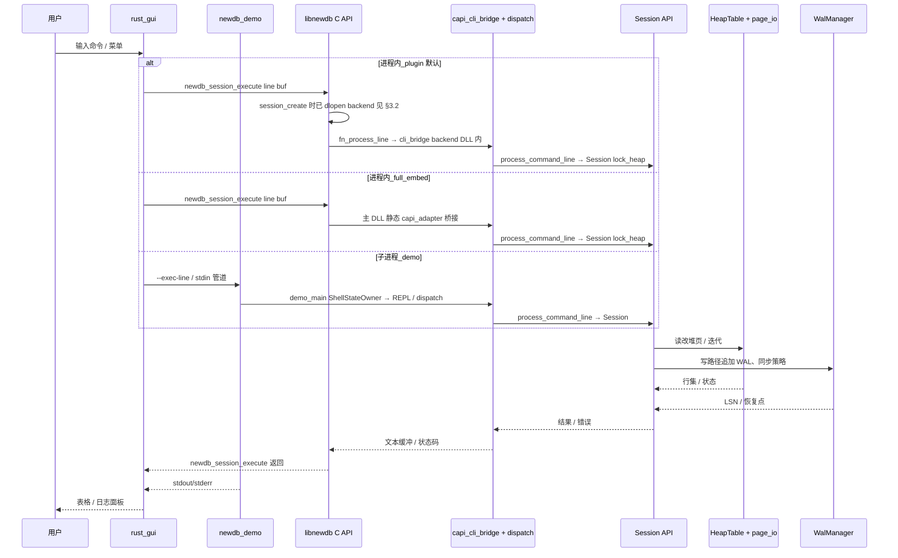

**说明**：**默认（plugin）** 与 **full_embed** 对用户均为进程内 **`libnewdb`**；差别仅在 **`capi_cli_bridge`/`dispatch` 代码位于 `newdb_cli_backend`（需环境变量）还是主 DLL 静态段**。**slim** 主库无完整执行链，GUI 须 **full_embed** 或 **plugin**。Rust 导出 **`newdb_session_execute`**（`rust_gui/src-tauri/src/lib.rs`）。

---

## 5. 持久化与恢复数据流（磁盘）

**编译归属（默认 plugin）**：图中 **CLI** 逻辑（handler / txn / WAL 协调）的 **目标代码** 始终在 **`newdb_capi_adapter`** 聚合体内；**plugin** 下该静态库被 **链入 `newdb_cli_backend`**，由主库 **`dlopen`** 后间接执行；**full_embed** 下则 **链入主 `libnewdb`**。磁盘上的 **WAL/堆/sidecar** 关系两种形态 **相同**。

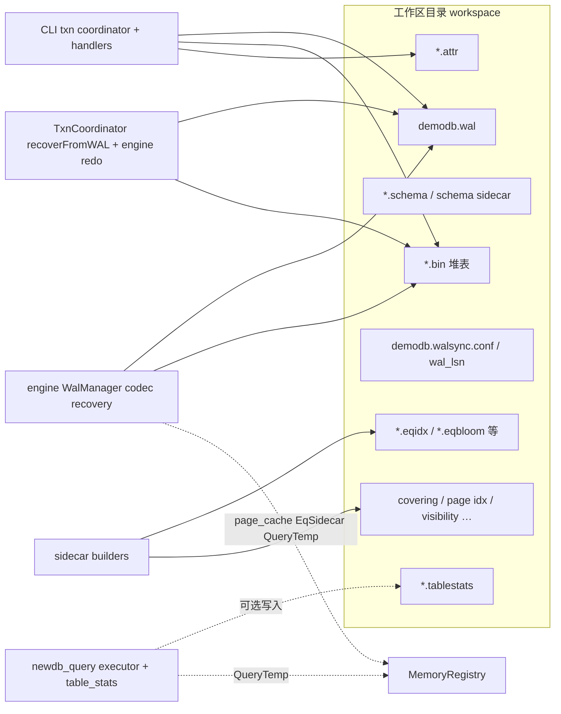

**读路径**：打开表 → `HeapTable` + 可选 **page_cache**（引擎）→ MVCC 快照过滤 → WHERE/sidecar 加速命中。

**写路径**：命令经事务协调器 → `WalManager` 落盘 → 堆与索引/sidecar 更新 →（可选）**`VACUUM`**（`compact_heap_file`：合并逻辑行、去掉墓碑与旧版本，**不改变**幸存行的 `id`）、**`CONFIRM_REORDER`**（`reorder_heap_ids_dense`：用户确认删除行不需 WAL/时间点恢复后，将逻辑行 **`id` 压成连续 1..N**，仅当主键为 `id` 或未设置）、**storage_health** 采样进入 runtime stats。

**WAL 恢复（v2 closed loop · P2 拆分）**：`WalManager::recover_replay_segments` 边读边喂给 [`WalRedoPlanner`](../../engine/include/newdb/wal/wal_redo_planner.h)；遇到 `COMMIT` 触发 `finalize() → RedoPlanSummary`，再交由 [`WalRedoApplier`](../../engine/include/newdb/wal/wal_redo_applier.h) 写入 `HeapTable`（`ApplyStats` 累计 `apply_count` / `redo_apply_ms`）。`WalRecordReader`（`wal/wal_recovery_pipeline.h`）继续作为只读边界供 fault 测试与摘要使用。`WalRedoPlanner::feed_record` 仅对 **`INSERT` / `UPDATE` / `DELETE`** 解码入 redo 计划；`SESSION_SNAPSHOT`、`SAVEPOINT_*`、`PITR_MARK` 等非 DML 不进入重做链；未知 `WalOp` 值走 `default` 分支忽略。

**协调器 WAL 协调（`TxnCoordinator::recoverFromWAL`）**：[`recovery_service.cc`](../../cli/modules/txn/coordinator/recovery/recovery_service.cc) 在构建按事务的 redo/undo 列表时，同样**仅**将 **`INSERT` / `UPDATE` / `DELETE`** 且带行载荷的记录纳入堆补偿；其余 WAL 类型仍用于 `COMMIT`/`ROLLBACK`/checkpoint 等控制语义，但不写入 `txn_records` 的表数据链，与引擎侧 redo 语义对齐。

**堆表 id 与墓碑（无 MVCC 快照）**：[`HeapTable::rebuild_indexes`](../../engine/src/heap/heap_table.cpp) 在 **`active_snapshot` 未设置** 时，对存储槽按文件顺序做 **last-writer-wins**：后出现同一 `id` 的 **`__deleted=1` 墓碑** 时从 `index_by_id` **擦除**该 id，避免删除（含「删中间行」）后 `find_by_id` / `sorted_indices` 仍指向旧物理行。存在快照时仍按「仅 `is_row_visible`」路径扫描，以保留 MVCC 单测语义。堆文件加载路径 [`merge_one_page_into_fingers`](../../engine/src/io/page/page_io.cpp) 已对墓碑执行 `latest.erase(row.id)`，与上式一致。

**内存预算（v2 closed loop · P5 闭环）**：`page_cache` / equality `sidecar` / WHERE `query_temp` 三类调用 `MemoryRegistry::try_admit/release` 走统一全局 cap 与 per-kind cap；evictor 注册回调（`PageCache` / `EqSidecar` LRU 尾部释放）。新增 stats 字段族 `mem_*_{used_bytes,evictions,admit_rejects}` + `mem_global_*`，旧 `memory_budget_*` 字段保持兼容映射（详见 [`STORAGE_GOVERNANCE_AND_RECOVERY_BUDGETS.md`](../storage/STORAGE_GOVERNANCE_AND_RECOVERY_BUDGETS.md) §6）。

---

## 6. WHERE / 计划 / Sidecar 数据流（逻辑）

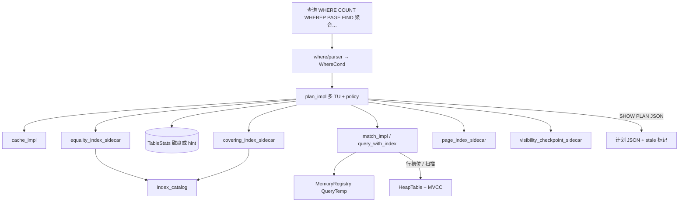

---

## 7. 观测与 CI 数据流（运行时统计）

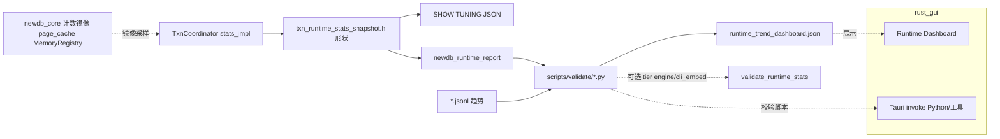

`rust_gui` 通过 **镜像脚本**（`sync_runtime_binaries.ps1`）与 Tauri `invoke` 调用本机 Python/可执行文件参与校验；与引擎内部计数通过「导出 JSON / 日志」间接耦合。`validate_runtime_stats.py` 默认校验完整 **`required_stats_keys`**；可选 **`--stats-keys-tier engine|cli_embed`** 做契约子集门禁（与 [RUNTIME_STATS_SCHEMA.md](../../scripts/validate/RUNTIME_STATS_SCHEMA.md)、CI `runtime-stats-schema-gate` 一致）。

---

## 8. 测试体系数据流

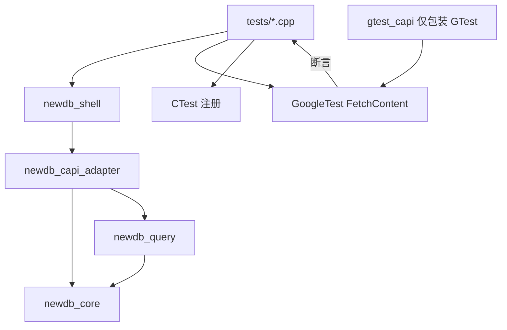

- **进程内（`newdb_tests`）**：**`newdb_shell`** → **`newdb_capi_adapter`** → **`newdb_core`** + **`newdb_query`** + `GTest::gtest_main`（与 **`newdb_demo`** 同源 CLI/dispatch/WHERE 闭包）。
- **跨语言演示（`gtest_capi`）**：仅链接 **FetchContent GTest** 的共享库包装层，**不**链接 `newdb_core`；供 Python ctypes 等（见 `scripts/examples`），与引擎业务数据流正交。

---

## 9. 与 `gtest_capi/` 仓库根子树的关系

| 路径 | 说明 |
|------|------|
| `newdb/CMakeLists.txt` 内 `gtest_capi` 目标 | 主构建产出的 `libgtest_capi.dll`（名称随工具链） |
| 根目录 `gtest_capi/` | 独立 CMake 工程示例，便于单独分发与实验，**不替代** newdb 内目标 |

数据流上：二者均为「测试运行器 ↔ GTest」边界，与引擎业务数据流正交。

---

## 10. 一页总览：主数据平面

| 平面 | 输入 | 输出 | 关键模块 |
|------|------|------|----------|
| **用户命令** | 文本行 | 文本结果 / 表 | `dispatch` → `handlers` → `txn`/`where`/… |
| **表数据** | SQL-like 语义命令 | 行 / 页 | `HeapTable`、`page_io`、sidecar |
| **事务与 WAL** | BEGIN…COMMIT、写操作 | WAL 记录、LSN | `wal_service`、`wal_manager`、recovery |
| **可见性** | 快照、读事务 | 过滤后的行集 | `mvcc`、`txn_manager` |
| **观测** | 运行中事件 | JSON/JSONL、报告 | `stats_impl`、`runtime_report`、scripts |
| **GUI** | 点击 / 脚本 | 命令、文件对话框 | **默认**：Tauri + **`libnewdb`** + **`newdb_cli_backend`**（**`NEWDB_CLI_BACKEND_PATH`**）；对照：**full_embed** 单 DLL；可选 **`newdb_demo`** 子进程 |

---

## 11. 模块与子模块间流动详解

本节在 §3–§10 的粗粒度图之上，按**真实调用顺序**与**数据载体**说明 `cli` 内各 handler、`modules/*`、`shell/state` 与 `engine` 之间如何衔接。实现以 `process_command_line`（`cli/shell/dispatch/router/dispatch.cc`）为准；入口侧 **`demo_main`** 用 **`ShellStateOwner`** 持有 `ShellState`，分发路径内用 **`ShellStateFacade`** 收窄对表名/数据路径/日志的访问并驱动 **`reset_session_heap_guard`** RAII。

### 11.1 命令入口：从 REPL 到两阶段分发

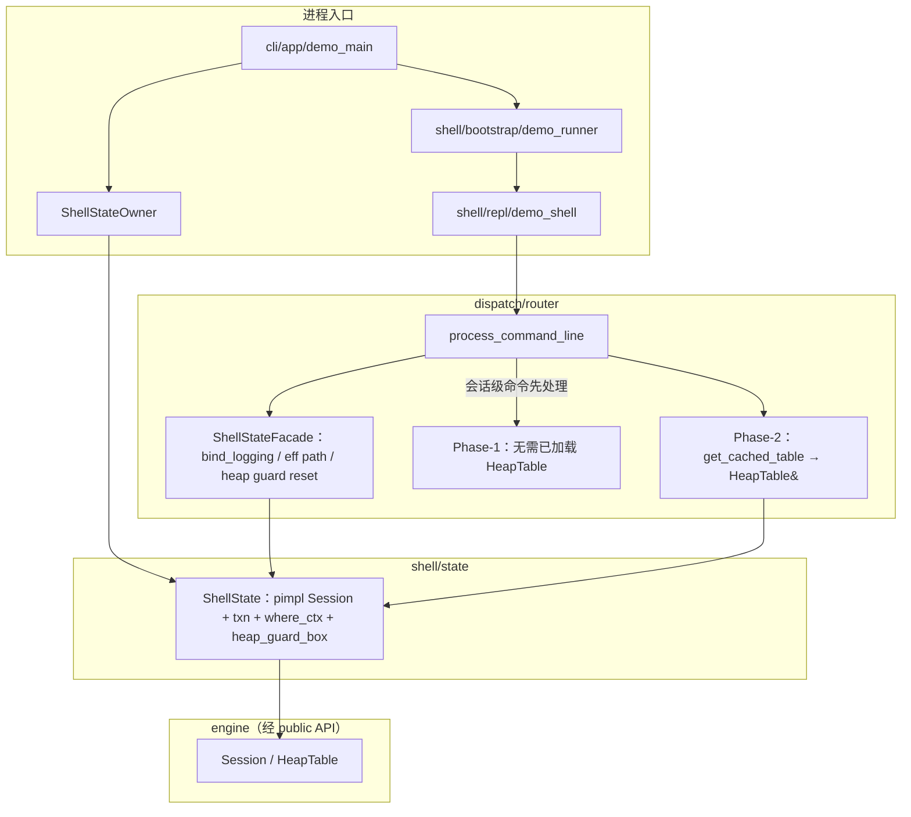

**控制流要点**

1. **`ShellStateFacade::bind_logging`** 与 **`append_session_log_line`**：把当前行绑定到日志后端并写入会话日志文件（与业务模块正交）。
2. **会话子通道**：`handle_session_commands` 若命中则直接返回，不进入 phase-1/2。
3. **Phase-1 短路**：若 `shell_line_targets_phase2_only(line)` 为真（前缀见 `dispatch_routing.cc` 中 **`kPhase2Prefixes`**，含 `WHERE`/`PAGE`/`QBAL`/`UPDATE`/`UPDATEWHERE`/`DELETEWHERE`/聚合与 attr 命令等），**整段 phase-1 跳过**，直接进入 phase-2，避免无表时对 txn/DDL 链的空转。
4. **Phase-2 前置条件**：`get_cached_table` 失败则 phase-2 静默 no-op（保持与历史 shell 行为一致：无表时不报错直接返回）。
5. **命令结束**：`process_command_line` 尾部 RAII **`ShellHeapGuardClear`** 调用 **`ShellStateFacade::reset_session_heap_guard`**，与 phase-2 内栈上 guard 配合释放本次行的堆访问句柄。

### 11.2 Phase-1：handler 链顺序与模块落点

下列顺序为源码中的**固定数组顺序**：前者返回 `true` 则后续不再执行。

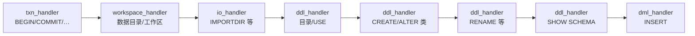

| 顺序 | Handler 入口（概念） | 常触达的 `cli/modules` / 服务 |
|------|----------------------|-------------------------------|
| 1 | `handle_txn_commands` | `txn/coordinator/*`（锁、WAL、恢复、vacuum、写冲突、**stats_impl**） |
| 2 | `handle_workspace_admin_commands` | `common/*`、工作区路径解析；**`VACUUM`** / **`CONFIRM_REORDER`** / `RESET` / `SCAN` / `SHOWLOG` 等对 `*.bin` 的维护（见 [`workspace_handler.cc`](../../cli/shell/dispatch/handlers/workspace/workspace_handler.cc)） |
| 3 | `handle_import_defattr_commands` | `import_export`、磁盘 attr |
| 4–6 | DDL / catalog 系列 | `catalog`、模式文件、引擎表创建 |
| 7 | `handle_schema_show_commands` | 目录与表元数据展示 |
| 8 | `handle_dml_insert_command` | `txn` + 堆写入路径、可能触发 WAL |

**典型载体**：`ShellState&`、`current_table` / `data_path` 字符串、日志路径、`eff_data`（effective 后的数据根）。

### 11.3 Phase-2：handler 链顺序与查询落点

源码中为长度 **9** 的 **`phase2_handlers`** 数组（`dispatch.cc`）：聚合类命令已从单一 handler 拆成 **FIND**、**SUM/AVG**、**MIN/MAX** 三段，便于独立演进与测试。


| 顺序 | Handler | 主要向下调用 |
|------|---------|----------------|
| 1 | `handle_schema_key_command` | 目录 / 主键元数据、引擎表句柄 |
| 2 | `handle_query_where_count_commands` | **`where/*`**（parser → executor → plan/policy/cache）、**sidecar**、`table_stats` |
| 3 | `handle_dml_update_delete_commands` | `txn`、行级写、WAL、写冲突检测 |
| 4 | `handle_dml_attr_commands` | 属性列、堆行更新 |
| 5 | `handle_query_find_commands` | `where` / PK 查找路径 |
| 6 | `handle_query_sum_avg_commands` | 带可选 WHERE 的聚合 |
| 7 | `handle_query_min_max_commands` | 极值扫描 |
| 8 | `handle_query_page_command` | 页级扫描 + **page_index_sidecar** 等 |
| 9 | `handle_export_command` | `import_export`、流式写出 |

**典型载体**：`HeapTable& tbl`、WHERE 文本 → 解析树 → 候选行 id / 聚合标量；`SHOW PLAN` / `EXPLAIN WHERE` 为同一路径上的**观测侧输出**（计划 JSON + stale 标记）。

### 11.4 写路径：从 DML handler 到磁盘

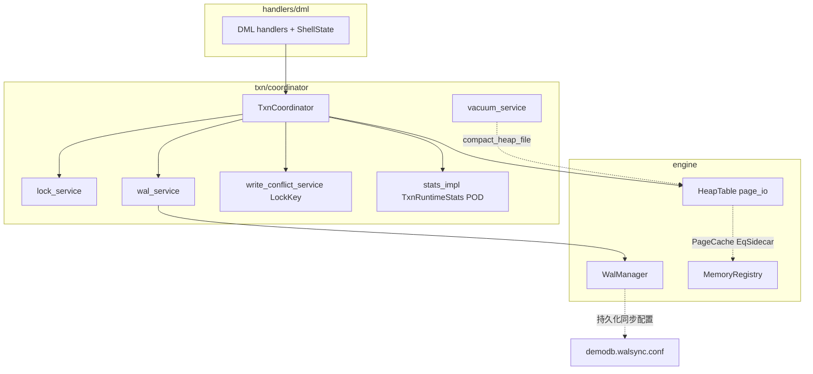

**数据流摘要**：命令参数 → 事务状态机 →（必要时）**锁键** → **WAL 记录**追加 → 堆页/sidecar 就地更新 → 计数器进入 **runtime stats**；冲突时 `write_conflict_service` 在提交前短路。

### 11.5 WHERE 执行子图：parser → plan → 策略与缓存

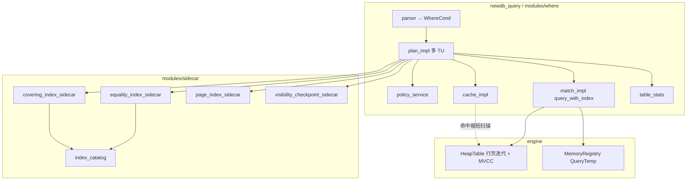

**流动说明**：`plan_impl` 汇聚「统计是否过期、缓存是否命中、哪类 sidecar 可剪枝」；**不可剪枝或 miss** 时仍回落到 `HeapTable` 全表/分页扫描。`*.tablestats` 为 **executor** 与磁盘之间的可选持久化层（见 §5）。

### 11.6 跨 handler 服务：`dispatch/services`

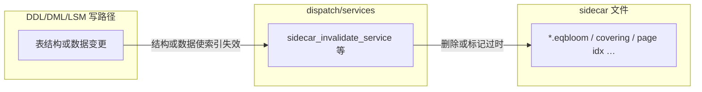

**意图**：避免每个 handler 直接散落文件删除逻辑；**失效事件**（表名、索引类）从写路径注入服务，读路径在 `plan_impl` 侧视为「可能 miss」。

### 11.7 观测子系统：从协调器到 GUI / CI

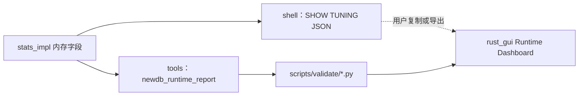

**耦合性质**：`stats_impl` 与 **GUI 无直接链接**；流动靠 **JSON 文本 / 文件 / 子进程 stdout**，与 §7 一致。

### 11.8 引擎内部（只标与 CLI 接壤的边界）

CLI **不得** include `engine/src/**`；合法流动为：

| 方向 | 载体 | 说明 |
|------|------|------|
| CLI → Engine | `newdb::HeapTable*`、`Session` API、C API 封装 | 经 `include/newdb/*.h` |
| Engine → CLI | 行缓冲、错误码、LSN 可见性 | 由 session/table_access 返回 |
| Engine ↔ 磁盘 | WAL codec、`wal_segment_scanner`（恢复） | 对 CLI 透明，仅通过打开表 / recovery 命令暴露效果 |

### 11.9 子模块→子模块矩阵（速查）

| 源 | 经载体 | 典型目标 | 语义 |
|----|--------|----------|------|
| `repl` | 原始行文本 | `dispatch` | 一行一调度 |
| `dispatch` | `ShellState` | `handlers/*` | 两阶段、责任链 |
| `query_handler` | WHERE 字符串 | `where/parser` | 语法树 |
| `where/plan_impl` | 计划上下文 | `policy` / `cache` / `sidecar` | 剪枝与限流 |
| `where/executor` | 行 id / 列缓冲 | `HeapTable` | 取列、判条件 |
| `dml_handler` | 键与列值 | `txn` → `wal_service` | 持久化顺序 |
| `txn` | LSN、锁集合 | `engine` WAL + heap | 一致性与隔离 |
| `ddl` | schema diff | `catalog` + `sidecar_invalidate` | 元数据与索引一致 |
| `stats_impl` | 计数器 | `SHOW TUNING` / `runtime_report` | 可观测性出口 |

---

## 12. 数据结构、算法要点、耦合与关联

本节按子系统列出**主要类型（磁盘或内存）**、**算法/启发式角色**、以及与其它模块的**耦合面**（include、共享状态、文件格式、环境变量）。路径以 `newdb/` 为根。**与实现对照的节选代码**见 [§12.11](#1211-关键源码节选)。**各字段、枚举取值与公开 API 形参的逐项释义**见 [§12.12](#1212-字段与形参释义手册)。

### 12.1 耦合维度速览

| 维度 | 含义 | 本仓库典型表现 |
|------|------|----------------|
| **编译耦合** | 头文件 / 目标链接方向 | `cli` → `engine/include/newdb/*`；`cli/modules/*` 互相 include；`engine` → `waterfall` |
| **进程内运行期关联** | 指针、引用、同结构体成员 | `ShellState` 聚合 `Session`、`TxnCoordinator`、`WhereQueryContext` |
| **文件格式关联** | 无类型共享，靠命名与魔数 | `.wal` 与 `WalRecordHeader`、`WalDecodedRecord`；sidecar 与 `IndexDescriptor` / 头尾字段 |
| **弱关联（契约）** | JSON 字段名、脚本 schema | `TxnRuntimeStats` → `SHOW TUNING JSON` → `scripts/validate`；`rust_gui` 的 `commandPolicy` 与 schema 文档 |

### 12.2 `ShellState`：CLI 聚合根

**定义**：`cli/shell/state/shell_state.h` 中 **`class ShellState`（pimpl）**：对外仅暴露窄接口（`session()`、`txn()`、`where_ctx()`、`lsm()`、`sidecar()`、路径访问器等），**真实字段**在 **`ShellState::Impl`**（`shell_state_impl.h`，仅供 `shell_state.cc` / `shell_state_ops.cc` include）。LSM 与侧车调参置于 **`ShellLsmSidecarRuntime`**（`shell_state_lsm_sidecar_runtime_impl.h`），事务 + WHERE 运行时 bundle 置于 **`ShellTxnWhereRuntime`**，避免臃肿头文件。

**进程所有权**：**`ShellStateOwner`**（`shell_state_owner.h`）默认构造内嵌 **`Session`**；可选 **`ShellStateEngineBorrowedTag` + `newdb_engine_session_t*`** 构造路径把 `Session` **挂在引擎句柄上**（full C API / GUI DLL 场景）。

**子结构 / 访问方式（节选）**：

| 访问器 / 成员桶 | 类型角色 | 关联模块 |
|-----------------|----------|----------|
| `session()` | `newdb::Session` | 引擎会话、堆表、`lock_heap` 与 `HeapAccess` |
| `impl_->heap_guard_box_->session_heap_guard` | `optional<Session::HeapAccess>` | phase-2 **`get_cached_table`** 缓存；与 `process_command_line` 尾部 **`reset_session_heap_guard`** 配对 |
| `txn()` | `TxnCoordinator` | 事务、WAL、锁、vacuum、写冲突、**统计挂载点** |
| `where_ctx()` | `WhereQueryContext` | WHERE LRU、策略、`TableStats*` 提示 |
| `lsm()` | `LsmShellCache` | memtable / segment 元数据（定义见 `shell_state_lsm.h`） |
| `sidecar()` | `SidecarShellTuning` | 侧车失效频率/模式（`shell_state_sidecar.h`） |
| `log_file_path()` / `data_dir()` 等 | 路径与 I/O | **`resolve_table_file(ShellState&, …)`**、`effective_data_path` |

**算法/不变式**：`get_cached_table`（`shell_state_ops.cc`）在首次需要时 **`emplace(lock_heap(log_file_path))`**；`shell_invalidate_session_table` 必须先 **`heap_guard_box_->session_heap_guard.reset()`** 再 **`session().invalidate()`**，避免持锁死锁。

**耦合**：handler 仍以 **`ShellState&`** 为扇出中心；窄读写推荐 **`ShellStateFacade`**（见 [`SHELL_STATE_INCLUDE_AUDIT.md`](../dev/SHELL_STATE_INCLUDE_AUDIT.md)）。

### 12.3 事务协调器 `TxnCoordinator`

**定义**：`cli/modules/txn/coordinator/txn_manager.h`（**类声明**）；状态机实现隐藏在 **`TxnCoordinatorState`**（`std::unique_ptr` 成员 **`st_`**）。

**核心数据结构（头文件拆分）**：

| 类型 | 定义位置 | 作用 |
|------|-----------|------|
| `TxnState` / `TxnRecord` | **`txn_coordinator_types.h`** | 事务枚举与逻辑回滚日志项 |
| `WriteConflictPolicy` / `TxnIsolationLevel` / `WriteTimingStage` | **`txn_coordinator_types.h`** | 冲突策略、隔离级别、写路径分段标签 |
| **`TxnRuntimeStats`** | **`engine/include/newdb/txn_runtime_stats_snapshot.h`**（CLI 通过 **`txn_runtime_stats_types.h`** 间接包含） | **SHOW TUNING / JSONL / C API** 的扁平 POD；含 **`wal_recovery_undo_chain_fallback_txns`** 等恢复细分字段 |
| `LockKey` / `LockKeyKind` | `write_conflict/lock_key.h` | range / predicate / 二级索引等写意向 |

**子模块文件（概念映射）**：`core_impl`、`lock_service`、`wal_service`、`recovery_service`、`vacuum_service`、`write_conflict_service`、`stats_impl` 等实现 TU 仍挂 **`TxnCoordinator`** API；新增 API 如 **`tryReserveWriteKeysBatchSorted`**、**`releaseWriteIntentStorageKeysForCurrentTxn`** 见 `txn_manager.h`。

**算法要点（摘要）**：

- **WAL 先行**：`writeWAL` / `flushWAL` 与引擎 `WalManager` 协同；`recoverFromWAL` 触发扫描与 undo/redo 统计进入 `TxnRuntimeStats`。P2 拆分后，checkpoint 后扫描、redo planning pending txn、apply conflict/skip 等也进入 `wal_recovery_*` 指标族。
- **写冲突**：`tryReserveWriteKey` / **`tryReserveWriteKeysBatchSorted`** 处理主键行写意图（批量路径在首次失败时释放本语句已抢到的预留）；`tryReserveWriteLockKey` 复用同一 reservation map 承载 range/predicate/secondary-index 写意图。策略 `Reject`/`Wait` 控制立即失败或等待；超时计入 `write_conflict_wait_timeout_count`，range/predicate 成功预留计入 `lock_key_range_count` / `lock_key_predicate_count`。
- **Vacuum**：队列 + 冷却 + 可选 `measure_table_storage_health` 加权 **debt**（`stats_impl` 中 tier 推导）。
- **快照读**：`syncHeapReadSnapshotForQuery`（`HeapReadViewGuard`）与 `transaction_snapshot_lsn` / `statement_snapshot_lsn` 字段反映读视图刷新。
- **内存观测闭环**：`stats_impl` 同时镜像旧 `memory_budget_*` 字段与新 `mem_*` per-kind / global 字段；后者来自 `MemoryRegistry` 对 page cache、eq sidecar、WHERE query temp 的 admit/release/evict 计数。

**耦合**：`TxnCoordinator` **include** `<newdb/wal_manager.h>`；`table_storage_health.h` 用于 vacuum 决策采样；`lock_key.h` 定义扩展写意向键；handler 与 **引擎堆** 通过 `Session` 间接耦合。

### 12.4 WHERE 执行栈

**解析**：`cli/modules/where/parser/condition.h` — `CondOp`（Eq/Ne/Gt/Lt/…）、`parse_cond_op`。

**计划与执行**：`cli/modules/where/executor/where.h`。

| 类型 | 作用 |
|------|------|
| `WhereCond` | 单谓词：`attr`、`CondOp`、`value`、`logic_with_prev`（与前一条件的逻辑连接） |
| `WhereQueryContext` | **每 shell** 查询缓存：`unordered_map` + **LRU 列表**（`kMaxQueryCacheEntries = 128`）；大量 `atomic` 计数器（cache hit、plan 分类、扫描行数、sidecar 磁盘读、heap scan budget、query temp reservation 等）；`WherePolicyState policy`；`const TableStats* query_stats_hint` |
| `PlanCandidate` / `PlanCost` | `SHOW PLAN` / `EXPLAIN` / C API 用的轻量候选路径、估计行数与 `rationale` 人类可读排序原因 |
| `query_with_index` | 主入口：解析后多条件 → 选路（sidecar / PK / fallback scan）→ 通过 `MemoryKind::QueryTemp` 预留临时内存 → 返回行 slot 向量 |
| `where_build_plan_candidates` | 按估计代价升序生成候选集合；重载接收 **`WherePlanningStatsRef`**（封装可选 `TableStats*`），与 `where_estimate_scan_rows` 门控一致 |
| `build_candidate_slots` / **`where_predicate_fingerprint_for_write_intent`** / **`where_try_derive_closed_int_range`** | 计划槽位构建、谓词指纹（写冲突）、闭区间范围推导（range intent） |

**算法要点（摘要）**：

- **缓存键**：由表 + 条件序列等派生（实现于 `cache_impl` / `plan_impl`）；LRU 驱逐最旧条目。
- **统计提示**：`NEWDB_QUERY_USE_TABLE_STATS=1` 时 `TableStats` 参与 **选择性估计**（`eq_selectivity_from_stats` / `range_selectivity_from_stats`），影响剪枝与 `estimated_scan_rows_*`。
- **策略门**：`policy_service` 可拒绝查询并写入 `WherePolicyState`（窗口计数等）。
- **扫描上限**：环境变量如 `NEWDB_WHERE_HEAP_SCAN_BUDGET_ROWS` 与 `where_heap_scan_budget_binding_events` 观测绑定。
- **查询临时内存**：`query_with_index` 对候选 slot / 条件解析等热路径估算 `query_temp_reserved_bytes`，并通过 `MemoryRegistry` 的 `QueryTemp` kind 进入 `mem_query_temp_*` 与 `mem_global_*` 观测。

**耦合**：`where.h` **include** `heap_table.h`、`schema.h`、`table_stats.h`、`condition.h`；与 **sidecar** 通过 **`plan_impl` 管线**（多文件：`plan_impl.cc`、`plan_impl_support`、`plan_query_index`、`plan_scan_estimate`、`where_plan_catalog` 等，目录 `cli/modules/where/executor/plan/`）调用 sidecar 目标；与 `MemoryRegistry` 通过 query temp 预留形成运行期弱耦合。

### 12.5 表级统计 `TableStats`

**定义**：`cli/modules/where/executor/stats/table_stats.h`。

| 类型 | 作用 |
|------|------|
| `ColumnStats` | 列级：`non_null_count`、`distinct_count`、`min_value`/`max_value`、`top_k` |
| `TableStats` | `row_count`、`stats_built_ts_ms`、`stats_schema_fp`、`columns` 映射 |

**算法**：`build_table_stats_from_heap` — **O(n) 全表扫描**（注释明确为 ANALYZE 风格）；`load_table_stats_file` / `save_table_stats_file` — 文本 v1 + **schema fingerprint** 不匹配则拒绝加载。

**耦合**：`*.tablestats` 与 **堆数据文件** 同目录命名约定；**DDL** 后指纹失效 → `table_stats_matches_schema` / plan 中 **stale** 标记；与 `WhereQueryContext::query_stats_hint` 弱关联（指针生命周期由调用方保证）。

### 12.6 Sidecar 与 `index_catalog`

**定义**：`cli/modules/sidecar/common/index_catalog.h` 等。

| 类型 | 作用 |
|------|------|
| `IndexKind` | Eq / Range / Covering / PageOrder / Visibility |
| `IndexDescriptor` | 逻辑索引元数据：`table_name`、`index_name`、`data_lsn`、`schema_version`、`built_at_ms`、`valid` |
| `IndexCatalogParsedTail` / `IndexCatalogPlaintextNames` | 侧车文件头尾解析：版本、FNV、构建状态、`;tbl_n=` / `;inx_n=` 百分号编码名 |

**算法要点**：`index_descriptor_matches_runtime` — 将描述符与当前 **表 schema 版本 / 数据 LSN** 比较，判定 stale；`index_catalog_fnv1a64` — 表路径与索引键的稳定哈希。

**耦合**：**写路径** 经 `sidecar_invalidate_service` 使描述符或文件失效；**读路径** `plan_impl` 在 mismatch 时回落扫描；与 `TxnRuntimeStats::sidecar_invalidate_*` 观测闭环。

### 12.7 存储健康 `TableStorageHealth`

**定义**：`cli/modules/storage/table_storage_health.h`（命名空间 `newdb`）。

| 字段（节选） | 语义 |
|----------------|------|
| `logical_rows` / `physical_rows` / `tombstone_*` | 槽位与删除标记比例 |
| `data_file_bytes`、`live_bytes`、`dead_bytes`、`fragmentation_ratio` | 文件级碎片启发式 |
| `last_vacuum_*` | 预留与 vacuum 元数据衔接 |

**算法**：`measure_table_storage_health(const HeapTable&)` — 只读度量，无持久化；结果被 **vacuum 打分** 与 `TxnRuntimeStats` 中 `table_storage_health_*`、`table_storage_health_tier` 消费。

**耦合**：仅依赖 `HeapTable` 公共形状；不反向修改引擎。

### 12.8 引擎侧关键类型（与 CLI 接壤）

| 类型 / API | 位置（概念） | 算法 / 语义 |
|-------------|----------------|-------------|
| `WalOp` / `WalRecordHeader` / `WalDecodedRecord` | `include/newdb/wal_manager.h` | 变长 payload、LSN 单调、CRC；**`WalDecodedRecord` 含 PITR / 时间戳可选字段** |
| `WalSyncMode` | **`include/newdb/wal_sync_mode.h`** | `Full` / `Normal` / `Off` 控制 fsync 频率与吞吐 |
| **`TxnRuntimeStats`（引擎侧 POD）** | **`include/newdb/txn_runtime_stats_snapshot.h`** | 与 CLI `TxnCoordinator::runtimeStats()` 导出形状对齐 |
| `PageCacheGlobalStats` / `page_cache_try_get` / `page_cache_put` | `include/newdb/page_cache.h` | 进程级 LRU（按 heap 路径 + 页号）；**可选**环境变量启用；向 `MemoryRegistry` 报告 PageCache kind 的 admit / eviction / reject |
| `MemoryBudgetSnapshot` | `include/newdb/memory_budget.h` | 旧兼容视角：与页缓存上限统一语义；拒绝与驱逐计数 |
| `MemoryRegistry` / `MemoryKind` | `include/newdb/memory_registry.h` | v2 closed loop：统一 global cap 与 per-kind cap；kind 包括 `PageCache`、`EqSidecar`、`QueryTemp`；支持 evictor 回调与 `memory_registry_totals()` 汇总 |
| `Session` / `HeapTable` | `include/newdb/session.h`、`heap_table.h` | MVCC 快照、lazy materialize、`logical_row_count` |

**耦合**：`TxnRuntimeStats` 中旧 page_cache / memory_budget 字段由 **stats 采样** 从 `page_cache_global_stats()` / `memory_budget_snapshot()` 拉取；新 `mem_*` 字段由 `memory_registry_totals()` 拉取，形成 **引擎/CLI 共享内存治理单例 → CLI 协调器统计 → JSON/GUI/CI** 的镜像关系。

### 12.9 工具链、GUI、脚本

| 组件 | 数据结构 / 契约 | 耦合 |
|------|-----------------|------|
| `tools/*_report` | 读出 `TxnRuntimeStats` 或日志，输出 JSON | 与 `SHOW TUNING` 字段集合强一致需求 |
| `scripts/validate/*.py` | 期望 JSON key 与 `RUNTIME_STATS_SCHEMA.md` | CI 破线即契约破坏 |
| `rust_gui` | Vue 状态、`commandPolicy.ts` 分组键 | 与上述 JSON **弱耦合**（前端字符串与后端字段同步靠人工/CI） |
| `gtest_capi` | C 导出符号 + GTest | 与引擎业务正交 |

### 12.10 关联矩阵（扩展）

| 源类型 / 模块 | 关联手段 | 目标 |
|---------------|----------|------|
| `ShellState::txn()` | 访问器 + `writeWAL` 调用 | `newdb::WalManager`、堆文件 |
| `ShellState::where_ctx()` | 指针/引用传入 `query_with_index` | `HeapTable`、`TableStats*`、sidecar 读 |
| `TableStats::stats_schema_fp` | 文件 on disk | `TableSchema` 列集合指纹 |
| `IndexDescriptor::data_lsn` | 文件头 + 运行时比较 | 当前表代际 |
| `TxnRuntimeStats` | JSON 序列化 | Python 校验、GUI、文档 schema |
| `WhereQueryContext` LRU | 内存 | 同进程多查询；**不**跨进程共享 |

### 12.11 关键源码节选

以下引用为**仓库内真实路径与行号**（相对仓库根 `database/`）；若你本地移动过符号，请用符号名或 `rg` 重新对齐。节选仅覆盖与 §11–§12 叙述直接相关的片段。

#### 分发：`process_command_line` 门面与两阶段责任链

入口先用 **`ShellStateFacade`** 绑定日志、规范化行尾，并在 **`handle_session_commands`** 之后进入 phase-1 / phase-2；函数末尾 **`ShellHeapGuardClear`** 确保 **`reset_session_heap_guard`** 在行处理结束时运行。

```14:52:newdb/cli/shell/dispatch/router/dispatch.cc
bool process_command_line(ShellState& st, const char* input_line) {
    ShellStateFacade f(st);
    std::string& current_table = f.table_name();
    std::string& current_file = f.data_path();
    const char* log_file = f.log_file_path().c_str();
    std::string line;
    if (input_line != nullptr) {
        line = input_line;
    }
    while (!line.empty() && (line.back() == '\n' || line.back() == '\r')) {
        line.pop_back();
    }
    if (line.empty()) {
        return true;
    }
    const char* line_cstr = line.c_str();

    f.bind_logging();
    const std::string eff_data = f.effective_data_path();
    append_session_log_line(log_file, line_cstr, f.encrypt_log());

    struct ShellHeapGuardClear {
        ShellStateFacade* f;
        ~ShellHeapGuardClear() {
            if (f != nullptr) {
                f->reset_session_heap_guard();
            }
        }
    } shell_heap_clear{&f};

    bool session_handled = false;
    const bool keep_going = handle_session_commands(line_cstr, log_file, session_handled);
    if (!keep_going) {
        return false;
    }
    if (session_handled) {
        return true;
    }
```

```53:98:newdb/cli/shell/dispatch/router/dispatch.cc
    // Phase-1: commands that do not require a loaded HeapTable (txn, DDL, catalog, insert, ...).
    if (!shell_line_targets_phase2_only(line_cstr)) {
        const std::array<std::function<bool()>, 8> phase1_handlers = {
            [&]() { return handle_txn_commands(st, line_cstr, log_file, current_table); },
            [&]() { return handle_workspace_admin_commands(st, line_cstr, log_file, eff_data, current_table, current_file); },
            [&]() { return handle_import_defattr_commands(st, line_cstr, log_file, eff_data, current_file); },
            [&]() { return handle_schema_catalog_commands(st, line_cstr, log_file); },
            [&]() { return handle_ddl_create_use_commands(st, line_cstr, log_file, eff_data, current_table, current_file); },
            [&]() { return handle_ddl_alter_rename_commands(st, line_cstr, log_file, eff_data, current_table, current_file); },
            [&]() { return handle_schema_show_commands(st, line_cstr, log_file, current_table, current_file); },
            [&]() { return handle_dml_insert_command(st, line_cstr, log_file, eff_data, current_table, current_file); },
        };
        for (const auto& h : phase1_handlers) {
            if (h()) {
                return true;
            }
        }
    }

    // Phase-2: need a loaded heap table (Session::lock_heap via ShellState guard).
    newdb::HeapTable* tbl_ptr = get_cached_table(st);
    if (!tbl_ptr) {
        return true;
    }
    newdb::HeapTable& tbl = *tbl_ptr;

    // Phase-2 dispatch chain: commands requiring loaded table cache.
    const std::array<std::function<bool()>, 9> phase2_handlers = {
        [&]() { return handle_schema_key_command(st, line_cstr, log_file, eff_data, tbl); },
        [&]() { return handle_query_where_count_commands(st, line_cstr, log_file, eff_data, current_table, tbl); },
        [&]() { return handle_dml_update_delete_commands(st, line_cstr, log_file, eff_data, current_table, tbl); },
        [&]() { return handle_dml_attr_commands(st, line_cstr, log_file, eff_data, current_table, tbl); },
        [&]() { return handle_query_find_commands(st, line_cstr, log_file, eff_data, tbl); },
        [&]() { return handle_query_sum_avg_commands(st, line_cstr, log_file, eff_data, tbl); },
        [&]() { return handle_query_min_max_commands(st, line_cstr, log_file, tbl); },
        [&]() { return handle_query_page_command(st, line_cstr, log_file, eff_data, tbl); },
        [&]() { return handle_export_command(st, line_cstr, log_file, current_table, current_file, tbl); },
    };
    for (const auto& h : phase2_handlers) {
        if (h()) {
            return true;
        }
    }

    log_and_print(log_file, "[ERR] unknown command. Type HELP.\n");
    return true;
}
```

`shell_line_targets_phase2_only` 与 **`kPhase2Prefixes`**（含 **`UPDATEWHERE` / `DELETEWHERE` / `SETATTRMULTI`** 等，与 phase-2 handler 动词对齐）：

```31:73:newdb/cli/shell/dispatch/router/dispatch_routing.cc
bool shell_line_targets_phase2_only(const char* line) {
    if (line == nullptr) {
        return false;
    }
    const char* s = skip_ws(line);
    if (*s == '\0') {
        return false;
    }
    // Prefixes aligned with handlers in query/dml/io/ddl (phase-2 chain order is irrelevant here).
    static const struct {
        const char* pfx;
        std::size_t len;
    } kPhase2Prefixes[] = {
        {"PAGE", 4},
        {"WHEREP", 6},
        {"WHERE", 5},
        {"COUNT", 5},
        {"MIN", 3},
        {"MAX", 3},
        {"SUM", 3},
        {"AVG", 3},
        {"FIND(", 5},
        {"FINDPK", 6},
        {"QBAL", 4},
        {"UPDATEWHERE", 11},
        {"UPDATE", 6},
        {"DELETEWHERE", 11},
        {"DELETE(", 7},
        {"DELETEPK", 8},
        {"EXPORT", 6},
        {"SETATTRMULTI", 12},
        {"SETATTR", 7},
        {"RENATTR", 7},
        {"DELATTR", 7},
        {"SET PRIMARY KEY", 15},
    };
    for (const auto& e : kPhase2Prefixes) {
        if (command_has_prefix_token(s, e.pfx, e.len)) {
            return true;
        }
    }
    return false;
}
```

#### `ShellState`（pimpl）、`Impl` 布局、`get_cached_table`、读视图 RAII

```37:114:newdb/cli/shell/state/shell_state.h
class ShellState {
    struct Impl;
    std::unique_ptr<Impl> impl_;

public:
    ShellState();
    explicit ShellState(ShellStateEngineBorrowedTag, newdb_engine_session_t* engine_host);
    ~ShellState();
    ShellState(ShellState&&) noexcept;
    ShellState& operator=(ShellState&&) noexcept;
    ShellState(const ShellState&) = delete;
    ShellState& operator=(const ShellState&) = delete;

    [[nodiscard]] newdb::Session& session() noexcept;
    [[nodiscard]] const newdb::Session& session() const noexcept;

    void reset_session_heap_guard() noexcept;

    [[nodiscard]] std::uint64_t bump_txn_stmt_savepoint_seq() noexcept;

    TxnCoordinator& txn();
    [[nodiscard]] const TxnCoordinator& txn() const;
    WhereQueryContext& where_ctx();
    [[nodiscard]] const WhereQueryContext& where_ctx() const;

    LsmShellCache& lsm();
    [[nodiscard]] const LsmShellCache& lsm() const;
    SidecarShellTuning& sidecar();
    [[nodiscard]] const SidecarShellTuning& sidecar() const;

    [[nodiscard]] std::string& log_file_path() noexcept;
    [[nodiscard]] const std::string& log_file_path() const noexcept;
    [[nodiscard]] std::string& data_dir() noexcept;
    [[nodiscard]] const std::string& data_dir() const noexcept;

    [[nodiscard]] int& mirror_output_fd() noexcept;
    [[nodiscard]] int mirror_output_fd() const noexcept;

    [[nodiscard]] bool& encrypt_log() noexcept;
    [[nodiscard]] bool encrypt_log() const noexcept;

    [[nodiscard]] bool& verbose() noexcept;
    [[nodiscard]] bool verbose() const noexcept;

    [[nodiscard]] ShellRuntimePolicy& runtime_policy() noexcept;
    [[nodiscard]] const ShellRuntimePolicy& runtime_policy() const noexcept;

    [[nodiscard]] std::uint64_t heap_decode_slot_calls() const noexcept;
    [[nodiscard]] std::uint64_t heap_decode_slot_hits() const noexcept;
    [[nodiscard]] std::uint64_t heap_decode_slot_misses() const noexcept;

    [[nodiscard]] std::string& session_table_name() noexcept;
    [[nodiscard]] const std::string& session_table_name() const noexcept;
    [[nodiscard]] std::string& session_data_path() noexcept;
    [[nodiscard]] const std::string& session_data_path() const noexcept;
    [[nodiscard]] newdb::TableSchema& session_schema() noexcept;
    [[nodiscard]] const newdb::TableSchema& session_schema() const noexcept;
    [[nodiscard]] newdb::HeapTable& session_heap_table() noexcept;
    [[nodiscard]] const newdb::HeapTable& session_heap_table() const noexcept;

    [[nodiscard]] newdb::Status session_ensure_loaded();
    void session_invalidate();

    [[nodiscard]] bool emit_where_plan_json(const char* log_path,
                                            const WhereCond* conds,
                                            std::size_t cond_count,
                                            std::string* out_json);

    friend newdb::HeapTable* get_cached_table(ShellState& st);
    friend void shell_invalidate_session_table(ShellState& st);
    friend void reload_schema_from_data_path(ShellState& st, const std::string& data_path);
};
```

```34:44:newdb/cli/shell/state/shell_state_impl.h
struct ShellState::Impl {
    std::unique_ptr<newdb::Session> session_;
    newdb_engine_session_t* engine_session_borrow_{nullptr};
    std::unique_ptr<shell_state_detail::HeapGuardBox> heap_guard_box_;
    std::unique_ptr<ShellTxnWhereRuntime> txn_where_;
    std::unique_ptr<ShellLsmSidecarRuntime> lsm_sidecar_;
    ShellStatePathsAndIoFlags paths_and_io_;
    std::uint64_t txn_stmt_savepoint_seq{0};
};
```

```25:33:newdb/cli/shell/state/shell_state_lsm.h
struct LsmShellCache {
    std::unordered_map<int, newdb::Row> hot_index_recent;
    std::unordered_map<int, LsmEntry> lsm_memtable;
    std::unordered_map<int, LsmEntry> lsm_immutable;
    std::vector<LsmSegmentMeta> lsm_segments;
    std::uint64_t lsm_memtable_bytes{0};
    std::uint64_t lsm_seq{0};
    std::string lsm_table_name;
};
```

```60:73:newdb/cli/shell/state/shell_state_ops.cc
newdb::HeapTable* get_cached_table(ShellState& st) {
    ShellStateFacade f(st);
    auto& g = st.impl_->heap_guard_box_->session_heap_guard;
    if (!g.has_value() || !g.value()) {
        g.emplace(f.session().lock_heap(f.log_file_path().c_str()));
    }
    newdb::Session::HeapAccess& acc = g.value();
    return acc ? &f.heap_table() : nullptr;
}

void shell_invalidate_session_table(ShellState& st) {
    st.impl_->heap_guard_box_->session_heap_guard.reset();
    ShellStateFacade(st).session().invalidate();
}
```

```9:16:newdb/cli/shell/state/shell_state_heap_read_guard.h
struct HeapReadViewGuard {
    ShellState& st;
    newdb::HeapTable& tbl;
    HeapReadViewGuard(ShellState& s, newdb::HeapTable& t) : st(s), tbl(t) {
        st.txn().syncHeapReadSnapshotForQuery(tbl);
    }
    ~HeapReadViewGuard() { tbl.clear_snapshot(); }
};
```

#### 事务枚举 / 记录 / 策略与 **`TxnRuntimeStats`（引擎共享 POD）**

```8:47:newdb/cli/modules/txn/coordinator/txn_coordinator_types.h
enum class TxnState {
    None,
    Active,
    Committed,
    RolledBack,
};

struct TxnRecord {
    int64_t txn_id;
    TxnState state;
    std::string table_name;
    std::string operation;
    std::string key;
    std::string old_value;
    std::string new_value;
    int64_t timestamp;
    std::uint64_t op_seq{0};
    std::uint64_t wal_lsn{0};
};

enum class WriteConflictPolicy {
    Reject,
    Wait,
};

enum class TxnIsolationLevel {
    ReadCommitted,
    Snapshot,
};

enum class WriteTimingStage : std::uint8_t {
    HeapAppend = 0,
    HotIndex = 1,
    SidecarInvalidate = 2,
    WalAppend = 3,
    LsmTrack = 4,
    LsmRotateCompact = 5,
    LsmFlush = 6,
    LsmCompaction = 7,
};
```

`TxnRuntimeStats` **单一权威定义**在引擎头 **`txn_runtime_stats_snapshot.h`**（CLI 经 **`txn_runtime_stats_types.h`** 转发）；与 **`SHOW TUNING JSON` / JSONL** 字段顺序一致：

```9:157:newdb/engine/include/newdb/txn_runtime_stats_snapshot.h
struct TxnRuntimeStats {
    std::uint64_t vacuum_trigger_count{0};
    std::uint64_t vacuum_execute_count{0};
    std::uint64_t vacuum_cooldown_skip_count{0};
    std::uint64_t vacuum_compact_success_count{0};
    std::uint64_t vacuum_compact_failure_count{0};
    std::uint64_t vacuum_compact_bytes_reclaimed{0};
    std::uint64_t vacuum_compact_last_elapsed_ms{0};
    std::uint64_t vacuum_queue_depth{0};
    std::uint64_t vacuum_queue_depth_peak{0};
    std::uint64_t maintenance_checkpoint_trigger_count{0};
    std::uint64_t maintenance_checkpoint_vacuum_enqueue_count{0};
    std::uint64_t write_conflict_count{0};
    std::uint64_t write_conflict_wait_count{0};
    std::uint64_t write_conflict_wait_timeout_count{0};
    std::string write_conflict_last_sample;
    std::uint64_t file_lock_acquire_fail_count{0};
    std::uint64_t file_lock_same_process_reuse_count{0};
    std::uint64_t file_lock_stale_marker_count{0};
    std::uint64_t sidecar_invalidate_count{0};
    std::uint64_t sidecar_invalidate_fail_count{0};
    std::uint64_t txn_begin_lock_conflict_count{0};
    std::uint64_t wal_compact_count{0};
    std::uint64_t wal_recovery_runs{0};
    std::uint64_t wal_recovery_undo_ops{0};
    std::uint64_t wal_recovery_last_elapsed_ms{0};
    std::uint64_t wal_recovery_analyze_ms{0};
    std::uint64_t wal_recovery_undo_ms{0};
    std::uint64_t wal_recovery_finalize_ms{0};
    std::uint64_t wal_recovery_records_scanned{0};
    std::uint64_t wal_recovery_dangling_txns{0};
    std::uint64_t wal_recovery_redo_ms{0};
    std::uint64_t wal_recovery_checkpoint_begin_count{0};
    std::uint64_t wal_recovery_checkpoint_end_count{0};
    std::uint64_t wal_recovery_records_after_checkpoint{0};
    std::uint64_t wal_recovery_segments_after_checkpoint{0};
    std::uint64_t wal_recovery_redo_plan_pending_txn_count{0};
    std::uint64_t wal_recovery_apply_conflict_count{0};
    std::uint64_t wal_recovery_undo_chain_fallback_txns{0};
    std::string wal_recovery_policy;
    std::uint64_t wal_group_commit_count{0};
    std::uint64_t wal_group_commit_batch_commits{0};
    std::uint64_t wal_group_commit_pending_commits{0};
    std::uint64_t txn_commit_count{0};
    std::uint64_t txn_commit_p95_ms{0};
    std::uint64_t txn_commit_max_ms{0};
    std::uint64_t wal_bytes_since_start{0};
    std::uint64_t wal_bytes_per_commit_avg{0};
    std::uint64_t lock_deadlock_detect_count{0};
    std::uint64_t lock_deadlock_victim_count{0};
    std::uint64_t lock_wait_ms_total{0};
    std::uint64_t lock_wait_max_ms{0};
    std::uint64_t lock_wait_p95_ms{0};
    std::uint64_t scheduler_throttle_count{0};
    bool hot_index_enabled{true};
    std::uint64_t segment_target_bytes{0};
    std::uint64_t lsm_memtable_flush_count{0};
    std::uint64_t lsm_compaction_count{0};
    std::uint64_t lsm_segment_count{0};
    std::uint64_t lsm_memtable_bytes{0};
    std::uint64_t lsm_read_segments_scanned{0};
    std::uint64_t lsm_read_segments_scanned_p95{0};
    std::uint64_t lsm_compaction_bytes_in{0};
    std::uint64_t lsm_compaction_bytes_out{0};
    std::uint64_t lsm_compaction_queue_pending{0};
    std::uint64_t lsm_compaction_queue_inflight{0};
    std::uint64_t lsm_compaction_enqueue_skipped_backpressure{0};
    std::uint64_t lsm_segment_cache_hits{0};
    std::uint64_t lsm_segment_cache_misses{0};
    double lsm_compaction_bytes_amp_efficiency_min_window{0.0};
    std::uint64_t lsm_read_segments_scanned_p95_window{0};
    std::string hybrid_mode{"throughput_mode"};
    std::uint64_t hybrid_mode_switch_count{0};
    std::string hybrid_last_switch_reason;
    std::uint64_t rollback_savepoint_count{0};
    std::uint64_t rollback_partial_ops{0};
    std::uint64_t pitr_runs{0};
    std::uint64_t pitr_target_lsn{0};
    std::uint64_t pitr_elapsed_ms{0};
    std::uint64_t undo_chain_fallback_count{0};
    std::uint64_t lazy_materialize_count{0};
    std::uint64_t lazy_materialize_rows_total{0};
    std::uint64_t lazy_materialize_max_rows{0};
    std::uint64_t lazy_materialize_elapsed_ms{0};
    std::uint64_t vacuum_priority_score{0};
    std::uint64_t vacuum_health_bonus_last{0};
    std::uint64_t vacuum_score_file_bytes_term{0};
    std::uint64_t vacuum_score_health_bonus_term{0};
    std::uint64_t vacuum_score_wal_since_term{0};
    std::uint64_t table_storage_health_logical_rows{0};
    std::uint64_t table_storage_health_physical_rows{0};
    std::uint64_t table_storage_health_tombstone_rows{0};
    std::uint64_t table_storage_health_data_file_bytes{0};
    std::uint64_t table_storage_health_live_bytes{0};
    std::uint64_t table_storage_health_dead_bytes{0};
    double table_storage_health_fragmentation_ratio{0.0};
    std::uint64_t table_storage_health_last_vacuum_lsn{0};
    std::uint64_t table_storage_health_last_vacuum_elapsed_ms{0};
    std::string table_storage_health_tier{"good"};
    std::uint64_t compact_debt_bytes{0};
    std::uint64_t compact_debt_rows{0};
    double compact_debt_ratio{0.0};
    std::uint64_t compact_debt_priority{0};
    std::uint64_t page_cache_hits{0};
    std::uint64_t page_cache_misses{0};
    std::uint64_t page_cache_evictions{0};
    std::uint64_t page_cache_bytes_in_cache{0};
    std::uint64_t memory_budget_max_bytes{0};
    std::uint64_t memory_budget_used_bytes{0};
    std::uint64_t memory_budget_reject_count{0};
    std::uint64_t memory_budget_bytes_evicted_total{0};
    std::uint64_t memory_budget_sidecar_load_skipped_total{0};
    std::uint64_t mem_page_cache_used_bytes{0};
    std::uint64_t mem_page_cache_evictions{0};
    std::uint64_t mem_page_cache_admit_rejects{0};
    std::uint64_t mem_sidecar_used_bytes{0};
    std::uint64_t mem_sidecar_evictions{0};
    std::uint64_t mem_sidecar_admit_rejects{0};
    std::uint64_t mem_query_temp_used_bytes{0};
    std::uint64_t mem_query_temp_evictions{0};
    std::uint64_t mem_query_temp_admit_rejects{0};
    std::uint64_t mem_global_used_bytes{0};
    std::uint64_t mem_global_admit_rejects{0};
    std::uint64_t txn_snapshot_refresh_count{0};
    std::uint64_t txn_snapshot_pinned_count{0};
    std::uint64_t txn_readpath_disabled_count{0};
    std::string last_snapshot_source{"none"};
    std::uint64_t transaction_snapshot_lsn{0};
    std::uint64_t statement_snapshot_lsn{0};
    std::uint64_t lock_key_range_count{0};
    std::uint64_t lock_key_predicate_count{0};

    std::uint64_t write_heap_append_p95_ms{0};
    std::uint64_t write_heap_append_max_ms{0};
    std::uint64_t write_hot_index_p95_ms{0};
    std::uint64_t write_hot_index_max_ms{0};
    std::uint64_t write_sidecar_invalidate_p95_ms{0};
    std::uint64_t write_sidecar_invalidate_max_ms{0};
    std::uint64_t write_wal_append_p95_ms{0};
    std::uint64_t write_wal_append_max_ms{0};
    std::uint64_t write_lsm_track_p95_ms{0};
    std::uint64_t write_lsm_track_max_ms{0};
    std::uint64_t write_lsm_flush_p95_ms{0};
    std::uint64_t write_lsm_flush_max_ms{0};
    std::uint64_t write_lsm_compaction_p95_ms{0};
    std::uint64_t write_lsm_compaction_max_ms{0};
    std::uint64_t write_lsm_rotate_compact_p95_ms{0};
    std::uint64_t write_lsm_rotate_compact_max_ms{0};
};
```

`TxnCoordinator`：**实现隐藏在 `TxnCoordinatorState`**（`st_`），对外 API 节选（至隔离级别；其后含 VACUUM、runtime stats getter、`syncHeapReadSnapshotForQuery` 等）：

```37:94:newdb/cli/modules/txn/coordinator/txn_manager.h
class TxnCoordinator {
public:
    TxnCoordinator();
    ~TxnCoordinator();
    TxnCoordinator(const TxnCoordinator&) = delete;
    TxnCoordinator& operator=(const TxnCoordinator&) = delete;

    // 事务控制
    Result<bool> begin(const std::string& table_name);
    Result<bool> commit();
    Result<bool> rollback();
    Result<bool> savepoint(const std::string& name);
    Result<bool> rollbackToSavepoint(const std::string& name);
    Result<bool> releaseSavepoint(const std::string& name);
    Result<bool> recoverToLsn(std::uint64_t target_lsn);
    Result<bool> recoverToTime(std::uint64_t target_ts_ms);
    TxnState getState() const;
    int64_t getTxnId() const;
    bool inTransaction() const;

    Result<bool> acquireLock(const std::string& file_path);
    Result<bool> releaseLock(const std::string& file_path);
    bool isLocked(const std::string& file_path) const;

    void writeWAL(const std::string& operation, const std::string& table,
                   const std::string& key, const std::string& old_val, const std::string& new_val);
    void flushWAL();
    bool recoverFromWAL();
    void setWalSyncMode(newdb::WalSyncMode mode);
    newdb::WalSyncMode walSyncMode();

    void recordOperation(const std::string& operation, const std::string& table,
                         const std::string& key, const std::string& old_val, const std::string& new_val);
    bool tryReserveWriteKey(const std::string& table_name, int id, std::string* reason = nullptr);
    bool tryReserveWriteKeysBatchSorted(const std::string& table_name,
                                        std::vector<int> row_ids,
                                        std::string* reason = nullptr);
    bool tryReserveWriteLockKey(const LockKey& lk, std::string* reason = nullptr);
    void releaseWriteIntentStorageKeysForCurrentTxn(const std::vector<std::string>& storage_keys);
    void setWriteConflictPolicy(WriteConflictPolicy policy);
    WriteConflictPolicy writeConflictPolicy() const;
    void setWriteConflictWaitTimeoutMs(std::uint64_t ms);
    std::uint64_t writeConflictWaitTimeoutMs() const;
    void setTxnIsolationLevel(TxnIsolationLevel level);
    TxnIsolationLevel txnIsolationLevel() const;
```

#### WHERE：计划候选、查询上下文、主入口声明（含 `WherePlanningStatsRef` 重载）

```19:149:newdb/cli/modules/where/executor/where.h
struct PlanCost {
    double estimated_rows{0.0};
};

struct PlanCandidate {
    std::string id;
    double estimated_cost{0.0};
    PlanCost cost;
    std::string rationale;
};

struct WhereCond {
    std::string attr;
    CondOp op{CondOp::Unknown};
    std::string value;
    std::string logic_with_prev;
};

struct WherePolicyState {
    bool blocked{false};
    std::string message;
    std::uint64_t window_sec{0};
    std::size_t window_count{0};
};

struct WhereQueryContext {
    static constexpr std::size_t kMaxQueryCacheEntries = 128;
    std::unordered_map<std::string, std::vector<std::size_t>> query_cache;
    std::list<std::string> query_cache_lru;
    std::unordered_map<std::string, std::list<std::string>::iterator> query_cache_lru_pos;
    std::unordered_set<std::string> eq_sidecar_prewarmed;
    std::atomic<std::uint64_t> cache_lookups{0};
    std::atomic<std::uint64_t> cache_hits{0};
    std::atomic<std::uint64_t> policy_checks{0};
    std::atomic<std::uint64_t> policy_rejects{0};
    std::atomic<std::uint64_t> fallback_scans{0};
    std::atomic<std::uint64_t> plan_eq_sidecar_count{0};
    std::atomic<std::uint64_t> plan_id_pk_count{0};
    std::atomic<std::uint64_t> plan_fallback_count{0};
    std::atomic<std::uint64_t> query_count{0};
    std::atomic<std::uint64_t> query_rows_scanned_total{0};
    std::atomic<std::uint64_t> query_rows_returned_total{0};
    const TableStats* query_stats_hint{nullptr};
    std::atomic<std::uint64_t> estimated_scan_rows_total{0};
    std::atomic<std::uint64_t> estimated_scan_rows_samples{0};
    std::atomic<std::uint32_t> last_plan_candidates_considered{1};
    std::atomic<std::uint64_t> where_eq_sidecar_disk_bytes_read_total{0};
    std::atomic<std::uint64_t> where_eq_sidecar_disk_loads{0};
    std::atomic<std::uint64_t> where_heap_scan_budget_binding_events{0};
    WherePolicyState policy{};
    std::string last_plan_id;
    std::atomic<std::uint64_t> query_temp_reserved_bytes{0};
    mutable std::mutex mu;
};

std::size_t where_estimate_scan_rows(const newdb::HeapTable& tbl,
                                     const newdb::TableSchema& schema,
                                     const std::vector<WhereCond>& conds,
                                     WhereQueryContext* ctx = nullptr);

std::vector<PlanCandidate> where_build_plan_candidates(const newdb::HeapTable& tbl,
                                                       const newdb::TableSchema& schema,
                                                       const std::vector<WhereCond>& conds,
                                                       WherePlanningStatsRef stats);

inline std::vector<PlanCandidate> where_build_plan_candidates(const newdb::HeapTable& tbl,
                                                              const newdb::TableSchema& schema,
                                                              const std::vector<WhereCond>& conds,
                                                              const TableStats* stats_hint) {
    return where_build_plan_candidates(tbl, schema, conds, WherePlanningStatsRef{stats_hint});
}

std::vector<std::size_t> query_with_index(const newdb::HeapTable& tbl,
                                          const newdb::TableSchema& schema,
                                          const std::vector<WhereCond>& conds,
                                          WhereQueryContext* ctx = nullptr);

std::vector<std::size_t> build_candidate_slots(const newdb::HeapTable& tbl,
                                               const newdb::TableSchema& schema,
                                               const std::vector<WhereCond>& conds,
                                               WhereQueryContext* ctx = nullptr);

std::string where_predicate_fingerprint_for_write_intent(const std::vector<WhereCond>& conds);

std::optional<WhereClosedIntRangeParts> where_try_derive_closed_int_range(const newdb::TableSchema& schema,
                                                                          const std::vector<WhereCond>& conds);
```

#### 表统计与侧车路径 API

```14:36:newdb/cli/modules/where/executor/stats/table_stats.h
struct ColumnStats {
    std::uint64_t non_null_count{0};
    std::uint64_t distinct_count{0};
    /// Lexicographic min among non-null string samples (empty = unknown).
    std::string min_value;
    std::string max_value;
    /// Up to 3 most frequent non-null values (best-effort; may be empty).
    std::vector<std::string> top_k;
};

struct TableStats {
    std::uint64_t row_count{0};
    /// Unix epoch ms when stats were last written (0 if unknown / legacy file).
    std::uint64_t stats_built_ts_ms{0};
    /// Schema fingerprint from the loaded `.tablestats` file (0 when built in-memory only).
    std::uint64_t stats_schema_fp{0};
    std::unordered_map<std::string, ColumnStats> columns;
};
```

```48:61:newdb/cli/modules/where/executor/stats/table_stats.h
/// Sidecar path: `<data_file>.tablestats` (same directory as heap `.bin`).
std::string table_stats_file_path_for_data_file(const std::string& data_file);

/// Stable fingerprint of schema columns used to reject stale files after DDL.
std::uint64_t table_stats_schema_fingerprint(const newdb::TableSchema& schema);

/// Text format v1; returns false if missing, corrupt, or fingerprint mismatch.
bool load_table_stats_file(const std::string& data_file,
                           const newdb::TableSchema& schema,
                           TableStats* out);

bool save_table_stats_file(const std::string& data_file,
                           const newdb::TableSchema& schema,
                           const TableStats& stats);
```

```7:28:newdb/cli/modules/sidecar/common/index_catalog.h
enum class IndexKind {
    Eq,
    Range,
    Covering,
    PageOrder,
    Visibility,
};

struct IndexDescriptor {
    std::string table_name;
    std::string index_name;
    IndexKind kind{IndexKind::Eq};
    std::uint64_t data_lsn{0};
    std::uint64_t schema_version{0};
    std::uint64_t built_at_ms{0};
    bool valid{true};
};

bool index_descriptor_matches_runtime(const IndexDescriptor& d,
                                      std::uint64_t table_schema_version,
                                      std::uint64_t table_data_lsn);
```

#### 存储健康快照

```9:28:newdb/cli/modules/storage/table_storage_health.h
namespace newdb {

struct HeapTable;

struct TableStorageHealth {
    std::uint64_t logical_rows{0};
    std::uint64_t physical_rows{0};
    std::uint64_t tombstone_slots{0};
    std::uint64_t tombstone_rows{0};
    double tombstone_ratio{0.0};
    std::uint64_t data_file_bytes{0};
    std::uint64_t live_bytes{0};
    std::uint64_t dead_bytes{0};
    double fragmentation_ratio{0.0};
    std::uint64_t last_vacuum_lsn{0};
    std::uint64_t last_vacuum_elapsed_ms{0};
};

TableStorageHealth measure_table_storage_health(const HeapTable& tbl);

}  // namespace newdb
```

#### 引擎：`WalSyncMode`、`WalOp`、记录头、解码行载体

`WalSyncMode` 已迁至独立头（`wal_manager.h` 通过 `#include <newdb/wal_sync_mode.h>` 转发）：

```7:11:newdb/engine/include/newdb/wal_sync_mode.h
enum class WalSyncMode : uint8_t {
    Full = 0,
    Normal = 1,
    Off = 2,
};
```

```27:56:newdb/engine/include/newdb/wal_manager.h
enum class WalOp : uint8_t {
    INSERT = 1,
    UPDATE = 2,
    DELETE = 3,
    COMMIT = 4,
    ROLLBACK = 5,
    CHECKPOINT = 6,
    SESSION_SNAPSHOT = 7,
    TXN_PREPARE = 8,
    CHECKPOINT_BEGIN = 9,
    CHECKPOINT_END = 10,
    SAVEPOINT_SET = 11,
    SAVEPOINT_ROLLBACK = 12,
    TXN_ABORT_PARTIAL = 13,
    PITR_MARK = 14
};

struct WalRecordHeader {
    uint32_t magic = 0x57414C30;      // "WAL0"
    uint64_t lsn = 0;
    uint64_t txn_id = 0;
    uint32_t payload_len = 0;
    uint16_t checksum = 0;
    uint8_t  type = 0;
    uint8_t  flags = 0;
#if defined(__GNUC__) || defined(__clang__)
} __attribute__((packed));
#else
};
#endif
```

```60:84:newdb/engine/include/newdb/wal_manager.h
struct WalDecodedRecord {
    uint64_t lsn{0};
    uint64_t txn_id{0};
    WalOp op{WalOp::CHECKPOINT};
    std::string table;
    Row row;
    bool has_row{false};
    Row before_row;
    bool has_before_row{false};
    Row after_row;
    bool has_after_row{false};
    std::uint64_t op_seq_in_txn{0};
    std::uint64_t db_object_id{0};
    bool has_db_object_id{false};
    std::uint64_t savepoint_id{0};
    bool has_savepoint_id{false};
    std::uint64_t undo_prev_lsn{0};
    bool has_undo_prev_lsn{false};
    std::uint64_t pitr_target_lsn{0};
    bool has_pitr_target_lsn{false};
    std::uint64_t pitr_target_ts_ms{0};
    bool has_pitr_target_ts_ms{false};
    std::uint64_t record_ts_ms{0};
    bool has_record_ts_ms{false};
};
```

#### 页缓存与内存预算门面

```7:39:newdb/engine/include/newdb/page_cache.h
namespace newdb {

struct PageCacheGlobalStats {
    std::uint64_t hits{0};
    std::uint64_t misses{0};
    std::uint64_t evictions{0};
    /// Sum of cached page payloads (each entry is one page_size bytes).
    std::uint64_t bytes_in_cache{0};
    /// `page_cache_put` skipped because a single page exceeds configured max bytes.
    std::uint64_t reject_oversized_page{0};
    /// Cumulative payload bytes removed by LRU eviction (since process start or last `page_cache_reset_stats_for_test`).
    std::uint64_t bytes_evicted_total{0};
};

/// Returns cumulative counters since process start (thread-safe).
[[nodiscard]] PageCacheGlobalStats page_cache_global_stats();

/// Test hook: clear all cached pages, release their registry bytes, and zero global stats counters.
void page_cache_reset_stats_for_test();

/// When `NEWDB_PAGE_CACHE_MAX_BYTES` > 0, try to copy a cached page into `buf` (length `page_size`).
[[nodiscard]] bool page_cache_try_get(const std::string& heap_file_path,
                                      std::size_t page_no,
                                      std::size_t page_size,
                                      unsigned char* buf);

/// Insert a full page copy into the cache (no-op when cache disabled).
void page_cache_put(const std::string& heap_file_path,
                    std::size_t page_no,
                    std::size_t page_size,
                    const unsigned char* data);

} // namespace newdb
```

```5:21:newdb/engine/include/newdb/memory_budget.h
namespace newdb {

/// Soft memory budget facade (doc §4.4): currently driven by page cache env + `page_cache_global_stats()`.
struct MemoryBudgetSnapshot {
    std::uint64_t max_bytes{0};
    std::uint64_t used_bytes{0};
    std::uint64_t reject_count{0};
    std::uint64_t eviction_events{0};
    std::uint64_t bytes_evicted_total{0};
};

/// `NEWDB_MEMORY_BUDGET_MAX_BYTES` if set and >0, else `NEWDB_PAGE_CACHE_MAX_BYTES` (same semantics as page cache cap).
[[nodiscard]] std::uint64_t memory_budget_max_bytes_env();
[[nodiscard]] MemoryBudgetSnapshot memory_budget_snapshot();

} // namespace newdb
```

#### GUI 与运行时 JSON 的弱耦合（诊断键分组）

```27:94:newdb/rust_gui/src/commandPolicy.ts
export const RUNTIME_TUNING_DIAGNOSTIC_GROUPS: ReadonlyArray<{ title: string; keys: readonly string[] }> = [
  {
    title: "WHERE / 计划观测",
    keys: [
      "where_query_cache_lookups",
      "where_query_cache_hits",
      "where_heap_scan_budget_binding_events",
      "where_fallback_scans",
      "where_plan_eq_sidecar_count",
      "where_plan_id_pk_count",
      "where_plan_fallback_count",
      "where_eq_sidecar_disk_bytes_read_total",
      "where_eq_sidecar_disk_loads",
    ],
  },
  {
    title: "Snapshot / 读路径",
    keys: [
      "transaction_snapshot_lsn",
      "statement_snapshot_lsn",
      "txn_snapshot_refresh_count",
      "txn_snapshot_pinned_count",
      "txn_readpath_disabled_count",
      "last_snapshot_source",
      "lock_key_range_count",
      "lock_key_predicate_count",
    ],
  },
  {
    title: "PageCache / memory budget",
    keys: [
      "page_cache_hits",
      "page_cache_misses",
      "page_cache_bytes_in_cache",
      "memory_budget_max_bytes",
      "memory_budget_used_bytes",
      "memory_budget_reject_count",
      "memory_budget_bytes_evicted_total",
      "memory_budget_sidecar_load_skipped_total",
    ],
  },
  {
    title: "WAL 恢复摘要",
    keys: [
      "wal_recovery_runs",
      "wal_recovery_last_elapsed_ms",
      "wal_recovery_redo_ms",
      "wal_recovery_checkpoint_begin_count",
      "wal_recovery_checkpoint_end_count",
    ],
  },
  {
    title: "表存储健康 (SHOW TUNING JSON)",
    keys: [
      "table_storage_health_logical_rows",
      "table_storage_health_physical_rows",
      "table_storage_health_tombstone_rows",
      "table_storage_health_data_file_bytes",
      "table_storage_health_live_bytes",
      "table_storage_health_dead_bytes",
      "table_storage_health_fragmentation_ratio",
      "table_storage_health_last_vacuum_lsn",
      "table_storage_health_last_vacuum_elapsed_ms",
      "table_storage_health_tier",
      "vacuum_health_bonus_last",
    ],
  },
] as const;
```

---

### 12.12 字段与形参释义手册

本节对 §12.2–§12.9、§12.11 涉及的**数据结构成员**、**枚举取值**与**常用公开函数形参**做逐项说明。语义优先依据头文件中的英文注释与实现约定；**单位**未写出时：计数类为**次**，时间为**毫秒（ms）**，字节为 **B**，比率为 **0–1 或 0–100%**（文中写明）。

#### 12.12.1 顶层调度：`process_command_line` 与 phase-2 判定

| 符号 | 类型 | 含义 |
|------|------|------|
| `st` | `ShellState&` | 当前交互会话的全局状态（表路径、事务、`where_ctx`、日志路径等）；同一对象在同一线程内复用于整条命令行处理。 |
| `input_line` | `const char*` | 用户或 `--exec-line` 传入的**单行**文本；不含换行则可能在 REPL 层已剥离 `\r\n`。 |

| 符号 | 含义 |
|------|------|
| `shell_line_targets_phase2_only(line)` 返回 `true` | 行首（跳过空白）匹配 `dispatch_routing.cc` 中 **phase-2 前缀表**之一时，**跳过整个 phase-1 链**，避免在未加载表路径下跑 txn/DDL 链；见 §11.1。 |

#### 12.12.2 `ShellState` 及嵌套成员

对外以 **`ShellState` 访问器** 为主（聚合字段在 **`ShellState::Impl`** / `ShellLsmSidecarRuntime` / `ShellTxnWhereRuntime` 内）。下表列出常用语义（与 §12.2 一致）：

| 访问器 / 对象 | 含义 |
|------|------|
| `session()` | 引擎 `Session`：`lock_heap` 产生 RAII 堆访问；表名/数据路径亦可经 `session_table_name()` / `session_data_path()` 收窄访问。 |
| `impl_->heap_guard_box_->session_heap_guard`（内部） | `optional<Session::HeapAccess>`：**`get_cached_table`** 缓存；须与 **`reset_session_heap_guard`** / **`shell_invalidate_session_table`** 顺序一致，避免与 `invalidate()` 死锁。 |
| `txn()` | `TxnCoordinator`：事务、WAL、锁、vacuum、运行时统计挂载点。 |
| `log_file_path()` | 会话日志与部分锁/诊断路径的基准文件名（默认 `demo_log.bin`）。 |
| `data_dir()` | 非空时，`.bin` / `.attr` / sidecar 相对此目录解析（见 **`resolve_table_file(ShellState&, …)`**）。 |
| `mirror_output_fd()` | ≥0 时向该 FD 镜像输出；`-1` 关闭。 |
| `encrypt_log()` | `true` 时使用旧式 XOR 帧写会话日志；默认 UTF-8 明文行。 |
| `verbose()` | 额外路径/加载错误等到 stderr。 |
| `where_ctx()` | 每条 shell 级 WHERE 缓存与原子计数器（见 §12.12.5）。 |
| `runtime_policy()` | [`ShellRuntimePolicy`](../../cli/shell/state/shell_state_benchmark.h)：内含 **`ShellBenchmarkProfile`**（`NewdbDefault` / `LeveldbLike` / `InnodbLike` / `HybridBalanced`）与 `initialized`。LSM 侧见 [`lsm_lite_service.cc`](../../cli/shell/dispatch/services/lsm/lsm_lite_service.cc)。 |

**`LsmShellCache`（`st.lsm`）**

| 成员 | 含义 |
|------|------|
| `hot_index_recent` | 近期写入行的进程内热索引（主键 → `Row`），best-effort。 |
| `lsm_memtable` / `lsm_immutable` | LSM-lite 可变 / 不可变 memtable（主键 → `LsmEntry`）。 |
| `lsm_segments` | 已落盘 segment 的目录级元数据（路径、层、键范围、条数、最大 seq）。 |
| `lsm_memtable_bytes` | 当前 memtable 估算字节，用于刷盘/背压。 |
| `lsm_seq` | 单调序号，用于删除墓碑与合并顺序。 |
| `lsm_table_name` | 当前 LSM 上下文绑定的逻辑表名。 |
| `LsmEntry` | `row` 快照、`deleted` 墓碑、`seq` 序号。 |
| `LsmSegmentMeta` | 段文件路径、level、`min_key`/`max_key`、`entry_count`、`max_seq`。 |

**`SidecarShellTuning`（`st.sidecar`）**

| 成员 | 含义 |
|------|------|
| `sidecar_pending_writes` | 自上次失效以来累积写次数，用于与 `sidecar_invalidate_every_n` 配合合并失效。 |
| `sidecar_invalidate_every_n` | 每 N 次写触发一次侧车失效；`1` 表示每次写。 |
| `sidecar_invalidate_mode` | `0` 未初始化；`1` 同步失效（默认）；`2` 异步后台失效。 |

#### 12.12.3 事务侧：`TxnState`、`TxnRecord`、`WriteConflictPolicy`、`TxnIsolationLevel`、`WriteTimingStage`

| `TxnState` | 含义 |
|------------|------|
| `None` | 无活跃事务。 |
| `Active` | 已 `BEGIN`，未提交/回滚。 |
| `Committed` / `RolledBack` | 终态（用于记录与观测）。 |

| `TxnRecord` 字段 | 含义 |
|------------------|------|
| `txn_id` | 逻辑事务 ID。 |
| `state` | 本条记录对应的事务状态快照。 |
| `table_name` / `operation` / `key` | 表名、操作名（如 INSERT）、主键字面值。 |
| `old_value` / `new_value` | 回滚用的前后映像（字符串形式）。 |
| `timestamp` | 记录时间戳（实现定义的时钟域）。 |
| `op_seq` | 同一事务内操作序号。 |
| `wal_lsn` | 对应 WAL 记录的 LSN（若有）。 |

| `WriteConflictPolicy` | 含义 |
|------------------------|------|
| `Reject` | 写键冲突时立即失败。 |
| `Wait` | 按策略等待（受超时计数约束）。 |

| `TxnIsolationLevel` | 含义 |
|---------------------|------|
| `ReadCommitted` | 语句级读视图刷新（见 `statement_snapshot_lsn`）。 |
| `Snapshot` | `BEGIN` 可固定 `transaction_snapshot_lsn` 直至提交。 |

| `WriteTimingStage` | 含义（写路径分段采样标签） |
|--------------------|---------------------------|
| `HeapAppend` … `LsmCompaction` | 依次对应堆追加、热索引、侧车失效、WAL 追加、LSM track/rotate/flush/compaction 等阶段；与 `write_*_p95_ms` / `max_ms` 字段对齐。 |

#### 12.12.4 `TxnRuntimeStats` 字段（按主题）

**Vacuum / 维护**

| 字段 | 含义 |
|------|------|
| `vacuum_trigger_count` | 触发 vacuum 逻辑的次数。 |
| `vacuum_execute_count` | 实际执行压缩等维护的次数。 |
| `vacuum_cooldown_skip_count` | 因冷却间隔跳过的次数。 |
| `vacuum_compact_*` | 压缩成功/失败次数、回收字节、上次耗时。 |
| `vacuum_queue_depth` / `_peak` | 当前/峰值队列深度。 |
| `maintenance_checkpoint_*` | checkpoint 触发与联动 enqueue vacuum 的次数。 |
| `vacuum_priority_score` | 队列压力启发式（与深度相关）。 |
| `vacuum_health_bonus_last` | 启用健康度加权时，上次来自 `measure_table_storage_health` 的加分。 |
| `vacuum_score_*_term` | 上次入队打分的分项：文件字节、健康加成、WAL 累积项。 |
| `compact_debt_*` | 上次用于 `triggerVacuum` 的债务：字节、行、比率、优先级。 |

**写冲突 / 文件锁 / 侧车失效**

| 字段 | 含义 |
|------|------|
| `write_conflict_count` / `_wait_count` / `_wait_timeout_count` | 冲突次数、进入等待次数、等待超时次数。 |
| `write_conflict_last_sample` | 最近一次冲突的人类可读采样行。 |
| `file_lock_acquire_fail_count` 等 | 跨进程文件锁获取失败、同进程复用、陈旧标记清理次数。 |
| `sidecar_invalidate_count` / `_fail_count` | 侧车失效调用次数与失败次数。 |
| `txn_begin_lock_conflict_count` | `BEGIN` 时锁冲突次数。 |

**WAL / 恢复 / 组提交**

| 字段 | 含义 |
|------|------|
| `wal_compact_count` | WAL 文件压缩/截断类操作次数。 |
| `wal_recovery_runs` | `recoverFromWAL` 执行次数。 |
| `wal_recovery_undo_ops` | 恢复过程中 undo 操作数。 |
| `wal_recovery_*_ms` | 总耗时及各阶段：analyze、undo、finalize、redo。 |
| `wal_recovery_records_scanned` | 扫描到的记录条数。 |
| `wal_recovery_dangling_txns` | 检测到的悬挂事务数。 |
| `wal_recovery_checkpoint_begin_count` / `_end_count` | 最近一次扫描中 CHECKPOINT_BEGIN/END 记录计数。 |
| `wal_recovery_policy` | 最近一次协调器与堆策略协商后的标签串。 |
| `wal_group_commit_*` | 组提交批次数、批量内提交数、挂起提交数。 |
| `txn_commit_count` / `txn_commit_p95_ms` / `max_ms` | 提交次数与延迟分位数。 |
| `wal_bytes_since_start` / `wal_bytes_per_commit_avg` | 进程启动以来 WAL 字节与每次提交均摊。 |

**锁与调度**

| 字段 | 含义 |
|------|------|
| `lock_deadlock_detect_count` / `lock_deadlock_victim_count` | 死锁检测与选中牺牲事务次数。 |
| `lock_wait_ms_total` / `max_ms` / `p95_ms` | 锁等待时间统计。 |
| `scheduler_throttle_count` | 调度层节流触发次数。 |

**LSM-lite / hybrid**

| 字段 | 含义 |
|------|------|
| `hot_index_enabled` | 热索引是否启用。 |
| `segment_target_bytes` | segment 目标大小阈值。 |
| `lsm_memtable_flush_count` / `lsm_compaction_count` 等 | memtable 刷盘、压缩、队列积压、segment 缓存命中等。 |
| `lsm_compaction_bytes_amp_efficiency_min_window` | 压缩字节放大效率窗口最小值。 |
| `lsm_read_segments_scanned_p95` / `_window` | 读路径扫描 segment 的 p95 与窗口辅助量。 |
| `hybrid_mode` / `hybrid_mode_switch_count` / `hybrid_last_switch_reason` | 当前混合模式名、切换次数与原因。 |

**Savepoint / PITR / 回滚链**

| 字段 | 含义 |
|------|------|
| `rollback_savepoint_count` / `rollback_partial_ops` | savepoint 与部分回滚操作计数。 |
| `pitr_runs` / `pitr_target_lsn` / `pitr_elapsed_ms` | 按 LSN/时间恢复类操作次数与上次参数。 |
| `undo_chain_fallback_count` | undo 链回退失败转兜底路径次数。 |

**Lazy materialize**

| 字段 | 含义 |
|------|------|
| `lazy_materialize_count` 等 | 强制物化 lazy 堆的次数、累计行数、峰值行数、总耗时。 |

**表存储健康（镜像 `measure_table_storage_health`）**

| 字段 | 含义 |
|------|------|
| `table_storage_health_logical_rows` … `dead_bytes` | 与 `TableStorageHealth` 同名字段对应的最后一次采样镜像。 |
| `table_storage_health_fragmentation_ratio` | 碎片率快照。 |
| `table_storage_health_last_vacuum_*` | 预留：上次 vacuum 的 LSN/耗时。 |
| `table_storage_health_tier` | `good` / `watch` / `degraded` / `critical`，由 `stats_impl` 根据快照推导。 |

**页缓存 / 内存预算（与引擎全局统计镜像）**

| 字段 | 含义 |
|------|------|
| `page_cache_hits` … `page_cache_bytes_in_cache` | 与 `page_cache_global_stats()` 对齐的镜像。 |
| `memory_budget_max_bytes` … `memory_budget_bytes_evicted_total` | 与 `memory_budget_snapshot()` / 页缓存 cap 对齐；`reject_count` 为单页过大的拒绝；`evicted_total` 为驱逐体积。 |
| `memory_budget_sidecar_load_skipped_total` | 因预算 cap，等值侧车整文件加载被跳过次数。 |

**读快照 / 隔离**

| 字段 | 含义 |
|------|------|
| `txn_snapshot_refresh_count` 等 | `syncHeapReadSnapshotForQuery` 相关：刷新次数、固定快照次数、读路径禁用次数。 |
| `last_snapshot_source` | 上次读视图来源标签（实现定义字符串）。 |
| `transaction_snapshot_lsn` | Snapshot 隔离下 `BEGIN` 固定的 LSN；ReadCommitted 常为 0。 |
| `statement_snapshot_lsn` | 语句级读视图 LSN。 |

**写路径分段耗时（p95 / max）**

| 前缀 | 含义 |
|------|------|
| `write_heap_append_*` | 堆页追加阶段。 |
| `write_hot_index_*` | 热索引更新。 |
| `write_sidecar_invalidate_*` | 侧车失效阶段。 |
| `write_wal_append_*` | WAL 追加。 |
| `write_lsm_*` | LSM track / flush / compaction / rotate_compact。 |

**`TxnRuntimeStats` 逐字段全表**（与 **`engine/include/newdb/txn_runtime_stats_snapshot.h`** 中声明顺序一致；未标注单位：**次数**；`bool`/`double`/`std::string` 除外）

| 字段 | 含义 |
|------|------|
| `vacuum_trigger_count` | 调用 vacuum 触发逻辑的次数（入队/判定）。 |
| `vacuum_execute_count` | 后台或同步路径实际执行压缩维护的次数。 |
| `vacuum_cooldown_skip_count` | 因最小间隔冷却而未触发执行的次数。 |
| `vacuum_compact_success_count` | 压缩/紧凑执行成功的次数。 |
| `vacuum_compact_failure_count` | 压缩执行失败次数。 |
| `vacuum_compact_bytes_reclaimed` | 累计估算回收的字节数。 |
| `vacuum_compact_last_elapsed_ms` | 最近一次成功紧凑耗时的 wall ms。 |
| `vacuum_queue_depth` | 当前 vacuum 队列长度。 |
| `vacuum_queue_depth_peak` | 进程内观测到的队列深度峰值。 |
| `maintenance_checkpoint_trigger_count` | 维护类 checkpoint 触发次数。 |
| `maintenance_checkpoint_vacuum_enqueue_count` | checkpoint 路径顺带将 vacuum 任务入队的次数。 |
| `write_conflict_count` | 写意图冲突被检测到的次数。 |
| `write_conflict_wait_count` | 冲突后进入等待路径的次数。 |
| `write_conflict_wait_timeout_count` | 等待超时次数。 |
| `write_conflict_last_sample` | 最近一次冲突的可读单行采样（表/行/持有者等）。 |
| `file_lock_acquire_fail_count` | 跨进程文件锁获取失败次数。 |
| `file_lock_same_process_reuse_count` | 同进程重复获取已持有锁的次数（优化命中）。 |
| `file_lock_stale_marker_count` | 因过期/严格策略删除陈旧锁标记次数。 |
| `sidecar_invalidate_count` | 侧车索引失效请求成功计数。 |
| `sidecar_invalidate_fail_count` | 侧车失效失败次数。 |
| `txn_begin_lock_conflict_count` | 在 `BEGIN` 上因表/文件锁冲突失败的次数。 |
| `wal_compact_count` | WAL 侧压缩/截断/整理类操作次数。 |
| `wal_recovery_runs` | 执行 `recoverFromWAL` 的次数。 |
| `wal_recovery_undo_ops` | 恢复中处理的 undo 操作条数。 |
| `wal_recovery_last_elapsed_ms` | 最近一次完整恢复总 wall 时间。 |
| `wal_recovery_analyze_ms` | 恢复分析阶段耗时。 |
| `wal_recovery_undo_ms` | 恢复 undo 阶段耗时。 |
| `wal_recovery_finalize_ms` | 恢复收尾阶段耗时。 |
| `wal_recovery_records_scanned` | 恢复扫描的 WAL 逻辑记录条数。 |
| `wal_recovery_dangling_txns` | 检测到的未闭合/悬挂事务个数。 |
| `wal_recovery_redo_ms` | 已提交路径 redo 重放阶段 wall 时间。 |
| `wal_recovery_checkpoint_begin_count` | 最后一次扫描中 `CHECKPOINT_BEGIN` 条数。 |
| `wal_recovery_checkpoint_end_count` | 最后一次扫描中 `CHECKPOINT_END` 条数。 |
| `wal_recovery_records_after_checkpoint` | 最后一次恢复扫描中，LSN 严格位于最后完整 checkpoint 边界之后的记录条数。 |
| `wal_recovery_segments_after_checkpoint` | 从 segment 扫描视角，checkpoint 之后被索引/访问的段数。 |
| `wal_recovery_redo_plan_pending_txn_count` | redo planning 阶段看到的未提交 / dangling 事务数。 |
| `wal_recovery_apply_conflict_count` | redo apply 中因幂等重复、保护条件冲突等而跳过/记冲突的次数。 |
| `wal_recovery_undo_chain_fallback_txns` | 恢复扫描中 undo 链需走兜底路径的事务计数（与协调器 reconcile 细分一致）。 |
| `wal_recovery_policy` | 协调器与堆策略对账后得到的策略标签串。 |
| `wal_group_commit_count` | 组提交批处理轮次次数。 |
| `wal_group_commit_batch_commits` | 各批中累计提交事务数（或统计口径内累加，见实现）。 |
| `wal_group_commit_pending_commits` | 当前/最近观测的挂起提交数（背压相关）。 |
| `txn_commit_count` | 事务提交成功次数。 |
| `txn_commit_p95_ms` | 提交延迟 p95 采样（ms）。 |
| `txn_commit_max_ms` | 提交延迟最大样本（ms）。 |
| `wal_bytes_since_start` | 进程启动以来写入 WAL 的累计字节。 |
| `wal_bytes_per_commit_avg` | 均摊到每次提交的 WAL 字节（实现定义滑动/全量平均）。 |
| `lock_deadlock_detect_count` | 死锁检测器报告死锁次数。 |
| `lock_deadlock_victim_count` | 选为牺牲者并中止/回滚的次数。 |
| `lock_wait_ms_total` | 锁等待时间累计（ms）。 |
| `lock_wait_max_ms` | 单次锁等待最大时间（ms）。 |
| `lock_wait_p95_ms` | 锁等待 p95（ms）。 |
| `scheduler_throttle_count` | 写/提交调度节流触发次数。 |
| `hot_index_enabled` | 热索引路径是否启用（`bool`）。 |
| `segment_target_bytes` | LSM segment 目标大小阈值（字节）。 |
| `lsm_memtable_flush_count` | memtable 刷盘为 segment 的次数。 |
| `lsm_compaction_count` | 层间/段间压缩执行次数。 |
| `lsm_segment_count` | 当前追踪的段文件数量（或累计，见实现）。 |
| `lsm_memtable_bytes` | 当前 memtable 占用字节估计。 |
| `lsm_read_segments_scanned` | 读路径为回答查询扫描的段次数（累计）。 |
| `lsm_read_segments_scanned_p95` | 单次查询扫描段数的 p95 估计。 |
| `lsm_compaction_bytes_in` | 压缩输入侧累计字节。 |
| `lsm_compaction_bytes_out` | 压缩输出侧累计字节。 |
| `lsm_compaction_queue_pending` | 等待压缩的任务数。 |
| `lsm_compaction_queue_inflight` | 正在执行的压缩任务数。 |
| `lsm_compaction_enqueue_skipped_backpressure` | 因背压跳过入队的次数。 |
| `lsm_segment_cache_hits` | 段元数据/段体缓存命中次数。 |
| `lsm_segment_cache_misses` | 段缓存未命中次数。 |
| `lsm_compaction_bytes_amp_efficiency_min_window` | 压缩字节放大率效率窗口中的最小值（`double`）。 |
| `lsm_read_segments_scanned_p95_window` | 与 p95 段扫描统计配合的窗口辅助量。 |
| `hybrid_mode` | 当前混合运行模式名（如 `throughput_mode`）。 |
| `hybrid_mode_switch_count` | 模式切换次数。 |
| `hybrid_last_switch_reason` | 最近一次模式切换原因说明。 |
| `rollback_savepoint_count` | `ROLLBACK TO SAVEPOINT` 等操作次数。 |
| `rollback_partial_ops` | 部分回滚/子事务级撤销操作次数。 |
| `pitr_runs` | 按 LSN/时间做 PITR 类恢复的次数。 |
| `pitr_target_lsn` | 上次 PITR 目标 LSN（0 表示无）。 |
| `pitr_elapsed_ms` | 上次 PITR 总耗时。 |
| `undo_chain_fallback_count` | undo 链无法遍历时走兜底路径次数。 |
| `lazy_materialize_count` | 强制将 lazy 堆物化为内存向量的调用次数。 |
| `lazy_materialize_rows_total` | 上述路径累计物化的逻辑行数。 |
| `lazy_materialize_max_rows` | 单次物化观测到的最大行数。 |
| `lazy_materialize_elapsed_ms` | 物化累计 wall 时间。 |
| `vacuum_priority_score` | 基于队列深度的 vacuum 优先级分数。 |
| `vacuum_health_bonus_last` | 启用健康度时纳入打分最后一次 health bonus。 |
| `vacuum_score_file_bytes_term` | 上次入队打分的「文件体积」项。 |
| `vacuum_score_health_bonus_term` | 上次打分的健康度加成项。 |
| `vacuum_score_wal_since_term` | 上次打分的 WAL 增长相关项。 |
| `table_storage_health_logical_rows` | 上次 `measure_table_storage_health` 的逻辑行数镜像。 |
| `table_storage_health_physical_rows` | 物理/槽位尺度行数镜像。 |
| `table_storage_health_tombstone_rows` | 墓碑行数镜像。 |
| `table_storage_health_data_file_bytes` | 堆文件字节数镜像。 |
| `table_storage_health_live_bytes` | 估计存活 payload 字节镜像。 |
| `table_storage_health_dead_bytes` | 估计可回收字节镜像。 |
| `table_storage_health_fragmentation_ratio` | 碎片率（`double`）。 |
| `table_storage_health_last_vacuum_lsn` | 预留：表级上次 vacuum LSN。 |
| `table_storage_health_last_vacuum_elapsed_ms` | 预留：表级上次 vacuum 耗时。 |
| `table_storage_health_tier` | 健康档位字符串：`good`/`watch`/`degraded`/`critical`。 |
| `compact_debt_bytes` | 触发 compact 时估算的文件侧债务（字节）。 |
| `compact_debt_rows` | 债务中的行侧分量。 |
| `compact_debt_ratio` | 债务比率启发式（`double`）。 |
| `compact_debt_priority` | 归一化后的入队优先级整数。 |
| `page_cache_hits` | 进程级页缓存命中（与引擎统计镜像）。 |
| `page_cache_misses` | 页缓存未命中。 |
| `page_cache_evictions` | 页缓存驱逐次数。 |
| `page_cache_bytes_in_cache` | 当前缓存占用 payload 字节。 |
| `memory_budget_max_bytes` | 配置的内存预算上限（与页缓存 cap 对齐语义）。 |
| `memory_budget_used_bytes` | 当前归因于页缓存 LRU 的使用量。 |
| `memory_budget_reject_count` | 单页过大等原因拒绝 `put` 的次数。 |
| `memory_budget_bytes_evicted_total` | LRU 驱逐的累计字节。 |
| `memory_budget_sidecar_load_skipped_total` | 因预算将 sidecar 整文件加载跳过次数。 |
| `mem_page_cache_used_bytes` | `MemoryRegistry` 中 `PageCache` kind 当前使用字节。 |
| `mem_page_cache_evictions` | `PageCache` kind 报告给 MemoryRegistry 的驱逐次数。 |
| `mem_page_cache_admit_rejects` | `PageCache` kind 的 `try_admit` 拒绝次数。 |
| `mem_sidecar_used_bytes` | `EqSidecar` kind 当前驻留字节。 |
| `mem_sidecar_evictions` | equality sidecar evictor 向 MemoryRegistry 回报的驱逐次数。 |
| `mem_sidecar_admit_rejects` | `EqSidecar` kind 的 `try_admit` 拒绝次数。 |
| `mem_query_temp_used_bytes` | `QueryTemp` kind 当前预留字节。 |
| `mem_query_temp_evictions` | `QueryTemp` kind 的驱逐计数预留位；当前多用于未来扩展/占位观测。 |
| `mem_query_temp_admit_rejects` | WHERE 查询临时内存申请被拒绝次数。 |
| `mem_global_used_bytes` | 各 kind 当前使用量聚合值。 |
| `mem_global_admit_rejects` | 各 kind `try_admit` 拒绝总数。 |
| `txn_snapshot_refresh_count` | 读视图刷新次数（ReadCommitted 语句边界等）。 |
| `txn_snapshot_pinned_count` | 快照长期钉扎次数（Snapshot 隔离）。 |
| `txn_readpath_disabled_count` | 读路径被禁用/短路次数（诊断）。 |
| `last_snapshot_source` | 上次快照来源标签（如 `none` 或实现定义枚举串）。 |
| `transaction_snapshot_lsn` | Snapshot 隔离下事务级钉扎 LSN；无时为 0。 |
| `statement_snapshot_lsn` | 语句级读视图 LSN。 |
| `lock_key_range_count` | 成功首次预留 `LockKeyKind::RangeWriteIntent` 的次数。 |
| `lock_key_predicate_count` | 成功首次预留 `LockKeyKind::PredicateWriteIntent` 的次数。 |
| `write_heap_append_p95_ms` | 写路径堆追加阶段延迟 p95。 |
| `write_heap_append_max_ms` | 堆追加阶段延迟最大样本。 |
| `write_hot_index_p95_ms` | 热索引更新 p95。 |
| `write_hot_index_max_ms` | 热索引更新 max。 |
| `write_sidecar_invalidate_p95_ms` | 侧车失效 p95。 |
| `write_sidecar_invalidate_max_ms` | 侧车失效 max。 |
| `write_wal_append_p95_ms` | WAL 追加 p95。 |
| `write_wal_append_max_ms` | WAL 追加 max。 |
| `write_lsm_track_p95_ms` | LSM 写跟踪 p95。 |
| `write_lsm_track_max_ms` | LSM 写跟踪 max。 |
| `write_lsm_flush_p95_ms` | LSM flush p95。 |
| `write_lsm_flush_max_ms` | LSM flush max。 |
| `write_lsm_compaction_p95_ms` | LSM 压缩 p95。 |
| `write_lsm_compaction_max_ms` | LSM 压缩 max。 |
| `write_lsm_rotate_compact_p95_ms` | LSM rotate/compact p95。 |
| `write_lsm_rotate_compact_max_ms` | LSM rotate/compact max。 |

#### 12.12.5 WHERE：`CondOp`、`WhereCond`、`WherePolicyState`、`PlanCost`、`PlanCandidate`、`WhereQueryContext`

| `CondOp` | 含义 |
|----------|------|
| `Eq` `Ne` `Gt` `Lt` `Ge` `Le` | 比较谓词。 |
| `Contains` | 子串包含（语义依实现）。 |
| `Unknown` | 未解析或非法运算符占位。 |

| `WhereCond` 字段 | 含义 |
|------------------|------|
| `attr` | 列名（属性名）。 |
| `op` | 比较运算符。 |
| `value` | 右操作数字面值（字符串形式）。 |
| `logic_with_prev` | 与**前一谓词**的逻辑连接（如 AND/OR 文本，依解析器约定）。 |

| `WherePolicyState` | 含义 |
|--------------------|------|
| `blocked` | 当前策略是否拒绝执行查询。 |
| `message` | 拒绝原因说明。 |
| `window_sec` / `window_count` | 滑动窗口型策略的时间窗与窗内计数。 |

| `PlanCost` / `PlanCandidate` | 含义 |
|-----------------------------|------|
| `PlanCost.estimated_rows` | 估计扫描/命中行数（启发式）。 |
| `PlanCandidate.id` | 计划标签（如 `fallback_scan`）。 |
| `estimated_cost` | 用于排序的总代价标量。 |
| `cost` | 嵌套代价包，可扩展。 |
| `rationale` | 人类可读排序/选路原因，供 `SHOW PLAN` / C API `where_plan_json` 展示。 |

| `WhereQueryContext` 要点 | 含义 |
|---------------------------|------|
| `kMaxQueryCacheEntries` | 查询结果 LRU 最大条目数（128）。 |
| `query_cache` | 缓存键 → 行 slot 序号向量。 |
| `query_cache_lru` / `query_cache_lru_pos` | LRU 队列与迭代器索引，用于驱逐。 |
| `eq_sidecar_prewarmed` | 已预热的等值侧车键集合。 |
| `cache_lookups` / `cache_hits` | 缓存查找与命中次数。 |
| `policy_checks` / `policy_rejects` | 策略检查与拒绝次数。 |
| `fallback_scans` | 回落全表/大范围扫描次数。 |
| `plan_eq_sidecar_count` / `plan_id_pk_count` / `plan_fallback_count` | 计划器选择各类路径的计数。 |
| `query_count` | 完成的 `query_with_index` 调用次数。 |
| `query_rows_scanned_total` / `query_rows_returned_total` | 热路径检验行数与返回行数（聚合）。 |
| `query_stats_hint` | 指向可选 `TableStats`；仅当 `NEWDB_QUERY_USE_TABLE_STATS=1` 等路径设置；**指针生命周期由调用方保证**。 |
| `estimated_scan_rows_total` / `estimated_scan_rows_samples` | 估计扫描量统计，用于观测。 |
| `last_plan_candidates_considered` | 上次计划考虑的候选形状数（有上限）。 |
| `where_eq_sidecar_disk_*` | 等值侧车磁盘读字节与加载次数。 |
| `where_heap_scan_budget_binding_events` | 堆扫描预算收紧事件（与环境变量绑定）。 |
| `last_plan_id` | 上次完成的计划 id 字符串。 |
| `query_temp_reserved_bytes` | 上次 / 当前 in-flight `query_with_index` 通过 `MemoryKind::QueryTemp` 预留的字节数，用于观测查询临时内存。 |
| `mu` | 保护非原子字段（如 `last_plan_id`、LRU 结构）的互斥量。 |

**常用函数形参**

| 函数 | 形参 | 含义 |
|------|------|------|
| `query_with_index` | `tbl` / `schema` | 当前堆表与模式。 |
| | `conds` | 已解析的谓词列表（与一行多条件 AND 典型用法一致，具体组合见解析层）。 |
| | `ctx` | 可空；传入则累计原子计数与缓存；不传则无会话级统计。 |
| `where_estimate_scan_rows` | 同上 `tbl`/`schema`/`conds`/`ctx` | 返回估计扫描行数上门（与计划门控对齐）。 |
| `where_build_plan_candidates` | `stats` / `stats_hint` | 主重载接受 **`WherePlanningStatsRef`**（封装可选 `TableStats*`）；`TableStats*` 便捷重载为其薄包装。 |
| `build_candidate_slots` | 同 `query_with_index` 前三参 + `ctx` | 生成候选 slot 向量（计划/执行拆分路径）。 |

#### 12.12.6 表统计：`ColumnStats`、`TableStats` 与文件 API

| `ColumnStats` | 含义 |
|---------------|------|
| `non_null_count` / `distinct_count` | 非空值个数、不同值个数（估计或精确依构建路径）。 |
| `min_value` / `max_value` | 非空样本字典序最小/最大（空串表示未知）。 |
| `top_k` | 至多 3 个高频非空值（best-effort）。 |

| `TableStats` | 含义 |
|--------------|------|
| `row_count` | 统计构建时的逻辑行数。 |
| `stats_built_ts_ms` | 构建完成时的 Unix 毫秒时间戳；0 表示未知或旧文件。 |
| `stats_schema_fp` | 与 `table_stats_schema_fingerprint(schema)` 对齐的指纹；用于拒绝 DDL 后陈旧文件。 |
| `columns` | 列名 → `ColumnStats`。 |

| 函数 | 形参释义 |
|------|----------|
| `build_table_stats_from_heap` | `tbl`/`schema`：数据源；`out`：输出统计（全表 O(n)）。 |
| `eq_selectivity_from_stats` / `range_selectivity_from_stats` | `stats` 可空；`attr` 列名；`logical_rows` 当前逻辑行数上限参考；返回 (0,1] 选择性，未知返回 0。 |
| `table_stats_file_path_for_data_file` | `data_file`：堆 `.bin` 路径；返回并列 `.tablestats` 路径。 |
| `load_table_stats_file` / `save_table_stats_file` | `data_file` + `schema` + `out`/`stats`：文本 v1；指纹不匹配则加载失败。 |
| `invalidate_table_stats_for_data_file` | 使该表侧统计文件失效（例如 DDL 后）。 |
| `table_stats_matches_schema` | 检查指纹是否与当前 schema 一致。 |

#### 12.12.7 Sidecar：`IndexKind`、`IndexDescriptor`、匹配 API

| `IndexKind` | 含义 |
|-------------|------|
| `Eq` / `Range` / `Covering` / `PageOrder` / `Visibility` | 等值、范围、覆盖投影、页序、可见性 checkpoint 等侧车语义类别。 |

| `IndexDescriptor` | 含义 |
|-------------------|------|
| `table_name` / `index_name` | 逻辑名（展示/匹配）。 |
| `kind` | 侧车类别。 |
| `data_lsn` | 构建时堆数据代的 LSN 标记。 |
| `schema_version` | 构建时 schema 版本号。 |
| `built_at_ms` | 构建时间（UTC 毫秒）。 |
| `valid` | 描述符是否仍视为可用（可被运行时判 stale 覆盖）。 |

| `index_descriptor_matches_runtime(d, table_schema_version, table_data_lsn)` | 形参含义 |
|-----------------------------------------------------------------------------|----------|
| `d` | 待校验描述符。 |
| `table_schema_version` | 当前加载表的 schema 版本。 |
| `table_data_lsn` | 当前表数据代际 LSN；与 `d` 内字段比较判定是否过时。 |

#### 12.12.8 `TableStorageHealth` 与 `measure_table_storage_health`

| 字段 | 含义 |
|------|------|
| `logical_rows` | 逻辑可见行数估计。 |
| `physical_rows` | 槽位/元数据尺度下的行数估计。 |
| `tombstone_slots` / `tombstone_rows` | 删除标记槽与对应行计数。 |
| `tombstone_ratio` | 墓碑占比。 |
| `data_file_bytes` | 堆数据文件大小。 |
| `live_bytes` / `dead_bytes` | 估计存活/可回收字节。 |
| `fragmentation_ratio` | 碎片率；若字节未知可退回 `tombstone_ratio` 启发式。 |
| `last_vacuum_lsn` / `last_vacuum_elapsed_ms` | 预留，对接未来 vacuum 元数据。 |

| `measure_table_storage_health(tbl)` | `tbl` 为只读 `HeapTable` 引用，返回快照，不修改表。 |

#### 12.12.9 WAL：`WalSyncMode`、`WalOp`、`WalRecordHeader`、`WalDecodedRecord`

| `WalSyncMode` | 含义 |
|---------------|------|
| `Full` | 每次 flush 后 fsync（最强持久化）。 |
| `Normal` | 定期 fsync，介于吞吐与持久之间。 |
| `Off` | 仅 fflush，最低同步开销。 |

| `WalOp`（节选） | 含义 |
|-----------------|------|
| `INSERT`/`UPDATE`/`DELETE` | 数据变更。 |
| `COMMIT`/`ROLLBACK` | 事务边界。 |
| `CHECKPOINT` | 检查点控制。 |
| `SESSION_SNAPSHOT` | 会话快照类记录。 |
| `TXN_PREPARE` | 两阶段准备。 |
| `CHECKPOINT_BEGIN`/`END` | 嵌套检查点括号。 |
| `SAVEPOINT_*` | 保存点设置/回滚。 |
| `TXN_ABORT_PARTIAL` | 部分中止。 |
| `PITR_MARK` | 时间点恢复标记。 |

| `WalRecordHeader` | 含义 |
|-------------------|------|
| `magic` | 魔数 `WAL0`。 |
| `lsn` | 日志序号。 |
| `txn_id` | 事务 ID。 |
| `payload_len` | 负载长度。 |
| `checksum` | 头 CRC16。 |
| `type` | `WalOp` 枚举值。 |
| `flags` | 保留。 |

| `WalDecodedRecord` 字段 | 含义 |
|-------------------------|------|
| `lsn` / `txn_id` / `op` | 解码后的头信息与操作类型。 |
| `table` | 目标表名。 |
| `row` / `has_row` | 行映像及是否存在。 |
| `before_row` / `after_row` 及 `has_*` | 更新前后映像（用于 undo/redo）。 |
| `op_seq_in_txn` | 事务内操作序号。 |
| `db_object_id` / `has_db_object_id` | 可选对象 ID。 |
| `savepoint_id` / `has_savepoint_id` | 保存点 ID。 |
| `undo_prev_lsn` / `has_undo_prev_lsn` | undo 链上一 LSN。 |
| `pitr_target_lsn` / `pitr_target_ts_ms` 及 `has_*` | PITR 目标。 |
| `record_ts_ms` / `has_record_ts_ms` | 记录时间戳。 |

#### 12.12.10 页缓存与内存预算

| `PageCacheGlobalStats` | 含义 |
|------------------------|------|
| `hits` / `misses` / `evictions` | 命中、未命中、驱逐次数。 |
| `bytes_in_cache` | 当前缓存 payload 总字节。 |
| `reject_oversized_page` | 单页超过 cap 拒绝缓存的次数。 |
| `bytes_evicted_total` | LRU 累计驱逐字节。 |

| API | 形参 |
|-----|------|
| `page_cache_try_get(heap_file_path, page_no, page_size, buf)` | 堆文件路径、页号、页长、输出缓冲；成功则填入一页副本。 |
| `page_cache_put(..., data)` | 写入一页副本到缓存（禁用时 no-op）。 |

| `MemoryBudgetSnapshot` | 含义 |
|-------------------------|------|
| `max_bytes` / `used_bytes` | 预算上限与当前占用。 |
| `reject_count` / `eviction_events` | 拒绝与驱逐事件次数。 |
| `bytes_evicted_total` | 驱逐字节累计。 |

#### 12.12.11 辅助：`get_cached_table`、`shell_invalidate_session_table`、`HeapReadViewGuard`、`newdb_materialize_heap_if_lazy`

| API | 形参 / 行为 |
|-----|-------------|
| `get_cached_table(st)` | 无额外形参；经 **`ShellStateFacade`** 访问 session；在 **`heap_guard_box_->session_heap_guard`** 上必要时 `emplace(lock_heap(log_file_path))`；返回 **`&session_heap_table()`** 或 `nullptr`。 |
| `shell_invalidate_session_table(st)` | 先 **`heap_guard_box_->session_heap_guard.reset()`** 再 **`session().invalidate()`**。 |
| `HeapReadViewGuard(st, tbl)` | 构造时 `txn.syncHeapReadSnapshotForQuery(tbl)`，析构 `tbl.clear_snapshot()`。 |
| `newdb_materialize_heap_if_lazy(tbl, sch, stats_sink)` | 惰性 mmap 堆时物化所有行；`stats_sink` 非空则更新 lazy 物化计数；受 `NEWDB_LAZY_MATERIALIZE_WARN_ROWS` 警告。 |

#### 12.12.12 `rust_gui`：`RUNTIME_TUNING_DIAGNOSTIC_GROUPS` 条目

| TypeScript 字段 | 含义 |
|-----------------|------|
| `title` | UI 分组标题。 |
| `keys` | 与 **运行时 JSON / `SHOW TUNING`** 导出键名对应的字符串数组，用于诊断包展示；键名需与后端序列化一致（见 `RUNTIME_STATS_SCHEMA.md`）。 |

---

## 13. 维护说明

- 新增 CLI 子模块时：在 **handlers** 注册命令，避免从 `engine/src` 私有头拉依赖；遵守 [MODULE_BOUNDARIES.md](./MODULE_BOUNDARIES.md)。
- 新增磁盘产物或**可序列化统计字段**时：在本文件 **§5**、**§10**、**§11** 与 **§12** 补充条目，并在 `STORAGE_GOVERNANCE_AND_RECOVERY_BUDGETS.md`（若适用）对齐恢复预算；**JSON 契约**需同步 `scripts/validate` 与 `RUNTIME_STATS_SCHEMA.md`；若字段已进入 GUI 分组，请同步 **§12.11** 中 `commandPolicy.ts` 节选或改为「见文件全文」；**`TxnRuntimeStats` / `WhereQueryContext` 等命名变更时请同步 §12.12**。
- Mermaid 在 GitHub/GitLab 预览良好；本地若需 PNG 可导出后附在 `docs/handout/` 一类目录（按需）。

---

*文档版本：与当前仓库 newdb 一致；**数据流图默认 Plugin 双 DLL 口径**，并对照 **full_embed/slim**；若 CMake 选项或 `newdb_cli_backend_*` 导出变更，请同步 §3、§3.2、§4、§5 与 **§12.11** 行号引用。*
