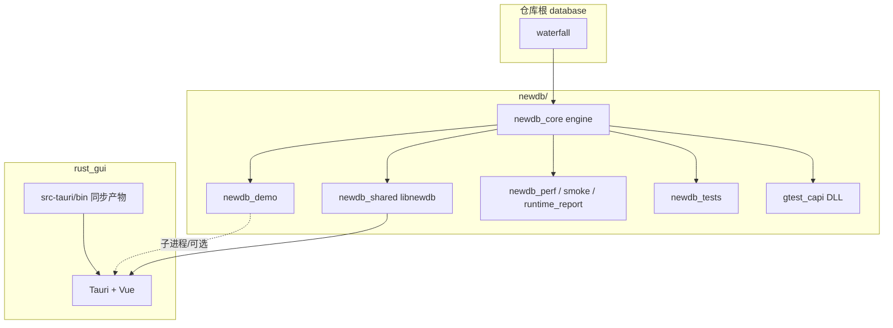
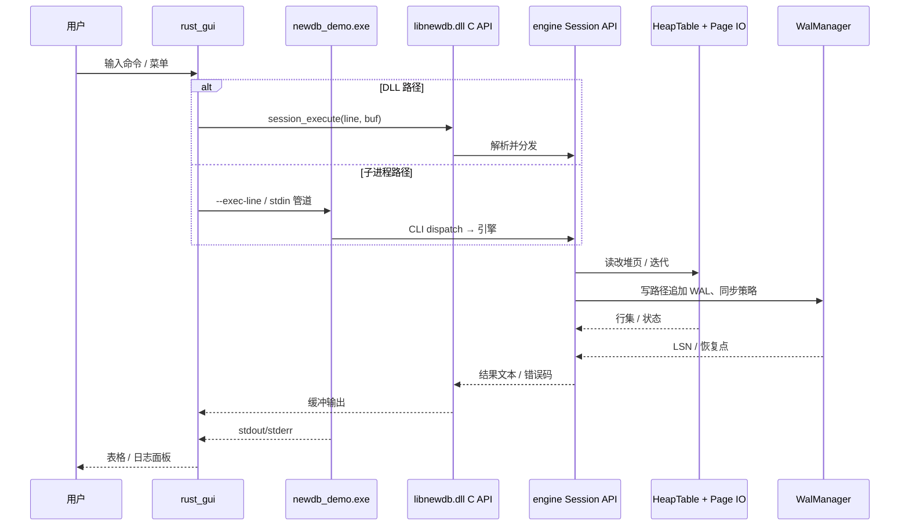
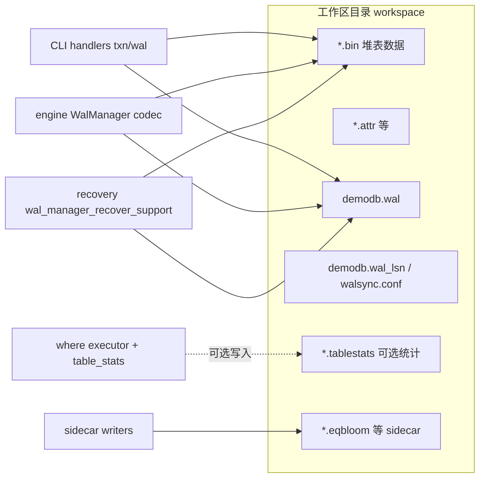

# database

[English](README.en.md) | 中文

教学与工程实践为导向的数据库实验仓库。下文是 [`newdb/docs/architecture/PROJECT_DATAFLOW_WHOLE.md`](newdb/docs/architecture/PROJECT_DATAFLOW_WHOLE.md) 的**截断版**：只保留**整体项目结构**与**整体数据流**；模块子表、字段释义、CI 观测细节等见原文。

## 仓库顶层结构

```
database/                    # 仓库根
├── waterfall/               # 页式存储与通用基础库（被 newdb_core 链接）
├── newdb/                   # 主工程：引擎 + CLI + 工具 + 测试 + Rust GUI + 脚本 + 文档
│   ├── engine/              # 存储引擎（C++）：堆表、WAL、MVCC、C ABI、缓存
│   ├── cli/                 # 交互式命令层（C++）：shell、dispatch、业务模块
│   ├── tools/               # 可执行工具：perf、smoke、runtime_report
│   ├── tests/               # GoogleTest 回归与 gtest_capi 桥接源码
│   ├── rust_gui/            # Tauri + Vue 桌面 GUI
│   ├── scripts/             # CI、压测、校验、soak（Python/PowerShell）
│   ├── docs/                # 设计与运维文档
│   ├── intro/               # LaTeX 源码解析工程 → PDF
│   └── CMakeLists.txt       # 构建编排
├── gtest_capi/              # 可选：gtest C API 示例/打包
├── docs/                    # 仓库级讲义（与 newdb/docs 互补）
├── rules/                   # Makefile 片段（非 CMake 路径）
├── Makefile                 # 顶层 make 入口
└── README.md / README.en.md
```

**编译依赖（宏观）**：`waterfall` ← `newdb/engine` ← newdb 可执行与库；`cli` 仅通过 `engine/include/newdb/*` 公共头访问引擎。

## 整体数据流：编译与链接



## 整体数据流：交互式命令（GUI / demo / C API）

同一条逻辑命令可走 **进程内 DLL** 或 **子进程 demo**，形态均为「命令文本 → 输出缓冲 / 日志」。



## 整体数据流：持久化与恢复（磁盘）



**读路径（宏观）**：打开表 → `HeapTable` + 可选 page_cache → MVCC 快照过滤 → WHERE/sidecar 加速。

**写路径（宏观）**：命令经事务协调器 → `WalManager` 落盘 → 堆与 sidecar 更新。

## 快速入口与文档

- 源码：`newdb/` · 图形界面：`newdb/rust_gui/`
- 深度文档（PDF）：`newdb/intro/out/newdb-intro.pdf`
- 开发者手册：`docs/dev-guide.md`
- 模块边界：`newdb/docs/architecture/MODULE_BOUNDARIES.md`
- 构建与测试：`newdb/docs/dev/BUILD.md`

## 仓库地址

- GitHub: [skyline019/database](https://github.com/skyline019/database)
